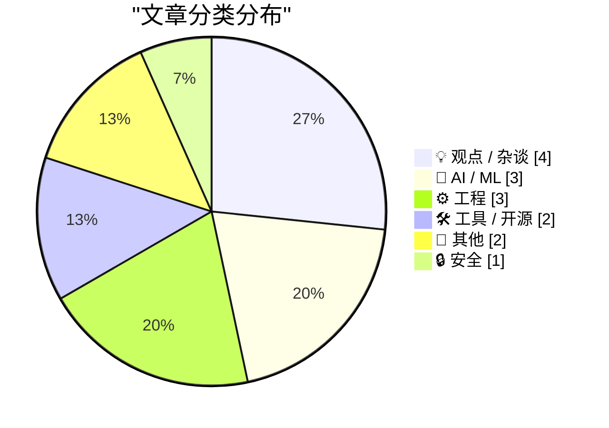
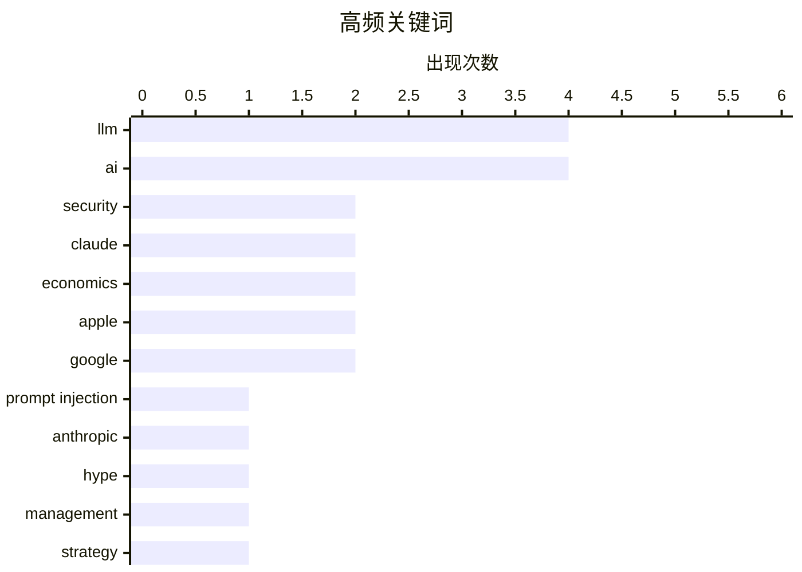

# 📰 Jul 26, 2026

> 来自 Karpathy 推荐的 92 个顶级技术博客，AI 精选 Top 15

## 📝 今日看点

随着 Claude Opus 5 的发布，大模型竞争正从单纯的性能竞赛转向性价比与安全防御的深度博弈。与此同时，技术圈正掀起一场针对“AI 狂热”的集体反思，多位评论家深入剖析了巨头营销背后的决策扭曲与市场泡沫。此外，从 Python 工具 Ruff 的激进更新到 Linux 诞生史的回顾，开发者社区依然在高性能工具迭代与底层工程精神中寻求技术确定性。

---

## 🏆 今日必读

🥇 **引用 Boris Cherny：Claude Opus 5 的提示注入防御力**

[Quoting Boris Cherny](https://simonwillison.net/2026/Jul/25/boris-cherny/#atom-everything) — simonwillison.net · 1 天前 · 🔒 安全

> Anthropic 高管 Boris Cherny 指出，新发布的 Claude Opus 5 在安全性方面取得了重大突破。该模型在系统卡（System Card）中被描述为迄今为止最难被“提示注入”（Prompt Injection）攻击的模型。通过多项 PI 评估和红队测试，Opus 5 表现出了极高的防御韧性。相比于单纯的性能跑分，这种底层安全性的提升被认为是该模型最令人兴奋的特性。

💡 **为什么值得读**: 揭示了 Anthropic 在大模型安全防御，特别是对抗提示注入攻击方面的最新进展。

🏷️ LLM, security, prompt injection, Claude

🥈 **Anthropic 发布 Claude Opus 5：性能接近旗舰但价格减半**

[Introducing Claude Opus 5](https://simonwillison.net/2026/Jul/24/introducing-claude-opus-5/#atom-everything) — simonwillison.net · 1 天前 · 🤖 AI / ML

> Anthropic 正式推出了新一代模型 Claude Opus 5，定位为兼具高智能与高性价比的生产力工具。官方将其描述为一种“深思熟虑且主动”的模型，其智能水平已接近顶尖的 Claude Fable 5 级别。最显著的优势在于成本控制，Opus 5 的使用价格仅为 Fable 5 的一半。目前社区反馈积极，被视为在推理能力与部署成本之间取得了极佳平衡的“前沿智能”模型。

💡 **为什么值得读**: 了解 Anthropic 如何通过 Opus 5 在保持高智能水平的同时大幅降低大模型的使用门槛。

🏷️ Anthropic, Claude, LLM, AI

🥉 **“AI 狂热正在摧毁全球决策体系”**

[‘AI Mania Is Eviscerating Global Decision-Making’](https://ludic.mataroa.blog/blog/ai-mania-is-eviscerating-global-decision-making/) — daringfireball.net · 14 小时前 · 💡 观点 / 杂谈

> Nikhil Suresh 在文中深入探讨了当前企业界对 AI 的盲目崇拜如何扭曲了高层决策。许多 Fortune 500 强高管即便具备技术素养，也不得不在董事会压力下对 AI 创新做出夸大其词的承诺。这种现象导致企业资源被大量投入到尚未成熟或名不副实的 AI 项目中，以维持股价和市场形象。作者认为，这种“AI 狂热”正在削弱企业的理性判断力，形成了一种系统性的决策风险。

💡 **为什么值得读**: 批判性地审视了企业界在 AI 浪潮下的非理性扩张及其对商业决策的负面影响。

🏷️ AI, hype, management, strategy

---

## 📊 数据概览

| 扫描源 | 抓取文章 | 时间范围 | 精选 |
|:---:|:---:|:---:|:---:|
| 83/92 | 2513 篇 → 30 篇 | 48h | **15 篇** |

### 分类分布



### 高频关键词



<details>
<summary>📈 纯文本关键词图（终端友好）</summary>

```
llm              │ ████████████████████ 4
ai               │ ████████████████████ 4
security         │ ██████████░░░░░░░░░░ 2
claude           │ ██████████░░░░░░░░░░ 2
economics        │ ██████████░░░░░░░░░░ 2
apple            │ ██████████░░░░░░░░░░ 2
google           │ ██████████░░░░░░░░░░ 2
prompt injection │ █████░░░░░░░░░░░░░░░ 1
anthropic        │ █████░░░░░░░░░░░░░░░ 1
hype             │ █████░░░░░░░░░░░░░░░ 1
```

</details>

### 🏷️ 话题标签

**llm**(4) · **ai**(4) · **security**(2) · claude(2) · economics(2) · apple(2) · google(2) · prompt injection(1) · anthropic(1) · hype(1) · management(1) · strategy(1) · investment(1) · benchmark(1) · gpu(1) · quantization(1) · linux(1) · kernel(1) · software development(1) · operating systems(1)

---

## 💡 观点 / 杂谈

### 1. “AI 狂热正在摧毁全球决策体系”

[‘AI Mania Is Eviscerating Global Decision-Making’](https://ludic.mataroa.blog/blog/ai-mania-is-eviscerating-global-decision-making/) — **daringfireball.net** · 14 小时前 · ⭐ 25/30

> Nikhil Suresh 在文中深入探讨了当前企业界对 AI 的盲目崇拜如何扭曲了高层决策。许多 Fortune 500 强高管即便具备技术素养，也不得不在董事会压力下对 AI 创新做出夸大其词的承诺。这种现象导致企业资源被大量投入到尚未成熟或名不副实的 AI 项目中，以维持股价和市场形象。作者认为，这种“AI 狂热”正在削弱企业的理性判断力，形成了一种系统性的决策风险。

🏷️ AI, hype, management, strategy

---

### 2. The Talk Show：一场靠爱国主义和金漆维持的骗局

[The Talk Show: ‘A Scam Held Together With Patriotism and Golden Paint’](https://daringfireball.net/thetalkshow/2026/07/23/ep-452) — **daringfireball.net** · 1 天前 · ⭐ 23/30

> 本期播客节目深入探讨了 OpenAI 在 ChatGPT/Codex 原生应用迁移过程中遭遇的挫折。主持人与嘉宾 Quinn Nelson 详细评测了 Apple OS 27 测试版中 Siri AI 的表现，以及 MacOS 27 Golden Gate 的新特性。节目还以批判性的视角剖析了近期备受争议的“Trump T1”手机，将其形容为缺乏技术含量的营销产物。讨论涵盖了从主流 AI 架构演进到消费电子市场乱象的多个维度。

🏷️ OpenAI, Apple, AI, MacOS

---

### 3. Pluralistic：苹果的“机器人自动收回”机制

[Pluralistic: Apple's robo-repo (25 Jul 2026)](https://pluralistic.net/2026/07/25/cruel-cruelty-oh-cruelty/) — **pluralistic.net** · 21 小时前 · ⭐ 23/30

> Cory Doctorow 抨击了苹果公司推行的“机器人自动收回”（robo-repo）机制，认为这是一种将风险私有化、成本社会化的行为。文章探讨了科技巨头如何利用自动化手段强化对硬件资产的控制，从而削弱消费者的所有权。此外，文中还汇集了印刷电池技术、机场插座地图、以及墨西哥原住民电话合作社等一系列关于技术主权与反垄断的短评。作者呼吁关注大公司如何通过技术手段实施数字时代的“圈地运动”。

🏷️ Apple, monopoly, economics, tech policy

---

### 4. 讨厌鬼的 Oracle 指南（第二部分）

[Premium: The Hater’s Guide To Oracle (Part 2)](https://www.wheresyoured.at/premium-the-haters-guide-to-oracle-part-2/) — **wheresyoured.at** · 1 天前 · ⭐ 23/30

> Ed Zitron 继续深入剖析甲骨文（Oracle）这家老牌科技巨头的商业神话。文章揭示了 Oracle 如何在公众眼中维持“高增长、高利润”的形象，并对比了其真实的业务现状与市场宣传之间的差距。作者通过对 Oracle 销售策略和并购史的分析，指出其成功更多依赖于强大的法律与销售机器，而非单纯的技术创新。这篇深度长文旨在打破行业对 Oracle 的盲目崇拜，还原其复杂的商业底色。

🏷️ Oracle, enterprise software, business strategy

---

## 🤖 AI / ML

### 5. Anthropic 发布 Claude Opus 5：性能接近旗舰但价格减半

[Introducing Claude Opus 5](https://simonwillison.net/2026/Jul/24/introducing-claude-opus-5/#atom-everything) — **simonwillison.net** · 1 天前 · ⭐ 26/30

> Anthropic 正式推出了新一代模型 Claude Opus 5，定位为兼具高智能与高性价比的生产力工具。官方将其描述为一种“深思熟虑且主动”的模型，其智能水平已接近顶尖的 Claude Fable 5 级别。最显著的优势在于成本控制，Opus 5 的使用价格仅为 Fable 5 的一半。目前社区反馈积极，被视为在推理能力与部署成本之间取得了极佳平衡的“前沿智能”模型。

🏷️ Anthropic, Claude, LLM, AI

---

### 6. Pluralistic：AI 唯我论者与 AI 怀疑论者

[Pluralistic: AI solipsists and AI cynics (24 Jul 2026)](https://pluralistic.net/2026/07/24/supplemental-income/) — **pluralistic.net** · 1 天前 · ⭐ 25/30

> Cory Doctorow 探讨了 AI 领域中“唯我论者”与“怀疑论者”之间的博弈。他指出，即便 AI 的实际效能尚未达到宣传的水平，资本市场仍将其视为优质投资标的，这种脱节构成了当前的行业奇观。文章还穿插了关于恶意软件与失窃电脑、咖啡渣工业材料、以及硅谷健康数据隐私等多个技术与社会议题的简评。作者的核心观点是，AI 的投资价值往往与其技术成熟度并不直接挂钩。

🏷️ AI, investment, economics, LLM

---

### 7. 在 RTX 3090 上评测 Qwen 3.6 35B MoE 模型

[Benchmarking Qwen 3.6 35B MoE (3B active) on an RTX 3090](https://www.gilesthomas.com/2026/07/benchmarking-qwen-3-6-35b-moe-rtx-3090) — **gilesthomas.com** · 1 天前 · ⭐ 25/30

> 本文测试了通义千问 Qwen 3.6 35B MoE 模型在单块 RTX 3090 显卡上的运行表现。受限于 24GB 显存，测试采用了 4-bit 量化版本，虽然牺牲了一定的上下文窗口长度，但仍能实现流畅运行。该模型采用混合专家架构（MoE），实际激活参数仅为 3B，在推理速度上具有显著优势。实验证明，消费级硬件通过量化技术完全可以驾驭中等规模的 MoE 模型。

🏷️ LLM, benchmark, GPU, quantization

---

## ⚙️ 工程

### 8. 成为林纳斯·托瓦兹：重温 Linux 内核的诞生

[Being Linux Torvalds](http://antirez.com/news/171) — **antirez.com** · 21 小时前 · ⭐ 24/30

> Redis 创始人 antirez 回顾了 Linus Torvalds 开发首个 Linux 内核的传奇历程。Linus 当时通过研究 Minix 源码和 386 计算机架构，在具备扎实底层知识的基础上编写了一个极简但可运行的 Unix 内核。文章强调，这种从零开始构建复杂系统的能力，源于对底层原理的深刻理解和天才的编程直觉。作者认为，理解 Linus 的成功路径对于当代程序员提升系统级编程思维具有重要启发。

🏷️ Linux, kernel, software development, operating systems

---

### 9. 在 C++/WinRT 中创建 Windows 运行时委托的敏捷版本（第五部分）

[Making an agile version of a Windows Runtime delegate in C++/WinRT, part 5](https://devblogs.microsoft.com/oldnewthing/20260724-00/?p=112562) — **devblogs.microsoft.com/oldnewthing** · 1 天前 · ⭐ 22/30

> 本文是 Raymond Chen 关于 C++/WinRT 委托处理系列的第五篇，重点探讨如何确保非敏捷（non-agile）委托在非敏捷环境下被正确调用。文章深入分析了在多线程环境中维持线程亲和性的技术细节，避免因跨线程调用导致的崩溃或未定义行为。通过具体的代码示例，展示了如何包装原始委托以实现线程安全的上下文切换。这对于需要处理复杂 UI 交互或异步回调的 Windows 开发者具有极高的参考价值。

🏷️ C++, WinRT, Windows, concurrency

---

### 10. 包管理周报：2026 年 7 月 25 日

[This Week in Package Management: 25 July 2026](https://nesbitt.io/2026/07/25/this-week-in-package-management.html) — **nesbitt.io** · 22 小时前 · ⭐ 22/30

> 本期周报汇总了 2026 年 7 月下旬全球包管理领域的关键动态，涵盖了主流包管理器的版本更新与安全通告。内容涉及 npm、PyPI 及 Cargo 等生态系统的最新发布说明，并重点关注了近期发现的供应链安全漏洞及其修复建议。此外，摘要中还收录了关于依赖管理最佳实践的多篇技术文章。对于关注开发工具链稳定性与安全性的工程师来说，这是快速同步行业进展的高效渠道。

🏷️ package management, security, software supply chain

---

## 🛠 工具 / 开源

### 11. Python 静态分析工具 Ruff v0.16.0 发布：默认规则大幅增加

[Ruff v0.16.0](https://simonwillison.net/2026/Jul/25/ruff/#atom-everything) — **simonwillison.net** · 9 小时前 · ⭐ 23/30

> Python 领域的高性能 Linter 工具 Ruff 发布了 v0.16.0 重大版本更新。该版本最显著的变化是将默认启用的规则数量从之前的 59 条激增至 413 条。这一变动导致许多未锁定依赖版本的 CI 流程因新增的检查项而报错。Astral 团队通过此次更新显著增强了 Ruff 的开箱即用检查能力，但也提醒开发者需注意版本升级带来的兼容性挑战。

🏷️ Python, Ruff, linter, CI

---

### 12. bIRC：一款全新的 Mac 原生 IRC 客户端

[bIRC — A New Native IRC Client for Mac](https://birc.app/) — **daringfireball.net** · 16 小时前 · ⭐ 20/30

> 开发者 Fredrik Blank 推出了名为 bIRC 的全新 macOS 原生 IRC 客户端，旨在接替已停止维护的知名客户端 Textual。该应用完全采用 Swift 语言基于 RFC 2812 规范从零开发，强调极致的原生性能与系统集成体验。作者坦言在 2026 年开发 IRC 客户端更多是出于对编程的热爱而非商业利益，力求还原经典协议的简洁性。对于仍在使用 IRC 进行技术交流的 Mac 用户，这提供了一个现代化且持续更新的工具选择。

🏷️ IRC, Mac, software, chat

---

## 📝 其他

### 13. 欧盟因违反《数字市场法案》对谷歌处以近 9 亿欧元罚款

[EU Fines Google $1 Billion for DMA Competition Violations, Including Making Search Results More Useful](https://digital-markets-act.ec.europa.eu/commission-fines-google-eur890-million-breaches-digital-markets-act-2026-07-23_en) — **daringfireball.net** · 14 小时前 · ⭐ 22/30

> 欧盟委员会宣布对谷歌处以 8.9 亿欧元（约 10 亿美元）罚款，理由是其违反了《数字市场法案》（DMA）的竞争规定。调查发现，谷歌在搜索结果中给予自家购物、酒店、交通和体育等服务优先待遇，通过置顶显示或增强视觉滤镜等手段打压第三方竞争对手。这一裁决明确了大型科技公司作为“守门人”在算法展示上的法律边界。此举旨在强制谷歌改变搜索排名逻辑，确保第三方服务在搜索页面拥有公平的曝光机会。

🏷️ Google, EU, DMA, antitrust

---

### 14. 法院批准 SerpApi 驳回谷歌起诉的动议：开放互联网的胜利

[Court Grants SerpApi’s Motion to Dismiss Google Lawsuit](https://serpapi.com/blog/google-v-serpapi-the-court-granted-our-motion-to-dismiss/) — **daringfireball.net** · 15 小时前 · ⭐ 20/30

> 美国加州北区地方法院驳回了谷歌针对 SerpApi 的诉讼，判定谷歌试图通过扩张《数字千年版权法》（DMCA）来控制公共网页访问权的行为无效。SerpApi 首席执行官表示，这一裁决保护了开发者获取公开信息的权利，防止科技巨头垄断互联网数据。法院的决定强调了“公开访问可用信息”是驱动创新的核心原则，而非版权法的延伸工具。此案例为网络爬虫和数据聚合服务在法律层面确立了重要的防御先例。

🏷️ Google, SerpApi, legal, scraping

---

## 🔒 安全

### 15. 引用 Boris Cherny：Claude Opus 5 的提示注入防御力

[Quoting Boris Cherny](https://simonwillison.net/2026/Jul/25/boris-cherny/#atom-everything) — **simonwillison.net** · 1 天前 · ⭐ 26/30

> Anthropic 高管 Boris Cherny 指出，新发布的 Claude Opus 5 在安全性方面取得了重大突破。该模型在系统卡（System Card）中被描述为迄今为止最难被“提示注入”（Prompt Injection）攻击的模型。通过多项 PI 评估和红队测试，Opus 5 表现出了极高的防御韧性。相比于单纯的性能跑分，这种底层安全性的提升被认为是该模型最令人兴奋的特性。

🏷️ LLM, security, prompt injection, Claude

---

*生成于 2026-07-26 08:36 | 扫描 83 源 → 获取 2513 篇 → 精选 15 篇*
*基于 [Hacker News Popularity Contest 2025](https://refactoringenglish.com/tools/hn-popularity/) RSS 源列表，由 [Andrej Karpathy](https://x.com/karpathy) 推荐*
