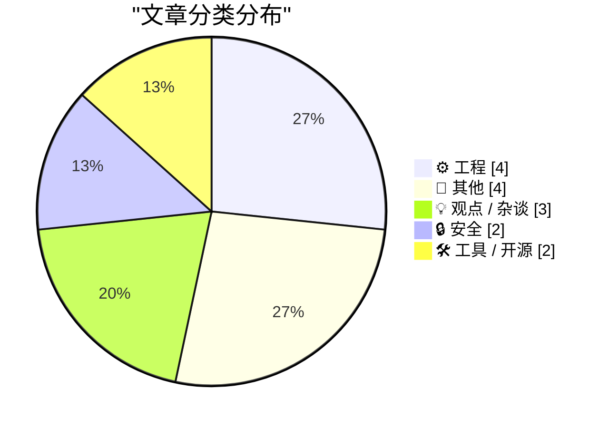
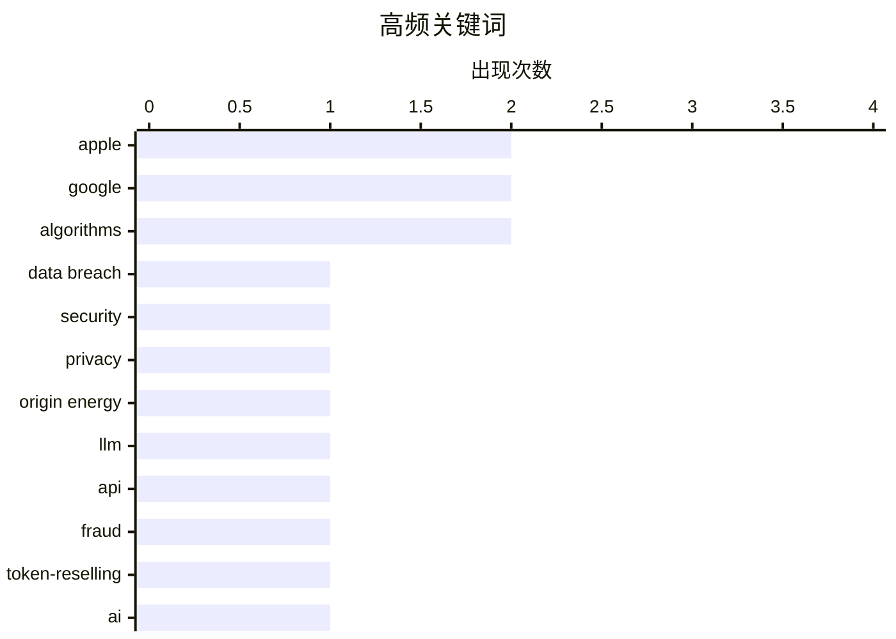

# 📰 Jul 27, 2026

> 来自 Karpathy 推荐的 92 个顶级技术博客，AI 精选 Top 15

## 📝 今日看点

今日技术圈呈现出监管收紧与技术反思的双重基调。欧盟与美国法院接连针对谷歌的垄断行为与数据限制做出裁决，标志着科技巨头正面临更严苛的合规挑战。与此同时，AI 狂热引发的决策失准与地下 Token 市场的滋生，揭示了技术爆发背后的非理性风险与安全隐患。在工程领域，从 Ruff 的重大版本更迭到对 Linux 开发初心的回溯，开发者社区依然在效率工具与底层逻辑的持续演进中寻找平衡。

---

## 🏆 今日必读

🥇 **每周更新 514：本周数据泄露动态**

[Weekly Update 514: This Week in Data Breaches](https://www.troyhunt.com/weekly-update-514/) — troyhunt.com · 1 天前 · 🔒 安全

> 本周数据泄露的焦点是澳大利亚 Origin Energy 公司，该公司正陷入一场与黑客的信息拉锯战。Origin Energy 官方声称用户的信用卡信息安全无虞，但黑客反驳称已掌握关键数据，这种多面性的冲突在大型泄露事件中愈发常见。Troy Hunt 在文中深入分析了企业在危机公关中的话术逻辑与实际安全风险之间的差距。此外，Have I Been Pwned 平台持续集成新的泄露数据库，提醒用户及时通过该工具检查个人账户的暴露情况。

💡 **为什么值得读**: 了解网络安全前沿动态以及企业在面对大规模数据泄露时的应对策略与公关陷阱。

🏷️ data breach, security, privacy, Origin Energy

🥈 **深度解析驱动 Token 转售与欺诈的中继市场**

[An Inside Look at the Relay Market Powering Token Resellers and Fraud](https://simonwillison.net/2026/Jul/26/relay-market/#atom-everything) — simonwillison.net · 14 小时前 · 🔒 安全

> 调查揭示了一个围绕 LLM Token 转售形成的地下中继市场，该现象在中国尤为普遍。转售商通过滥用免费试用额度、汇集非法获取的 API 密钥以及利用云端漏洞，向用户提供远低于官方定价的 API 代理服务。这种模式不仅损害了 OpenAI 等模型提供商的商业利益，也为下游应用埋下了极高的安全和稳定性隐患。文章详细拆解了这些“Token 搬运工”如何通过技术手段规避监管并实现套利。

💡 **为什么值得读**: 深入了解大模型商业化背后的黑产链条及其对 API 经济和开发者生态的负面影响。

🏷️ LLM, API, fraud, token-reselling

🥉 **“AI 狂热正在摧毁全球决策力”**

[‘AI Mania Is Eviscerating Global Decision-Making’](https://ludic.mataroa.blog/blog/ai-mania-is-eviscerating-global-decision-making/) — daringfireball.net · 1 天前 · 💡 观点 / 杂谈

> 文章探讨了当前 AI 狂热如何导致全球企业决策层陷入集体非理性，迫使高管在技术尚未成熟时做出夸大承诺。作者通过与财富 500 强高管的私下交流发现，即便技术上清醒的领导者也因董事会压力而不得不参与这场“AI 军备竞赛”。这种现象正在侵蚀企业的长期战略，将大量资源浪费在缺乏实际价值的演示项目上。作者警告称，这种对 AI 的盲目崇拜正在让全球商业决策变得脆弱且缺乏逻辑。

💡 **为什么值得读**: 批判性地反思 AI 浪潮中的企业乱象，警惕技术泡沫对组织决策和长期发展的负面影响。

🏷️ AI, decision-making, hype, corporate

---

## 📊 数据概览

| 扫描源 | 抓取文章 | 时间范围 | 精选 |
|:---:|:---:|:---:|:---:|
| 84/92 | 2532 篇 → 20 篇 | 48h | **15 篇** |

### 分类分布



### 高频关键词



<details>
<summary>📈 纯文本关键词图（终端友好）</summary>

```
apple         │ ████████████████████ 2
google        │ ████████████████████ 2
algorithms    │ ████████████████████ 2
data breach   │ ██████████░░░░░░░░░░ 1
security      │ ██████████░░░░░░░░░░ 1
privacy       │ ██████████░░░░░░░░░░ 1
origin energy │ ██████████░░░░░░░░░░ 1
llm           │ ██████████░░░░░░░░░░ 1
api           │ ██████████░░░░░░░░░░ 1
fraud         │ ██████████░░░░░░░░░░ 1
```

</details>

### 🏷️ 话题标签

**apple**(2) · **google**(2) · **algorithms**(2) · data breach(1) · security(1) · privacy(1) · origin energy(1) · llm(1) · api(1) · fraud(1) · token-reselling(1) · ai(1) · decision-making(1) · hype(1) · corporate(1) · linus torvalds(1) · linux(1) · kernel(1) · programming(1) · drm(1)

---

## ⚙️ 工程

### 1. 成为林纳斯·托瓦兹：Linux 开发初期的思考

[Being Linux Torvalds](http://antirez.com/news/171) — **antirez.com** · 1 天前 · ⭐ 24/30

> Redis 创始人 antirez 探讨了 Linus Torvalds 在开发 Linux 内核初期的心路历程与技术背景。Linus 当时深入研究了 Minix 源码和计算机架构，凭借卓越的编程能力在 386 平台上实现了极简且可运行的 Unix 内核。文章强调了在特定历史窗口下，扎实的基础知识与对单一架构的专注如何成就了改变世界的开源项目。这种“在限制中创造”的模式对于现代开发者理解系统底层逻辑具有重要的启发意义。

🏷️ Linus Torvalds, Linux, kernel, programming

---

### 2. 用 Haskell 实现数字电路模拟器（SICP 3.3 练习）

[Digital circuit simulator in Haskell (SICP 3.3)](https://entropicthoughts.com/sicp-3-3-digital-circuit-simulator-in-haskell) — **entropicthoughts.com** · 12 小时前 · ⭐ 22/30

> 作者分享了使用 Haskell 语言实现经典教材《计算机程序的构造和解释》(SICP) 第 3.3 节中数字电路模拟器的过程。文章展示了如何利用 Haskell 的强类型和函数式特性来构建复杂的事件驱动模拟系统。通过将原书中的 Lisp 示例移植到 Haskell，深入探讨了状态管理、信号传播以及模拟器时钟周期的实现细节。这不仅是对 SICP 理论的实践，也是对函数式编程处理可变状态能力的深度探索。

🏷️ Haskell, SICP, simulation, functional programming

---

### 3. 置换根

[Permutation roots](https://www.johndcook.com/blog/2026/07/26/permutation-roots/) — **johndcook.com** · 13 小时前 · ⭐ 18/30

> 本文探讨了组合数学中置换（Permutation）的根的概念，即寻找一个置换 τ 使得 τ² = σ。置换根的存在性与其循环分解（Cycle Decomposition）的结构密切相关。对于平方根而言，一个置换拥有根的充要条件是其分解中每个偶数长度的循环必须成对出现。文章通过具体的整数置换示例，深入浅出地解释了这一抽象代数中的判定逻辑。这种分析方法同样可以扩展到立方根或更高阶的置换根计算中。

🏷️ mathematics, permutations, algorithms

---

### 4. Excel 列编号系统解析

[Excel column numbering](https://www.johndcook.com/blog/2026/07/25/excel-column-numbering/) — **johndcook.com** · 1 天前 · ⭐ 18/30

> 作者在处理大型电子表格时发现，Excel 的列标签（如 A, B, Z, AA）并非简单的 26 进制系统。在标准 26 进制中，'A' 通常代表 0，但在 Excel 中 'A' 对应 1，'Z' 对应 26，且 'AA' 对应 27。这种系统被称为“双射 26 进制”（Bijective Base-26），它没有零的概念，从而避免了位置表示法中前导零带来的歧义。理解这一差异对于编写处理 Excel 数据的自动化脚本和转换算法至关重要，能有效避免索引偏移错误。

🏷️ Excel, algorithms, numbering systems

---

## 📝 其他

### 5. 欧盟因违反 DMA 对 Google 处以 10 亿美元罚款

[EU Fines Google $1 Billion for DMA Competition Violations, Including Making Search Results More Useful](https://digital-markets-act.ec.europa.eu/commission-fines-google-eur890-million-breaches-digital-markets-act-2026-07-23_en) — **daringfireball.net** · 1 天前 · ⭐ 21/30

> 欧盟委员会因 Google 违反《数字市场法案》(DMA) 对其处以约 10 亿美元罚款，理由是其在搜索结果中给予自家服务优先待遇。调查发现，Google 通过在搜索页面顶部显示增强视觉效果和过滤器，提升了自家购物、酒店和体育结果的可见度。这种做法压制了第三方竞争对手的展示机会，被认定为滥用市场支配地位。此裁决标志着欧盟在强制大型科技公司提供公平竞争环境方面迈出了实质性的一步。

🏷️ Google, DMA, EU, antitrust

---

### 6. 法院驳回 Google 对 SerpApi 的诉讼

[Court Grants SerpApi’s Motion to Dismiss Google Lawsuit](https://serpapi.com/blog/google-v-serpapi-the-court-granted-our-motion-to-dismiss/) — **daringfireball.net** · 1 天前 · ⭐ 19/30

> 美国加州北区地方法院授予了 SerpApi 驳回 Google 诉讼的动议，判定 Google 不能利用《数字千年版权法》(DMCA) 来限制第三方对公开网页信息的访问。SerpApi 首席执行官认为这是开放互联网的重大胜利，阻止了科技巨头通过法律手段垄断公共数据。法院拒绝了 Google 试图扩大 DMCA 适用范围以控制公共页面访问权限的尝试。该裁决对于依赖网页抓取和数据提取进行创新的初创公司具有重要的判例参考价值。

🏷️ Google, SerpApi, lawsuit, web-scraping

---

### 7. 苹果地图将为福特新款电动汽车提供导航体验

[Apple Maps to Power Navigation Experience for Ford’s New EVs](https://www.apple.com/newsroom/2026/07/apple-maps-to-power-navigation-experience-for-ford-uev-platform/) — **daringfireball.net** · 1 天前 · ⭐ 19/30

> 苹果与福特宣布将通过全新的 MapKit for Automotive SDK，将苹果地图直接集成到福特即将推出的通用电动汽车（UEV）平台中。该集成计划于 2027 年上线，旨在将苹果地图的导航体验原生引入车辆显示屏，而非仅仅通过 CarPlay 投屏。通过利用苹果地图提供的道路级高精度信息，福特的 Latitude AI 团队将能够构建更流畅的免提自动驾驶体验。这一合作标志着科技巨头与传统车企在车载软件生态系统上的深度融合，提升了电动汽车的智能化交互水平。

🏷️ Apple, Ford, EV, MapKit

---

### 8. 阅读清单 2026/07/25

[Reading List 07/25/26](https://www.construction-physics.com/p/reading-list-072526) — **construction-physics.com** · 1 天前 · ⭐ 18/30

> 本期阅读清单汇总了能源、基建和工业政策等多个前沿话题。核心内容包括对中国电动汽车补贴政策及其全球影响的深度分析，以及航空衍生燃气轮机在未来电力系统中的技术演进。清单还探讨了美沙核能协议背后的地缘政治博弈，以及关于缺陷道路护栏对公共安全威胁的调查报告。通过这些跨学科的视角，文章展示了技术进步如何受政策驱动并反过来重塑社会基础设施。读者可以从中快速获取多个工业领域的关键动态。

🏷️ energy, infrastructure, reading list

---

## 💡 观点 / 杂谈

### 9. “AI 狂热正在摧毁全球决策力”

[‘AI Mania Is Eviscerating Global Decision-Making’](https://ludic.mataroa.blog/blog/ai-mania-is-eviscerating-global-decision-making/) — **daringfireball.net** · 1 天前 · ⭐ 24/30

> 文章探讨了当前 AI 狂热如何导致全球企业决策层陷入集体非理性，迫使高管在技术尚未成熟时做出夸大承诺。作者通过与财富 500 强高管的私下交流发现，即便技术上清醒的领导者也因董事会压力而不得不参与这场“AI 军备竞赛”。这种现象正在侵蚀企业的长期战略，将大量资源浪费在缺乏实际价值的演示项目上。作者警告称，这种对 AI 的盲目崇拜正在让全球商业决策变得脆弱且缺乏逻辑。

🏷️ AI, decision-making, hype, corporate

---

### 10. 多元化：苹果的“机器人收回”与风险转嫁

[Pluralistic: Apple's robo-repo (25 Jul 2026)](https://pluralistic.net/2026/07/25/cruel-cruelty-oh-cruelty/) — **pluralistic.net** · 1 天前 · ⭐ 24/30

> 文章抨击了苹果公司利用技术手段实施的“机器人收回”策略，即通过私有化风险溢价来获取利润，同时将相关成本转嫁给社会。作者 Cory Doctorow 探讨了这种模式如何加强了科技巨头的垄断地位，并利用软件限制削弱了消费者的实际所有权。内容还涵盖了从打印电池到反垄断法等一系列关于数字权利与市场公平的深度观察。作者呼吁公众关注科技巨头如何通过技术壁垒重塑经济规则并损害公众利益。

🏷️ Apple, DRM, right to repair, monopoly

---

### 11. 关于 EMF Camp 2026 的一些随感

[Some Quick Thoughts on EMF Camp 2026](https://shkspr.mobi/blog/2026/07/some-quick-thoughts-on-emf-camp-2026/) — **shkspr.mobi** · 1 天前 · ⭐ 19/30

> 作者分享了作为普通游客而非演讲者参加 2026 年 EMF Camp（电磁场营地）的独特体验。在连续三届担任讲师后，作者发现以“游客”身份参与能彻底摆脱设备故障的焦虑、推广演讲的压力以及上台前的紧张感。这种转变让参与者能更纯粹地享受黑客马拉松和创客社区的氛围，而无需被繁重的日程表束缚。文章反映了技术社区活动中，深度参与和单纯体验之间心态的微妙平衡。对于长期活跃在技术讲台的人来说，这种“退一步”的视角提供了全新的乐趣。

🏷️ EMF Camp, hacker culture, conference

---

## 🔒 安全

### 12. 每周更新 514：本周数据泄露动态

[Weekly Update 514: This Week in Data Breaches](https://www.troyhunt.com/weekly-update-514/) — **troyhunt.com** · 1 天前 · ⭐ 27/30

> 本周数据泄露的焦点是澳大利亚 Origin Energy 公司，该公司正陷入一场与黑客的信息拉锯战。Origin Energy 官方声称用户的信用卡信息安全无虞，但黑客反驳称已掌握关键数据，这种多面性的冲突在大型泄露事件中愈发常见。Troy Hunt 在文中深入分析了企业在危机公关中的话术逻辑与实际安全风险之间的差距。此外，Have I Been Pwned 平台持续集成新的泄露数据库，提醒用户及时通过该工具检查个人账户的暴露情况。

🏷️ data breach, security, privacy, Origin Energy

---

### 13. 深度解析驱动 Token 转售与欺诈的中继市场

[An Inside Look at the Relay Market Powering Token Resellers and Fraud](https://simonwillison.net/2026/Jul/26/relay-market/#atom-everything) — **simonwillison.net** · 14 小时前 · ⭐ 25/30

> 调查揭示了一个围绕 LLM Token 转售形成的地下中继市场，该现象在中国尤为普遍。转售商通过滥用免费试用额度、汇集非法获取的 API 密钥以及利用云端漏洞，向用户提供远低于官方定价的 API 代理服务。这种模式不仅损害了 OpenAI 等模型提供商的商业利益，也为下游应用埋下了极高的安全和稳定性隐患。文章详细拆解了这些“Token 搬运工”如何通过技术手段规避监管并实现套利。

🏷️ LLM, API, fraud, token-reselling

---

## 🛠 工具 / 开源

### 14. Ruff v0.16.0 发布：默认规则大幅增加

[Ruff v0.16.0](https://simonwillison.net/2026/Jul/25/ruff/#atom-everything) — **simonwillison.net** · 1 天前 · ⭐ 23/30

> Python 静态检查工具 Ruff 发布了 v0.16.0 重大更新，最显著的变化是默认启用的规则数量从 59 条大幅提升至 413 条。这一变动导致许多未锁定依赖版本的 CI 流程因新增的检查项而意外失败。Astral 团队通过此次更新旨在提供更严格的代码质量把控，但也给现有项目的维护带来了迁移成本。开发者需要及时检查配置，决定是修复新发现的代码问题还是在配置文件中禁用特定的新规则。

🏷️ Python, linter, Ruff, Astral

---

### 15. bIRC：一款全新的 Mac 原生 IRC 客户端

[bIRC — A New Native IRC Client for Mac](https://birc.app/) — **daringfireball.net** · 1 天前 · ⭐ 20/30

> 开发者 Fredrik Blank 为 Mac 平台推出了一款全新的原生 IRC 客户端 bIRC，旨在填补经典工具 Textual 停止维护后的空白。该应用完全采用 Swift 语言编写，遵循 RFC 2812 标准，强调纯粹的编程乐趣与极致的原生交互体验。尽管 IRC 已非主流通讯工具，但 bIRC 为仍活跃在该协议上的开发者和极客提供了一个现代、高效且美观的选择。作者分享了在 2026 年坚持开发原生 IRC 客户端的初衷与技术挑战。

🏷️ IRC, macOS, bIRC, client

---

*生成于 2026-07-27 10:03 | 扫描 84 源 → 获取 2532 篇 → 精选 15 篇*
*基于 [Hacker News Popularity Contest 2025](https://refactoringenglish.com/tools/hn-popularity/) RSS 源列表，由 [Andrej Karpathy](https://x.com/karpathy) 推荐*
