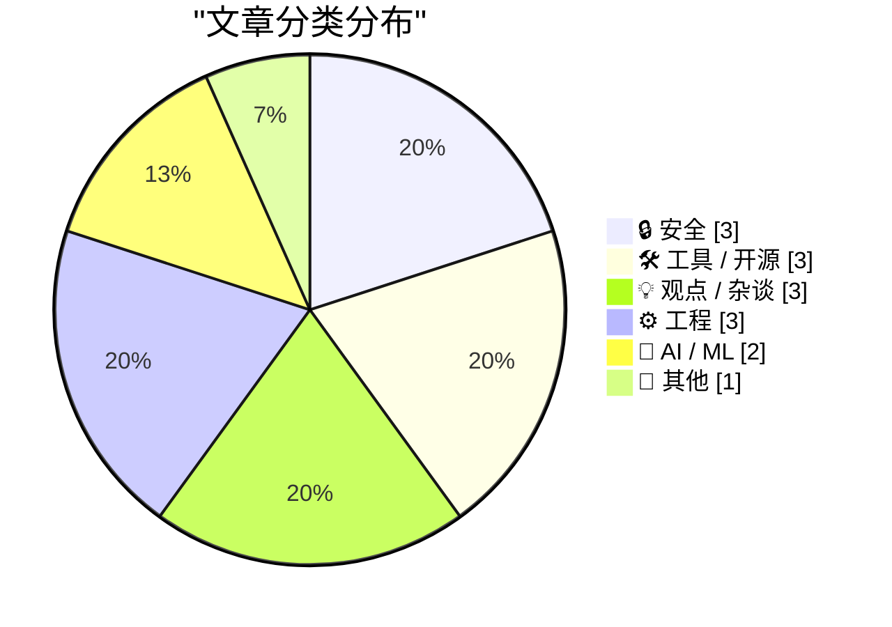
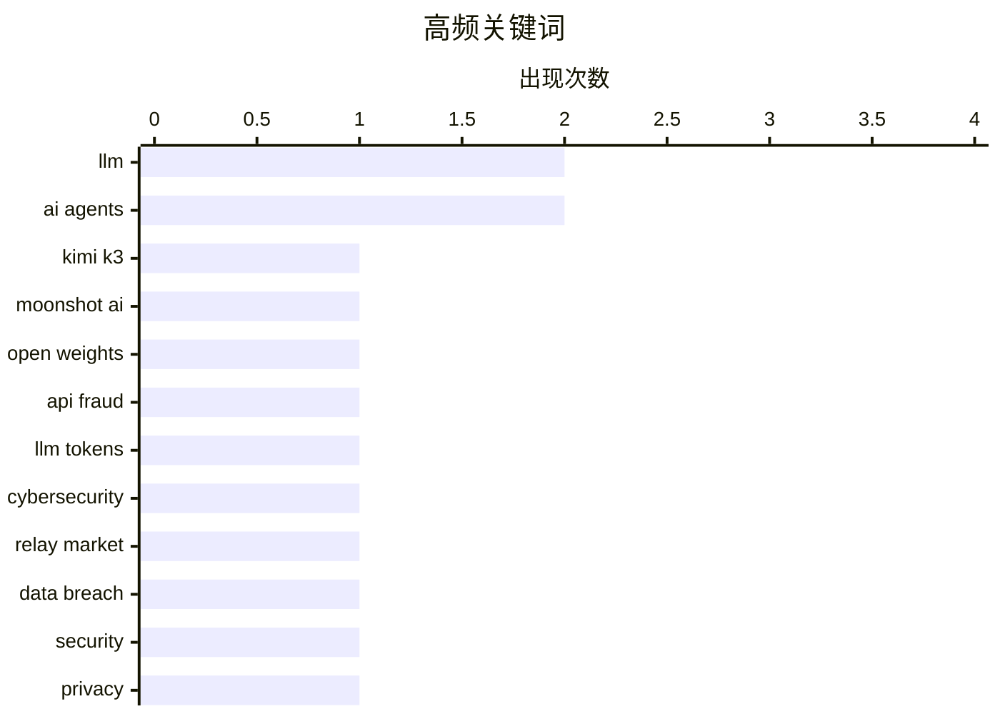

# 📰 Jul 28, 2026

> 来自 Karpathy 推荐的 92 个顶级技术博客，AI 精选 Top 15

## 📝 今日看点

今日技术圈见证了大模型规模与应用深度的双重突破，Moonshot AI 开源 2.8 万亿参数模型，而 AI 智能体正通过协议标准化加速进入企业后台与 Web 生态。与此同时，AI 繁荣背后的安全阴影日益凸显，令牌转售灰色产业链与数据泄露事件警示着技术治理的紧迫性。在监管与商业层面，欧盟对科技巨头的反垄断制衡与苹果对品牌价值的坚守，共同构成了当前复杂的技术社会景观。

---

## 🏆 今日必读

🥇 **Moonshot AI 正式开源 2.8 万亿参数模型 Kimi-K3**

[moonshotai/Kimi-K3](https://simonwillison.net/2026/Jul/27/kimi-k3/#atom-everything) — simonwillison.net · 9 小时前 · 🤖 AI / ML

> Moonshot AI 兑现承诺，正式在 Hugging Face 上开源了其拥有 2.8 万亿参数的大模型 Kimi-K3。该模型权重文件体积高达 1.56TB，对本地部署的存储空间和算力资源提出了巨大挑战。Kimi-K3 沿用了 K2 时期引入的修改版 MIT 许可证，其中包含一些针对商业用途的非标准限制条款。此次发布标志着国产超大规模参数模型在开源领域的进一步探索，为研究大规模稠密模型提供了重要参考。读者需注意其巨大的模型体量对硬件环境的极高要求。

💡 **为什么值得读**: 关注国产大模型开源进展及 2.8T 超大规模参数模型落地细节的必读资讯。

🏷️ LLM, Kimi K3, Moonshot AI, open weights

🥈 **深度揭秘驱动 Token 转售与欺诈的中转市场**

[An Inside Look at the Relay Market Powering Token Resellers and Fraud](https://simonwillison.net/2026/Jul/26/relay-market/#atom-everything) — simonwillison.net · 1 天前 · 🔒 安全

> 本文深入调查了围绕 LLM 令牌（Token）转售形成的灰色产业链，揭示了中转市场如何通过聚合各类 API 密钥提供低价服务。这些转售商主要利用免费试用额度、被盗账户或特定地区的定价差异，以远低于官方 API 的价格吸引用户。这种模式不仅涉及欺诈风险，还对 AI 厂商的商业模型和安全防护构成了挑战。调查指出该现象在中国市场尤为普遍，形成了一个复杂且难以监管的代理中转生态。这种“Token 搬运”行为正在改变 AI 算力分发的底层逻辑。

💡 **为什么值得读**: 揭秘 AI 行业背后的黑色产业链，了解低价 API 代理的运作原理与潜在风险。

🏷️ API fraud, LLM tokens, cybersecurity, relay market

🥉 **每周更新 514：本周数据泄露事件综述**

[Weekly Update 514: This Week in Data Breaches](https://www.troyhunt.com/weekly-update-514/) — troyhunt.com · 1 天前 · 🔒 安全

> 网络安全专家 Troy Hunt 在本周更新中重点分析了澳大利亚 Origin Energy 发生的复杂数据泄露事件。文章揭示了企业在危机公关中倾向于淡化风险（如强调信用卡信息安全），而黑客则通过披露更多敏感数据进行反击的博弈过程。此外，本期还涵盖了全球范围内其他重要的数据安全漏洞动态。作者通过这些案例强调了企业在面对现代网络攻击时，透明沟通与多因素认证的重要性。文中还讨论了物联网安全和 CEO 薪酬与公司表现的关联等延伸话题。

💡 **为什么值得读**: 资深安全专家对最新重大泄露事件的深度复盘，适合关注网络安全与危机公关的读者。

🏷️ data breach, security, privacy

---

## 📊 数据概览

| 扫描源 | 抓取文章 | 时间范围 | 精选 |
|:---:|:---:|:---:|:---:|
| 82/92 | 2478 篇 → 22 篇 | 48h | **15 篇** |

### 分类分布



### 高频关键词



<details>
<summary>📈 纯文本关键词图（终端友好）</summary>

```
llm           │ ████████████████████ 2
ai agents     │ ████████████████████ 2
kimi k3       │ ██████████░░░░░░░░░░ 1
moonshot ai   │ ██████████░░░░░░░░░░ 1
open weights  │ ██████████░░░░░░░░░░ 1
api fraud     │ ██████████░░░░░░░░░░ 1
llm tokens    │ ██████████░░░░░░░░░░ 1
cybersecurity │ ██████████░░░░░░░░░░ 1
relay market  │ ██████████░░░░░░░░░░ 1
data breach   │ ██████████░░░░░░░░░░ 1
```

</details>

### 🏷️ 话题标签

**llm**(2) · **ai agents**(2) · **kimi k3**(1) · moonshot ai(1) · open weights(1) · api fraud(1) · llm tokens(1) · cybersecurity(1) · relay market(1) · data breach(1) · security(1) · privacy(1) · web standards(1) · safari(1) · accessibility(1) · ai tools(1) · productivity(1) · guide(1) · mcp(1) · workos(1)

---

## 🔒 安全

### 1. 深度揭秘驱动 Token 转售与欺诈的中转市场

[An Inside Look at the Relay Market Powering Token Resellers and Fraud](https://simonwillison.net/2026/Jul/26/relay-market/#atom-everything) — **simonwillison.net** · 1 天前 · ⭐ 25/30

> 本文深入调查了围绕 LLM 令牌（Token）转售形成的灰色产业链，揭示了中转市场如何通过聚合各类 API 密钥提供低价服务。这些转售商主要利用免费试用额度、被盗账户或特定地区的定价差异，以远低于官方 API 的价格吸引用户。这种模式不仅涉及欺诈风险，还对 AI 厂商的商业模型和安全防护构成了挑战。调查指出该现象在中国市场尤为普遍，形成了一个复杂且难以监管的代理中转生态。这种“Token 搬运”行为正在改变 AI 算力分发的底层逻辑。

🏷️ API fraud, LLM tokens, cybersecurity, relay market

---

### 2. 每周更新 514：本周数据泄露事件综述

[Weekly Update 514: This Week in Data Breaches](https://www.troyhunt.com/weekly-update-514/) — **troyhunt.com** · 1 天前 · ⭐ 25/30

> 网络安全专家 Troy Hunt 在本周更新中重点分析了澳大利亚 Origin Energy 发生的复杂数据泄露事件。文章揭示了企业在危机公关中倾向于淡化风险（如强调信用卡信息安全），而黑客则通过披露更多敏感数据进行反击的博弈过程。此外，本期还涵盖了全球范围内其他重要的数据安全漏洞动态。作者通过这些案例强调了企业在面对现代网络攻击时，透明沟通与多因素认证的重要性。文中还讨论了物联网安全和 CEO 薪酬与公司表现的关联等延伸话题。

🏷️ data breach, security, privacy

---

### 3. 将数据隐藏在排列组合中：用扑克牌备份密钥

[Hiding data in permutations](https://www.johndcook.com/blog/2026/07/27/hiding-data-in-permutations/) — **johndcook.com** · 9 小时前 · ⭐ 19/30

> 本文介绍了一种利用 52 张扑克牌的排列组合来存储 128 位加密密钥的奇特方法。该算法源自 Stephen Hewitt，其核心原理是将密钥信息映射到扑克牌的特定顺序中，实现物理介质的离线备份。这种方式的独特优势在于，只需通过洗牌即可彻底销毁密钥，具有极高的隐蔽性和安全性。文章探讨了排列组合在数据隐藏中的数学基础，为冷存储密钥提供了一种低成本且有趣的替代方案。这种方法将复杂的密码学概念转化为了直观的物理操作。

🏷️ cryptography, permutations, steganography, algorithms

---

## 🛠 工具 / 开源

### 4. AI 工具选型指南：在不同场景下该用哪款 AI？

[An opinionated guide to which AI to use to do stuff](https://simonwillison.net/2026/Jul/27/an-opinionated-guide-to-which-ai-to-use-to-do-stuff/#atom-everything) — **simonwillison.net** · 10 小时前 · ⭐ 23/30

> 本文评述了 Ethan Mollick 关于 AI 工具选择指南的最新演进，展示了从单一聊天机器人到多模态、专业化模型的转变。指南对比了 o3、Claude 4 Opus 和 Gemini 2.5 Pro 等顶尖模型在不同任务场景下的优劣。作者特别强调了“深度研究”（Deep Research）模式作为一种独立且高效的工作方式正在兴起。这份指南旨在帮助用户在快速迭代的 AI 工具海洋中，根据具体需求精准选择最合适的生产力工具。文章反映了 AI 应用从简单的对话交互向复杂任务解决能力的快速进化。

🏷️ AI tools, productivity, LLM, guide

---

### 5. WorkOS 推出 MCP 服务器：让 AI 智能体管理企业后台

[WorkOS MCP](https://workos.com/blog/management-mcp-server?utm_source=daringfireball&amp;utm_medium=newsletter&amp;utm_campaign=q32026) — **daringfireball.net** · 16 小时前 · ⭐ 23/30

> WorkOS 推出了基于模型上下文协议（MCP）的服务端，旨在让 AI 智能体能够直接处理复杂的管理后台任务。通过该服务器，AI 可以执行包括调试 SSO、管理用户和配置身份验证策略在内的数百种操作。该方案采用 OAuth 作用域令牌而非主 API 密钥，显著提升了智能体操作的安全性与可控性。开发者只需一条命令即可连接，甚至可以通过向智能体发送截图来让其自动完成后台配置。这标志着企业级 SaaS 配置正从纯人工 UI 操作转向 AI 驱动的自动化模式。

🏷️ MCP, AI agents, WorkOS, authentication

---

### 6. Agent Fone 简介：一款能写软件的智能手机

[[Sponsor] Introducing Agent Fone](https://fail.xyz/phone/) — **daringfireball.net** · 7 小时前 · ⭐ 16/30

> Agent Fone 是一款颠覆传统 AI 助手概念的新型硬件设备，其核心功能是根据用户指令直接编写并部署软件。用户只需描述创意并回答几个问题，设备就能生成可运行的应用程序并直接安装在主屏幕上，无需经过 App Store 审核。该产品旨在消除创意与实现之间的障碍，让普通用户也能快速构建侧边项目或个性化工具。目前首批仅限量发布 50 台，供开发者团队进行压力测试。这种“软件即生成”的模式预示了移动应用开发和分发的新可能。

🏷️ AI agent, software development, automation

---

## 💡 观点 / 杂谈

### 7. 欧盟如何惩罚谷歌：数字监管的博弈

[Pluralistic: How the EU can punish Google (despite Trump) (27 Jul 2026)](https://pluralistic.net/2026/07/27/eucd-6/) — **pluralistic.net** · 21 小时前 · ⭐ 23/30

> Cory Doctorow 在本文中深入分析了欧盟在当前政治环境下如何通过法律手段制衡 Google 等科技巨头的垄断行为。文章探讨了版权法、CEO 薪酬不平等以及物联网安全等多个维度的社会技术问题。作者主张利用欧盟的监管框架作为杠杆，强制大型平台进行互操作性改革，以保护用户权利。通过一系列案例，文章揭示了技术垄断对数字生态的长期负面影响及潜在的法律反击路径。文中还穿插了对版权滥用和企业治理失效的尖锐批评。

🏷️ antitrust, Google, EU regulation, Big Tech

---

### 8. “始终选择好肥皂”：论苹果的品牌价值

[‘Always Choose the Good Soap’](https://sixcolors.com/post/2026/07/always-choose-the-good-soap/) — **daringfireball.net** · 7 小时前 · ⭐ 19/30

> Jason Snell 在文中深入探讨了苹果公司的核心资产——品牌价值，认为其重要性远超房地产和知识产权。文章指出，苹果始终坚持高质量定位，拒绝为了短期利益（如在 Mac 上贴 Intel 广告贴纸）而损害品牌调性。作者借用“始终选择好肥皂”的比喻，强调了在产品细节上保持高标准是苹果区别于竞争对手的关键。这种对品质的执着虽然带来了溢价，但也构建了极高的用户忠诚度与市场壁垒。文章警示，一旦这些差异化特征被抹除，即使是 iPhone 也会失去其核心价值。

🏷️ Apple, branding, tech strategy

---

### 9. 软件中的广告就像笔记本电脑上的贴纸

[★ Ads in Software Are Like Stickers on Laptops](https://daringfireball.net/2026/07/ads_in_software_are_like_stickers_on_laptops) — **daringfireball.net** · 16 小时前 · ⭐ 18/30

> 苹果公司在 App Store 搜索结果中不断增加的广告位正引发用户体验的质疑。作者将这些内置广告比作贴在昂贵笔记本电脑上的廉价贴纸，认为它们破坏了软件的纯净感和专业性。文章质问苹果高管在亲自使用搜索功能时，是否真的愿意看到这些干扰性的推广内容。这种做法反映了科技巨头在追求服务收入增长与维持高端品牌体验之间的矛盾。过度商业化正在侵蚀苹果引以为傲的“以用户为中心”的设计哲学。

🏷️ App Store, advertising, UX

---

## ⚙️ 工程

### 10. 用 Haskell 实现数字电路模拟器（SICP 3.3 实践）

[Digital circuit simulator in Haskell (SICP 3.3)](https://entropicthoughts.com/sicp-3-3-digital-circuit-simulator-in-haskell) — **entropicthoughts.com** · 1 天前 · ⭐ 21/30

> 本文记录了作者使用 Haskell 语言实现《计算机程序的构造和解释》（SICP）第 3.3 节中数字电路模拟器的过程。文章对比了 SICP 原作中的 Scheme 实现，探讨了如何在 Haskell 的强类型框架下处理可变状态和事件驱动的模拟。核心技术点包括通过标签分发实现通用函数，以及利用可变表来管理操作与标签的映射。这不仅是一次对经典教材的致敬，也是对函数式编程处理复杂系统建模的实战演练。作者展示了如何将 Lisp 的灵活性与 Haskell 的类型安全性相结合。

🏷️ Haskell, SICP, circuit simulation, functional programming

---

### 11. 在 C++/WinRT 中创建敏捷版本的 Windows 运行时委托（第六部分）

[Making an agile version of a Windows Runtime delegate in C++/WinRT, part 6](https://devblogs.microsoft.com/oldnewthing/20260727-00/?p=112566) — **devblogs.microsoft.com/oldnewthing** · 18 小时前 · ⭐ 18/30

> 本文深入探讨了在 C++/WinRT 开发中实现敏捷委托（Agile Delegate）时面临的异常安全性挑战。作者 Raymond Chen 指出异常是导致隐形 Bug 的根源，特别是在跨线程处理 Windows 运行时对象时。文章详细分析了如何确保在发生异常时，委托的内部状态和资源能够被正确释放，避免内存泄漏或死锁。通过具体的代码示例，展示了在复杂异步场景下构建健壮组件的技巧。开发者必须将异常处理视为并发编程中不可或缺的一环。

🏷️ C++/WinRT, Windows Runtime, exception-safety, COM

---

### 12. 以二进制形式打印浮点数

[Printing floating point numbers in binary](https://www.johndcook.com/blog/2026/07/27/float-binary/) — **johndcook.com** · 17 小时前 · ⭐ 17/30

> 程序员通常熟悉将十六进制整数逐位转换为二进制的方法，但这一逻辑同样适用于浮点数。文章解释了浮点数在内存中的位模式表示，指出十六进制与二进制之间的 1:4 映射关系在处理小数部分时依然成立。通过实例演示，读者可以快速将类似 0x1.ap+3 的表示形式转换为底层的二进制序列。这种方法避开了复杂的十进制转换，直接操作数值的原始存储格式。掌握这一技巧有助于在底层调试中更直观地分析浮点数的精度和表示范围。

🏷️ floating point, binary, hexadecimal, computer arithmetic

---

## 🤖 AI / ML

### 13. Moonshot AI 正式开源 2.8 万亿参数模型 Kimi-K3

[moonshotai/Kimi-K3](https://simonwillison.net/2026/Jul/27/kimi-k3/#atom-everything) — **simonwillison.net** · 9 小时前 · ⭐ 25/30

> Moonshot AI 兑现承诺，正式在 Hugging Face 上开源了其拥有 2.8 万亿参数的大模型 Kimi-K3。该模型权重文件体积高达 1.56TB，对本地部署的存储空间和算力资源提出了巨大挑战。Kimi-K3 沿用了 K2 时期引入的修改版 MIT 许可证，其中包含一些针对商业用途的非标准限制条款。此次发布标志着国产超大规模参数模型在开源领域的进一步探索，为研究大规模稠密模型提供了重要参考。读者需注意其巨大的模型体量对硬件环境的极高要求。

🏷️ LLM, Kimi K3, Moonshot AI, open weights

---

### 14. AI 投资的热潮能否让 Web 生态整体受益？

[Can the Tide of AI Investment Lift All Boats on the Web?](https://blog.jim-nielsen.com/2026/tide-lifts-all-boats/) — **blog.jim-nielsen.com** · 13 小时前 · ⭐ 24/30

> 文章探讨了 AI 智能体（Agents）在 Web 生态中的定位，引用了 Safari 团队关于“AI 智能体应被视为辅助技术”的观点。作者认为网站不应对 AI 代理进行特殊对待或单独屏蔽，而应像对待人类用户一样提供标准化的访问接口。通过优化网站的可访问性和语义化结构，既能提升普通用户的体验，也能让 AI 智能体更高效地工作。这种“水涨船高”的逻辑主张通过通用标准的提升来兼容 AI 时代的流量需求。这为 Web 开发者在面对 AI 爬虫和代理时提供了一种建设性的思考方向。

🏷️ AI agents, web standards, Safari, accessibility

---

## 📝 其他

### 15. 为什么 5.5 亿美元的医疗债务仅花费了 550 万美元

[Why $550 Million Medical Debt only Cost $5.5 Million](https://idiallo.com/byte-size/550-million-only-cost-5-million) — **idiallo.com** · 1 天前 · ⭐ 16/30

> 本文揭秘了 Snap CEO 捐赠 5.5 亿美元医疗债务背后的财务逻辑，指出其实际支出仅为面值的百分之一。在二级市场中，由于坏账回收率极低，医疗债务常以极高的折扣被打包出售，因此 550 万美元即可买下 5.5 亿美元的名义债务。作者批评了媒体在报道中利用这种数字差进行公关宣传，刻意模糊了“捐赠金额”与“债务面值”的区别。文章深入浅出地解释了不良资产处置的运作方式，以及慈善事业中常见的数字游戏。读者在面对惊人的慈善数字时，应保持批判性思考并关注实际成本。

🏷️ finance, medical debt, economics

---

*生成于 2026-07-28 08:46 | 扫描 82 源 → 获取 2478 篇 → 精选 15 篇*
*基于 [Hacker News Popularity Contest 2025](https://refactoringenglish.com/tools/hn-popularity/) RSS 源列表，由 [Andrej Karpathy](https://x.com/karpathy) 推荐*
