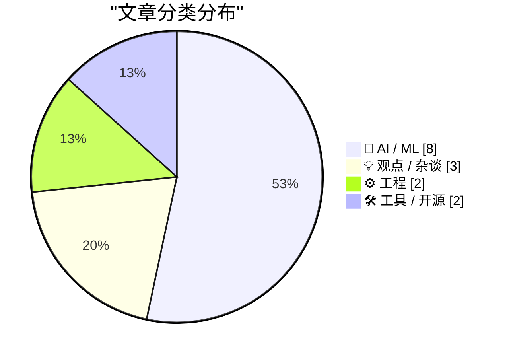
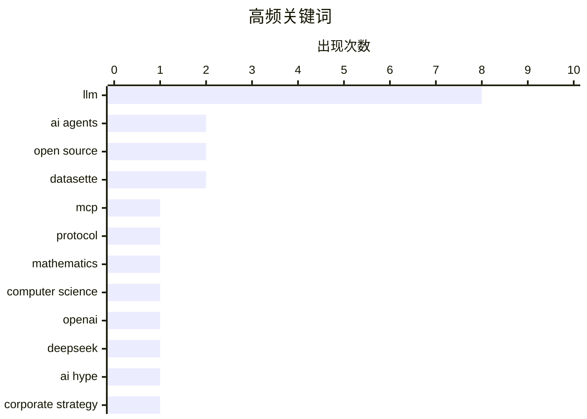

# 📰 Aug 2, 2026

> 来自 Karpathy 推荐的 92 个顶级技术博客，AI 精选 Top 15

## 📝 今日看点

今日技术圈见证了 AI 基础设施与工程范式的深度重构，开放权重模型的崛起正推动行业选型标准从单纯的“智能”转向以速度和效率为核心的实用主义。随着模型上下文协议（MCP）迈向无状态化以及智能体交互机制的突破，AI 落地正从理论探索加速转向更灵活、更轻量化的工程实践。与此同时，针对 AI 算力成本激增与行业宣传泡沫的理性反思也日益增多，预示着技术应用正进入一个更重实效的冷静期。

---

## 🏆 今日必读

🥇 **无状态 MCP 重新燃起了我的兴趣（并启发了 mcp-explorer 和 datasette-mcp）**

[Stateless MCP has recaptured my interest (and inspired mcp-explorer and datasette-mcp)](https://simonwillison.net/2026/Jul/31/stateless-mcp/#atom-everything) — simonwillison.net · 1 天前 · ⚙️ 工程

> 模型上下文协议（MCP）发布了 2.0 版本（正式名称为 2026-07-28 规范），引入了重大的“无状态”变更。这一更新解决了之前 MCP 规范中过于复杂的连接管理问题，使得客户端与服务器之间的交互更加简洁高效。作者为此开发了 mcp-explorer 用于可视化探索 MCP 服务器，并推出了 datasette-mcp 插件将 Datasette 暴露为 MCP 资源。无状态化标志着 MCP 协议走向成熟，极大地降低了开发者构建 AI 工具集成接口的门槛。这一转变让 MCP 从一个复杂的实验性协议变成了更具实用价值的基础设施。

💡 **为什么值得读**: 深入了解 MCP 2.0 协议的重大演进及其在实际 AI 工具开发中的应用潜力。

🏷️ MCP, LLM, protocol

🥈 **数学与理论计算机科学的十大进展**

[Ten advances in mathematics and theoretical computer science](https://simonwillison.net/2026/Aug/1/ten-advances-in-mathematics/#atom-everything) — simonwillison.net · 11 小时前 · 🤖 AI / ML

> OpenAI 总结了近期数学与理论计算机科学领域的十项突破性进展。此前 Anthropic 曾利用 Mythos Preview 版本的 Claude 模型，在投入 10 万美元 Token 成本的情况下发现了复杂的密码学漏洞。这些研究展示了前沿 AI 模型在处理非显而易见的科研难题（而非简单的“低垂果实”）方面的巨大潜力。文章强调了 AI 辅助证明和算法优化在推动基础科学边界方面的核心作用。这些进展预示着 AI 正在从代码助手进化为能够参与顶级科学发现的科研伙伴。

💡 **为什么值得读**: 洞察 AI 如何从简单的代码辅助进化到能够解决顶级数学和密码学难题的科研助手。

🏷️ mathematics, computer science, OpenAI

🥉 **DeepSeek-V4-Flash-0731 发布：性能超越更大规模模型的轻量化选择**

[deepseek-ai/DeepSeek-V4-Flash-0731](https://simonwillison.net/2026/Jul/31/deepseek-v4-flash-0731/#atom-everything) — simonwillison.net · 1 天前 · 🤖 AI / ML

> DeepSeek 发布了 V4 系列的最新成员 DeepSeek-V4-Flash-0731，重点增强了智能体（Agentic）能力。该模型拥有 3040 亿参数，在 Artificial Analysis 的排名中超越了参数量更大的 MiniMax M3（428B）。其输入价格极具竞争力，仅为每百万 Token 0.14 美元。这表明 DeepSeek 在模型架构优化和推理效率方面取得了显著进展，为开发者提供了高性价比的智能体构建方案。该模型的发布进一步加剧了大模型市场的性价比竞争。

💡 **为什么值得读**: 关注国产大模型在智能体能力和极致性价比方面的最新突破。

🏷️ DeepSeek, LLM, AI agents

---

## 📊 数据概览

| 扫描源 | 抓取文章 | 时间范围 | 精选 |
|:---:|:---:|:---:|:---:|
| 82/92 | 2493 篇 → 37 篇 | 48h | **15 篇** |

### 分类分布



### 高频关键词



<details>
<summary>📈 纯文本关键词图（终端友好）</summary>

```
llm              │ ████████████████████ 8
ai agents        │ █████░░░░░░░░░░░░░░░ 2
open source      │ █████░░░░░░░░░░░░░░░ 2
datasette        │ █████░░░░░░░░░░░░░░░ 2
mcp              │ ███░░░░░░░░░░░░░░░░░ 1
protocol         │ ███░░░░░░░░░░░░░░░░░ 1
mathematics      │ ███░░░░░░░░░░░░░░░░░ 1
computer science │ ███░░░░░░░░░░░░░░░░░ 1
openai           │ ███░░░░░░░░░░░░░░░░░ 1
deepseek         │ ███░░░░░░░░░░░░░░░░░ 1
```

</details>

### 🏷️ 话题标签

**llm**(8) · **ai agents**(2) · **open source**(2) · datasette(2) · mcp(1) · protocol(1) · mathematics(1) · computer science(1) · openai(1) · deepseek(1) · ai hype(1) · corporate strategy(1) · economics(1) · ai economics(1) · roi(1) · tech bubble(1) · performance(1) · inference speed(1) · latency(1) · ai safety(1)

---

## 🤖 AI / ML

### 1. 数学与理论计算机科学的十大进展

[Ten advances in mathematics and theoretical computer science](https://simonwillison.net/2026/Aug/1/ten-advances-in-mathematics/#atom-everything) — **simonwillison.net** · 11 小时前 · ⭐ 26/30

> OpenAI 总结了近期数学与理论计算机科学领域的十项突破性进展。此前 Anthropic 曾利用 Mythos Preview 版本的 Claude 模型，在投入 10 万美元 Token 成本的情况下发现了复杂的密码学漏洞。这些研究展示了前沿 AI 模型在处理非显而易见的科研难题（而非简单的“低垂果实”）方面的巨大潜力。文章强调了 AI 辅助证明和算法优化在推动基础科学边界方面的核心作用。这些进展预示着 AI 正在从代码助手进化为能够参与顶级科学发现的科研伙伴。

🏷️ mathematics, computer science, OpenAI

---

### 2. DeepSeek-V4-Flash-0731 发布：性能超越更大规模模型的轻量化选择

[deepseek-ai/DeepSeek-V4-Flash-0731](https://simonwillison.net/2026/Jul/31/deepseek-v4-flash-0731/#atom-everything) — **simonwillison.net** · 1 天前 · ⭐ 26/30

> DeepSeek 发布了 V4 系列的最新成员 DeepSeek-V4-Flash-0731，重点增强了智能体（Agentic）能力。该模型拥有 3040 亿参数，在 Artificial Analysis 的排名中超越了参数量更大的 MiniMax M3（428B）。其输入价格极具竞争力，仅为每百万 Token 0.14 美元。这表明 DeepSeek 在模型架构优化和推理效率方面取得了显著进展，为开发者提供了高性价比的智能体构建方案。该模型的发布进一步加剧了大模型市场的性价比竞争。

🏷️ DeepSeek, LLM, AI agents

---

### 3. 高级版：AI 的成本正变得过于昂贵

[Premium: AI Is Getting Way Too Expensive](https://www.wheresyoured.at/premium-ai-is-getting-way-too-expensive/) — **wheresyoured.at** · 1 天前 · ⭐ 26/30

> 文章深入分析了 AI 落地过程中被忽视的成本问题，指出当前的讨论过度集中在理论上的岗位流失或生产力提升。随着模型规模和算力需求的激增，运行 LLM 的实际开销正在迅速攀升，甚至超出了许多企业的承受能力。作者质疑，如果 AI 带来的效率增益无法覆盖其高昂的订阅和算力成本，那么所谓的技术革命将难以为继。核心观点认为，AI 行业必须从追求“理论价值”转向解决“成本效益”这一现实挑战。高昂的成本可能成为阻碍 AI 大规模普及的最大障碍。

🏷️ AI economics, LLM, ROI, tech bubble

---

### 4. 我现在的模型选型标准（基本）是速度而非智能

[I'm (mostly) picking models on speed now, not intelligence](https://martinalderson.com/posts/speed-vs-intelligence/?utm_source=rss&amp;utm_medium=rss&amp;utm_campaign=feed) — **martinalderson.com** · 8 小时前 · ⭐ 26/30

> 开发者 Martin Alderson 提出模型选型范式的转变：在模型智能水平趋同的当下，生成速度（Tokens per second）已成为首要考量指标。他认为 100 tok/s 将成为新的性能基准（类似于 Web 开发中的 100ms 响应延迟），能显著提升用户交互体验。文章预测，随着推理速度的提升，AI 市场将迎来一场激烈的价格战，低延迟将成为应用落地的核心竞争力。对于大多数日常任务，响应速度带来的“爽感”已超过了边际智能提升带来的价值。这种转变标志着 AI 应用开发进入了注重用户体验的成熟期。

🏷️ LLM, performance, inference speed, latency

---

### 5. 关于 AI 发展的公开信综述

[Open letters about AI development](https://simonwillison.net/2026/Aug/2/open-letters/#atom-everything) — **simonwillison.net** · 4 小时前 · ⭐ 25/30

> Simon Willison 总结了近期 AI 领域密集出现的几封公开信，重点关注了由微软主导的《开放权重与美国 AI 领导力》。该信件于 7 月 24 日发布，获得了 235 位 AI 相关从业者的签名支持，旨在游说政策制定者支持开源/开放权重模型的发展。文章梳理了这些公开信背后的利益博弈，包括安全监管、技术主权以及闭源巨头与开源社区之间的冲突。作者认为，这些公开信反映了行业在 AI 治理路径上的深度分歧。这些游说活动将直接影响未来 AI 监管政策的走向。

🏷️ AI safety, regulation, LLM

---

### 6. datasette-agent 0.4a0 发布

[datasette-agent 0.4a0](https://simonwillison.net/2026/Jul/31/datasette-agent/#atom-everything) — **simonwillison.net** · 1 天前 · ⭐ 22/30

> Datasette Agent 发布了 0.4a0 预览版，引入了突破性的 await context.browser_task() 机制。该功能允许智能体插件直接在用户的浏览器环境中执行自定义代码，实现了 AI 与前端交互的深度集成。通过这种方式，智能体不仅能处理后端数据，还能实时操控浏览器 UI 或执行客户端计算任务。这一更新极大地扩展了 Datasette 生态中 AI 助手的操作边界和响应能力。这标志着 AI 智能体正从单纯的文本交互向具备环境操控能力的“动作执行者”演进。

🏷️ AI agent, Datasette, browser automation

---

### 7. AI 常用语手册

[The AI Phrasebook](https://nesbitt.io/2026/07/31/the-ai-phrasebook.html) — **nesbitt.io** · 1 天前 · ⭐ 22/30

> 探讨了在家庭环境中使用自主代理（Autonomous Agents）的现状与交互方式。文章提出了“AI 常用语”的概念，旨在帮助用户更有效地与具备理解和执行能力的智能实体进行沟通。通过分析家庭自动化场景，展示了如何利用特定指令集来驱动 AI 完成复杂任务。作者认为，随着 AI 代理深入日常生活，建立一套标准化的交互语汇将成为提升用户体验的关键。核心观点在于，未来的智能家居不仅是设备的联网，更是基于自然语言理解的代理协作。

🏷️ AI agents, automation, LLM

---

### 8. 我是如何在博客中使用 AI 的

[How I use AI on this blog](https://www.gilesthomas.com/2026/07/ai-use) — **gilesthomas.com** · 1 天前 · ⭐ 21/30

> 分享了作者在博客创作流程中集成 AI 工具的具体实践与哲学思考。核心原则是将 AI 定位为“创意助手”而非替代者，主要用于头脑风暴、结构建议和初稿润色。文章详细记录了当前的 AI 工作流快照，以便未来回顾技术演进对创作模式的影响。作者强调了透明度的重要性，并参考了 LessWrong 的 AI 使用政策来界定人类创作与机器辅助的边界。最终观点认为，合理利用 AI 可以显著提升写作效率，但核心观点和灵魂必须保留在作者手中。

🏷️ AI, LLM, productivity, writing

---

## 💡 观点 / 杂谈

### 9. Pluralistic：为什么企业在 AI 问题上撒谎

[Pluralistic: Why businesses lie about AI (01 Aug 2026)](https://pluralistic.net/2026/08/01/dare-snot/) — **pluralistic.net** · 20 小时前 · ⭐ 26/30

> 知名作家 Cory Doctorow 探讨了企业在 AI 浪潮中普遍存在的虚假宣传现象，认为这往往是为了迎合上层意志而进行的“破产式幽默”。文章批评了当前的 AI 热潮中存在大量类似“弹簧高跷”式的骗局，许多所谓的生产力提升只是理论上的幻觉。作者指出，企业为了维持估值或展示创新，不惜在 LLM 的实际能力和替代人工的潜力上误导公众。这种集体性的谎言可能导致资源错配，并最终引发行业性的泡沫破裂。核心观点是，当前的 AI 繁荣很大程度上建立在对技术能力的过度承诺之上。

🏷️ AI hype, corporate strategy, economics

---

### 10. Oxide and Friends 播客：与 Simon Willison 聊开放权重革命

[Oxide and Friends: The Open Weight Revolution with Simon Willison](https://simonwillison.net/2026/Jul/31/oxide-and-friends/#atom-everything) — **simonwillison.net** · 1 天前 · ⭐ 24/30

> 在本期播客中，Simon Willison 与 Oxide 团队讨论了“开放权重模型革命”这一转折性时刻。讨论重点提及了 Kimi K3 等模型，证明了开放权重模型已具备与闭源顶尖模型正面竞争的实力。节目还探讨了近期 OpenAI 遭受的网络攻击以及这些事件对 AI 安全和透明度的影响。核心观点认为，开放权重模型的崛起正在打破闭源巨头的垄断，重塑 AI 生态的权力结构。这种趋势为开发者提供了更多的自主权和更低的创新门槛。

🏷️ open weights, LLM, open source

---

### 11. Pluralistic：先斩后奏胜过按部就班

[Pluralistic: Better to beg forgiveness (31 Jul 2026)](https://pluralistic.net/2026/07/31/just-do-it/) — **pluralistic.net** · 1 天前 · ⭐ 21/30

> 深入探讨了在技术创新与法律监管博弈中“先行动后请求原谅”的策略逻辑。文章通过分析数字经济法案、版权断网流程以及 P2P 技术的历史演变，揭示了过度许可制度对创新的阻碍。文中列举了从 Moxie Marlinspike 的个人简介到 V&A 博物馆禁止素描等多个案例，批判了当前数字环境中的版权控制与监控趋势。作者 Cory Doctorow 强调，在面对官僚主义的“拒绝之屋”时，直接行动往往是推动社会和技术进步的唯一途径。结论呼吁读者在数字权利受限的时代，应更具反叛精神地去创造和维护开放平台。

🏷️ innovation, legal strategy, tech policy

---

## ⚙️ 工程

### 12. 无状态 MCP 重新燃起了我的兴趣（并启发了 mcp-explorer 和 datasette-mcp）

[Stateless MCP has recaptured my interest (and inspired mcp-explorer and datasette-mcp)](https://simonwillison.net/2026/Jul/31/stateless-mcp/#atom-everything) — **simonwillison.net** · 1 天前 · ⭐ 28/30

> 模型上下文协议（MCP）发布了 2.0 版本（正式名称为 2026-07-28 规范），引入了重大的“无状态”变更。这一更新解决了之前 MCP 规范中过于复杂的连接管理问题，使得客户端与服务器之间的交互更加简洁高效。作者为此开发了 mcp-explorer 用于可视化探索 MCP 服务器，并推出了 datasette-mcp 插件将 Datasette 暴露为 MCP 资源。无状态化标志着 MCP 协议走向成熟，极大地降低了开发者构建 AI 工具集成接口的门槛。这一转变让 MCP 从一个复杂的实验性协议变成了更具实用价值的基础设施。

🏷️ MCP, LLM, protocol

---

### 13. 在 Mac Studio 上实现 25 Gbps 雷电以太网连接

[Getting 25 Gbps Thunderbolt Ethernet on my Mac Studio](https://www.jeffgeerling.com/blog/2026/getting-25g-ethernet-mac-thunderbolt/) — **jeffgeerling.com** · 1 天前 · ⭐ 22/30

> 探讨了如何突破 Mac Studio 内置 10GbE 网口的限制，通过雷电接口（Thunderbolt）升级至 25 Gbps 高速网络。作者在升级机架网络后，寻求比现有 1 GB/s 备份速度更快的方案，以提升从 NAS 直接编辑 4K 视频的效率。文中详细介绍了所需的硬件选型，包括雷电转 SFP28 适配器以及兼容的 25G 交换机配置。通过实际测试验证了在 macOS 环境下实现近乎理论带宽的吞吐量表现。结论是对于重度视频剪辑和大规模数据备份用户，雷电 25G 方案是目前 Mac 平台的极致网络升级路径。

🏷️ Thunderbolt, Ethernet, Mac Studio, networking

---

## 🛠 工具 / 开源

### 14. smevals：一个用于评估模型、提示词和测试框架的小型评测套件

[smevals - a small eval suite for evaluating models, prompts, and harnesses](https://simonwillison.net/2026/Jul/31/smevals/#atom-everything) — **simonwillison.net** · 1 天前 · ⭐ 24/30

> Simon Willison 与 Prime Radiant 实验室合作开发了名为 smevals 的轻量级评测工具，旨在解决模型能力评估的复杂性。该套件允许开发者针对特定任务快速测试不同模型、Prompt 策略以及测试框架的效果。通过标准化的评估流程，smevals 能够提供更具参考价值的性能指标，帮助开发者在模型选型时做出数据驱动的决策。该工具已在 GitHub 开源，强调简单易用和可扩展性。它填补了大型评测基准与开发者日常微调需求之间的空白。

🏷️ LLM evaluation, benchmarking, AI tools

---

### 15. datasette-apps 0.2a0 版本发布

[datasette-apps 0.2a0](https://simonwillison.net/2026/Aug/1/datasette-apps/#atom-everything) — **simonwillison.net** · 11 小时前 · ⭐ 20/30

> 宣布了 datasette-apps 0.2a0 预览版的发布，重点增强了与 Datasette Agent 的集成能力。新版本引入了 app_debug() 工具，允许 AI 代理在后台静默打开并使用 JavaScript 测试应用程序，显著提升了自动化调试效率。同时新增了 app_list() 接口，优化了代理对已创建应用的检索与管理流程。该版本旨在通过工具调用（Tool Calling）机制，让 AI 能够更深度地参与到 Datasette 应用的构建与验证中。结论是这一更新标志着 Datasette 生态向“AI 驱动的应用开发”迈出了重要一步。

🏷️ Datasette, SQLite, open source

---

*生成于 2026-08-02 08:33 | 扫描 82 源 → 获取 2493 篇 → 精选 15 篇*
*基于 [Hacker News Popularity Contest 2025](https://refactoringenglish.com/tools/hn-popularity/) RSS 源列表，由 [Andrej Karpathy](https://x.com/karpathy) 推荐*
