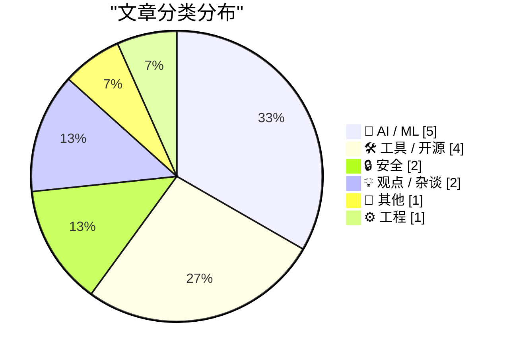
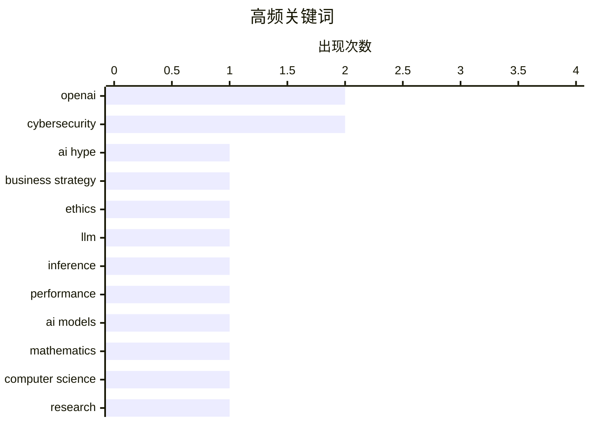

# 📰 Aug 3, 2026

> 来自 Karpathy 推荐的 92 个顶级技术博客，AI 精选 Top 15

## 📝 今日看点

今日技术圈呈现出从 AI 狂热转向务实应用与政策博弈的显著趋势。开发者正将模型选型标准从极致智能转向“毫秒级”响应速度，而关于企业 AI 泡沫的警示与开源权重战略价值的讨论正重塑行业共识。与此同时，全球网络安全合作与供应链防御持续深化，配合苹果强劲的财报表现，揭示了技术生态在应用落地与合规监管双重驱动下的演进逻辑。

---

## 🏆 今日必读

🥇 **为什么企业在 AI 问题上撒谎：陪老板一路走向破产**

[Pluralistic: Why businesses lie about AI (01 Aug 2026)](https://pluralistic.net/2026/08/01/dare-snot/) — pluralistic.net · 1 天前 · 🤖 AI / ML

> 企业在 AI 能力上撒谎已成为普遍现象，目的是迎合上层决策者而非解决实际问题。Cory Doctorow 指出这种行为正在将企业推向破产边缘，他将当前的 AI 浪潮比作“弹跳杆式骗局”（pogo-stick grift）。文章探讨了 AI 炒作背后的激励机制，以及这种虚假繁荣如何掩盖了 Web DRM 和可访问性等深层技术债务。作者认为，这种集体幻觉最终会导致严重的经济后果。这种“幽默感”式的盲从正在损害企业的长期生存能力。

💡 **为什么值得读**: 揭示了 AI 繁荣背后的职场政治与商业泡沫，适合对 AI 产业现状持批判性思考的读者。

🏷️ AI hype, business strategy, ethics

🥈 **我现在的模型选型标准：速度优先，智能次之**

[I'm (mostly) picking models on speed now, not intelligence](https://martinalderson.com/posts/speed-vs-intelligence/?utm_source=rss&amp;utm_medium=rss&amp;utm_campaign=feed) — martinalderson.com · 1 天前 · 🤖 AI / ML

> 开发者在选择日常使用的 AI 模型时，正从追求极致智能转向追求生成速度。目前 ~100 tok/s 已成为新的性能基准，类似于 Web 开发中的 100ms 响应延迟标准。文章分析了速度提升在何处会达到边际效应递减，并预言了即将到来的模型价格战。作者认为，在智能水平趋同的情况下，响应效率将决定模型的最终胜出。对于大多数交互式应用，速度带来的体验提升已超过了微小的逻辑能力差异。

💡 **为什么值得读**: 提出了 AI 模型选型的新维度，对关注 LLM 落地效率和用户体验的开发者极具参考价值。

🏷️ LLM, inference, performance, AI models

🥉 **数学与理论计算机科学的十大进展**

[Ten advances in mathematics and theoretical computer science](https://simonwillison.net/2026/Aug/1/ten-advances-in-mathematics/#atom-everything) — simonwillison.net · 1 天前 · 🤖 AI / ML

> OpenAI 发布了关于数学和理论计算机科学十项进展的报告，展示了 AI 在前沿研究中的潜力。此前 Anthropic 曾利用 Mythos Preview 版本的 Claude 发现了复杂的密码学漏洞，该过程消耗了价值 10 万美元的 Token。研究重点已从解决简单问题转向真正的科研攻关，强调了大规模计算资源在理论突破中的作用。文章还对比了不同厂商在处理高难度研究任务时的策略差异。这标志着 AI 辅助科研正进入高投入、高回报的深度探索阶段。

💡 **为什么值得读**: 汇总了 AI 在硬核科学领域的最前沿应用，展示了从“写代码”到“做科研”的跨越。

🏷️ Mathematics, Computer Science, OpenAI, Research

---

## 📊 数据概览

| 扫描源 | 抓取文章 | 时间范围 | 精选 |
|:---:|:---:|:---:|:---:|
| 82/92 | 2497 篇 → 29 篇 | 48h | **15 篇** |

### 分类分布



### 高频关键词



<details>
<summary>📈 纯文本关键词图（终端友好）</summary>

```
openai            │ ████████████████████ 2
cybersecurity     │ ████████████████████ 2
ai hype           │ ██████████░░░░░░░░░░ 1
business strategy │ ██████████░░░░░░░░░░ 1
ethics            │ ██████████░░░░░░░░░░ 1
llm               │ ██████████░░░░░░░░░░ 1
inference         │ ██████████░░░░░░░░░░ 1
performance       │ ██████████░░░░░░░░░░ 1
ai models         │ ██████████░░░░░░░░░░ 1
mathematics       │ ██████████░░░░░░░░░░ 1
```

</details>

### 🏷️ 话题标签

**openai**(2) · **cybersecurity**(2) · **ai hype**(1) · business strategy(1) · ethics(1) · llm(1) · inference(1) · performance(1) · ai models(1) · mathematics(1) · computer science(1) · research(1) · claude code(1) · anthropic(1) · prompt engineering(1) · coding assistant(1) · drm(1) · privacy(1) · policy(1) · ai policy(1)

---

## 🤖 AI / ML

### 1. 为什么企业在 AI 问题上撒谎：陪老板一路走向破产

[Pluralistic: Why businesses lie about AI (01 Aug 2026)](https://pluralistic.net/2026/08/01/dare-snot/) — **pluralistic.net** · 1 天前 · ⭐ 27/30

> 企业在 AI 能力上撒谎已成为普遍现象，目的是迎合上层决策者而非解决实际问题。Cory Doctorow 指出这种行为正在将企业推向破产边缘，他将当前的 AI 浪潮比作“弹跳杆式骗局”（pogo-stick grift）。文章探讨了 AI 炒作背后的激励机制，以及这种虚假繁荣如何掩盖了 Web DRM 和可访问性等深层技术债务。作者认为，这种集体幻觉最终会导致严重的经济后果。这种“幽默感”式的盲从正在损害企业的长期生存能力。

🏷️ AI hype, business strategy, ethics

---

### 2. 我现在的模型选型标准：速度优先，智能次之

[I'm (mostly) picking models on speed now, not intelligence](https://martinalderson.com/posts/speed-vs-intelligence/?utm_source=rss&amp;utm_medium=rss&amp;utm_campaign=feed) — **martinalderson.com** · 1 天前 · ⭐ 27/30

> 开发者在选择日常使用的 AI 模型时，正从追求极致智能转向追求生成速度。目前 ~100 tok/s 已成为新的性能基准，类似于 Web 开发中的 100ms 响应延迟标准。文章分析了速度提升在何处会达到边际效应递减，并预言了即将到来的模型价格战。作者认为，在智能水平趋同的情况下，响应效率将决定模型的最终胜出。对于大多数交互式应用，速度带来的体验提升已超过了微小的逻辑能力差异。

🏷️ LLM, inference, performance, AI models

---

### 3. 数学与理论计算机科学的十大进展

[Ten advances in mathematics and theoretical computer science](https://simonwillison.net/2026/Aug/1/ten-advances-in-mathematics/#atom-everything) — **simonwillison.net** · 1 天前 · ⭐ 26/30

> OpenAI 发布了关于数学和理论计算机科学十项进展的报告，展示了 AI 在前沿研究中的潜力。此前 Anthropic 曾利用 Mythos Preview 版本的 Claude 发现了复杂的密码学漏洞，该过程消耗了价值 10 万美元的 Token。研究重点已从解决简单问题转向真正的科研攻关，强调了大规模计算资源在理论突破中的作用。文章还对比了不同厂商在处理高难度研究任务时的策略差异。这标志着 AI 辅助科研正进入高投入、高回报的深度探索阶段。

🏷️ Mathematics, Computer Science, OpenAI, Research

---

### 4. Boris Cherny 谈如何让 Claude Code 重写 Claude 应用

[Boris Cherny on Trying to Get Claude Code to Rewrite the Claude App](https://www.ycrootaccess.com/p/boris-cherny-building-claude-code) — **daringfireball.net** · 12 小时前 · ⭐ 25/30

> Anthropic 的 Claude Code 负责人 Boris Cherny 在 YC 创业学校分享了如何让 AI 完成重构自身应用等高难度任务。他认为现在的核心技能已不再是提示词工程（Prompt Engineering），而是如何拆解任务并建立验证机制。通过让 Claude 在执行过程中不断自我验证，可以突破其原有的能力边界。这种“验证驱动”的方法论为处理复杂软件工程任务提供了新思路。作者强调，给 AI 一个“看起来太难”的任务并提供验证工具是提升产出的关键。

🏷️ Claude Code, Anthropic, Prompt engineering, Coding assistant

---

### 5. 关于 AI 发展的公开信汇总

[Open letters about AI development](https://simonwillison.net/2026/Aug/2/open-letters/#atom-everything) — **simonwillison.net** · 1 天前 · ⭐ 24/30

> 汇总了近期关于 AI 发展的多封公开信，重点关注由微软主导的《开放权重与美国 AI 领导力》声明。该信件获得了 235 位 AI 领域专家和从业者的签署，旨在强调开源权重对维持技术竞争力的核心作用。文章梳理了支持与反对开源 AI 的不同阵营观点，分析了政策监管对模型分发模式的影响。作者认为，这一系列公开信反映了行业对 AI 治理权的高度焦虑。讨论的核心在于如何在安全监管与技术创新之间取得平衡。

🏷️ AI policy, open letter, regulation, safety

---

## 🛠 工具 / 开源

### 6. 包管理周报：2026 年 8 月 1 日

[This Week in Package Management: 1 August 2026](https://nesbitt.io/2026/08/01/this-week-in-package-management.html) — **nesbitt.io** · 1 天前 · ⭐ 23/30

> 本周软件包管理简报汇总了 2026 年 8 月初全球包管理生态的最新动态。内容涵盖了主流包管理器的版本发布、安全预警以及相关的技术深度文章。重点关注了供应链安全领域的最新漏洞通报和防御策略更新。对于需要维护大型依赖库的开发者来说，这是获取生态系统健康状况的快速通道。简报还提及了针对特定语言包管理工具的性能优化讨论。通过阅读此类汇总，开发者可以有效规避潜在的依赖风险。

🏷️ package management, security, devops

---

### 7. condense-json 1.0 版本发布

[condense-json 1.0](https://simonwillison.net/2026/Aug/2/condense-json/#atom-everything) — **simonwillison.net** · 11 小时前 · ⭐ 20/30

> 开发者 Simon Willison 发布了小巧的 JSON 处理库 condense-json 的 1.0 正式版。该库已开发一年半，旨在通过合理的压缩和格式化逻辑使 JSON 数据更加紧凑且易读。1.0 版本包含了一系列非破坏性的修复，标志着 API 的成熟与稳定。作者借此机会分享了对发布 1.0 版本的心理跨越，以及该工具在实际开发中的应用场景。该工具特别适用于需要在有限空间内展示复杂 JSON 结构的场景。

🏷️ JSON, CLI, data processing, Python

---

### 8. datasette-apps 0.2a0 发布：增强 AI 代理的应用构建能力

[datasette-apps 0.2a0](https://simonwillison.net/2026/Aug/1/datasette-apps/#atom-everything) — **simonwillison.net** · 1 天前 · ⭐ 19/30

> Datasette 插件 datasette-apps 发布 0.2a0 版本，重点优化了与 Datasette Agent 的协同工作流。新版本引入了 app_debug() 工具，允许 AI 代理在后台静默打开并使用 JavaScript 测试应用。同时新增的 app_list() 等工具进一步增强了代理对应用的感知与管理能力。这些改进旨在让 AI 能够更自主地创建、调试和迭代基于 Datasette 的数据应用。该版本标志着 AI 在自动化软件工程领域向“闭环调试”迈进了一步。

🏷️ Datasette, LLM agents, SQLite, web apps

---

### 9. Agent Fone：让用户通过 AI 随手构建应用的智能手机

[Agent Fone](https://fail.xyz/phone/) — **daringfireball.net** · 12 小时前 · ⭐ 18/30

> 介绍了一款名为 Agent Fone 的新型智能手机，其核心卖点是内置的 AI 软件构建能力。用户无需编写代码，只需通过描述想法并回答几个问题，手机就能实时生成自定义应用或小组件并部署到主屏幕。该方案旨在打破传统应用商店的限制，让用户能够针对个人微小需求快速创建工具。这种“按需构建”的模式预示了移动操作系统从“应用分发”向“应用生成”的范式转移。它挑战了传统软件开发的门槛，将手机转变为一个动态的创作平台。

🏷️ Smartphone, AI assistant, Hardware, Custom software

---

## 🔒 安全

### 10. 二元论：为什么不能两者兼得？

[Pluralistic: Dualism (03 Aug 2026)](https://pluralistic.net/2026/08/03/andor/) — **pluralistic.net** · 1 小时前 · ⭐ 25/30

> 文章探讨了技术领域的二元性，重点关注数字权利与监管之间的博弈。内容涵盖了英国防火墙的倒塌、Getty Images 对 4.7 万张照片的“版权欺诈”指控，以及实名制政策的彻底失败。作者通过多个案例指出，技术既可以作为解放工具，也常被用于实施数字版权管理（DRM）和监控。核心观点强调了在复杂政策环境下保护开放互联网的重要性。文章提醒读者，技术进步往往伴随着权利的侵蚀，需要警惕“版权欺诈”等新型法律手段。

🏷️ DRM, privacy, cybersecurity, policy

---

### 11. 欢迎尼泊尔政府加入 Have I Been Pwned 服务

[Welcoming the Nepalese Government to Have I Been Pwned](https://www.troyhunt.com/welcoming-the-nepalese-government-to-have-i-been-pwned/) — **troyhunt.com** · 3 小时前 · ⭐ 24/30

> 尼泊尔政府正式加入 Have I Been Pwned (HIBP) 的免费政府服务，成为第 47 个合作伙伴。尼泊尔国家网络安全中心（NCSC）现在可以利用 HIBP 的数据库监控其政府域名的泄露情况。该服务允许安全机构及时识别受损的政府电子邮件地址，从而在数据泄露演变为更大威胁前采取行动。这标志着全球政府在利用社区安全工具应对网络威胁方面迈出了新的一步。目前已有数十个国家通过此机制增强了其国家级网络防御能力。

🏷️ HIBP, cybersecurity, data breach, government

---

## 💡 观点 / 杂谈

### 12. 引用 Greg Brockman：AI 不应成为人际关系的隔阂

[Quoting Greg Brockman](https://simonwillison.net/2026/Aug/1/greg-brockman/#atom-everything) — **simonwillison.net** · 1 天前 · ⭐ 19/30

> 探讨了 OpenAI 内部员工将 ChatGPT 接入 Slack 后引发的社交反馈。员工普遍反感同事的 AI 代理直接请求协助，即便他们非常乐意亲自帮助该同事。这一现象揭示了人类对真实社交关系的极度重视，以及对 AI 介入人际互动边界的敏感。作者认为 AI 的核心价值应是为人类节省时间或增强面对面的交流，而非成为人际沟通中的隔离层。这种心理抗拒提醒开发者在构建协作 AI 时需考虑社交礼仪与情感连接。

🏷️ AI agents, Slack, collaboration, OpenAI

---

### 13. 书评：Marcus Hutter 的《无就业乌托邦》

[Review: Job-Less Utopia](https://borretti.me/article/review-job-less-utopia) — **borretti.me** · 9 小时前 · ⭐ 19/30

> 对 Marcus Hutter 关于 AI 导致劳动力终结的著作《无就业乌托邦》进行了深度评述。文章探讨了在通用人工智能（AGI）实现后，人类社会如何从以劳动为中心转向资源极大丰富的后稀缺时代。核心论点围绕自动化对经济结构的重塑，以及在没有传统工作的情况下人类如何寻找生存意义。作者分析了 Hutter 愿景中的技术可行性及其对社会契约的潜在冲击。结论指出，应对这一转变需要从根本上重新定义财富分配与社会价值。

🏷️ AI, automation, future of work

---

## 📝 其他

### 14. 苹果 2026 年第三季度财报分析

[Apple Q3 2026 Results](https://sixcolors.com/post/2026/07/apple-announces-record-q3-results/) — **daringfireball.net** · 1 天前 · ⭐ 22/30

> 苹果公司发布 2026 财年第三季度财报，总营收达 1094 亿美元，同比增长 16%。其中 iPhone 业务表现强劲，增长 22%，而 iPad 业务则下滑 6%。这是蒂姆·库克担任 CEO 15 年来的最后一次财报会议，标志着一个时代的结束。财报数据反映了苹果在服务业务和核心硬件上的持续统治力，同时也引发了市场对继任者的关注。Mac 业务和可穿戴设备也分别实现了 10.4% 和 6% 的稳健增长。

🏷️ Apple, Earnings, Financials, Revenue

---

## ⚙️ 工程

### 15. 夹缝中的电话系统：从单一机器到互联网络

[telephones caught in between](https://computer.rip/2026-08-02-telephone-leasing.html) — **computer.rip** · 1 天前 · ⭐ 19/30

> 回顾了 AT&T 鼎盛时期电话系统的演进史，探讨其作为“人类建造的最大机器”的独特性。与互联网这种由互联设备组成的松散系统不同，早期的电话网络在设计和管理上更像是一个单一、庞大的整体设备。通过分析 AT&T “一个政策、一个系统、普遍服务”的口号，文章揭示了电信基础设施从高度集权到分布式架构的转变。这种定义上的差异反映了底层通信协议和商业模式对技术形态的深远影响。作者引导读者思考，当下的复杂网络系统是否还能被视为单一的实体。

🏷️ networking, infrastructure, internet, telephony

---

*生成于 2026-08-03 09:59 | 扫描 82 源 → 获取 2497 篇 → 精选 15 篇*
*基于 [Hacker News Popularity Contest 2025](https://refactoringenglish.com/tools/hn-popularity/) RSS 源列表，由 [Andrej Karpathy](https://x.com/karpathy) 推荐*
