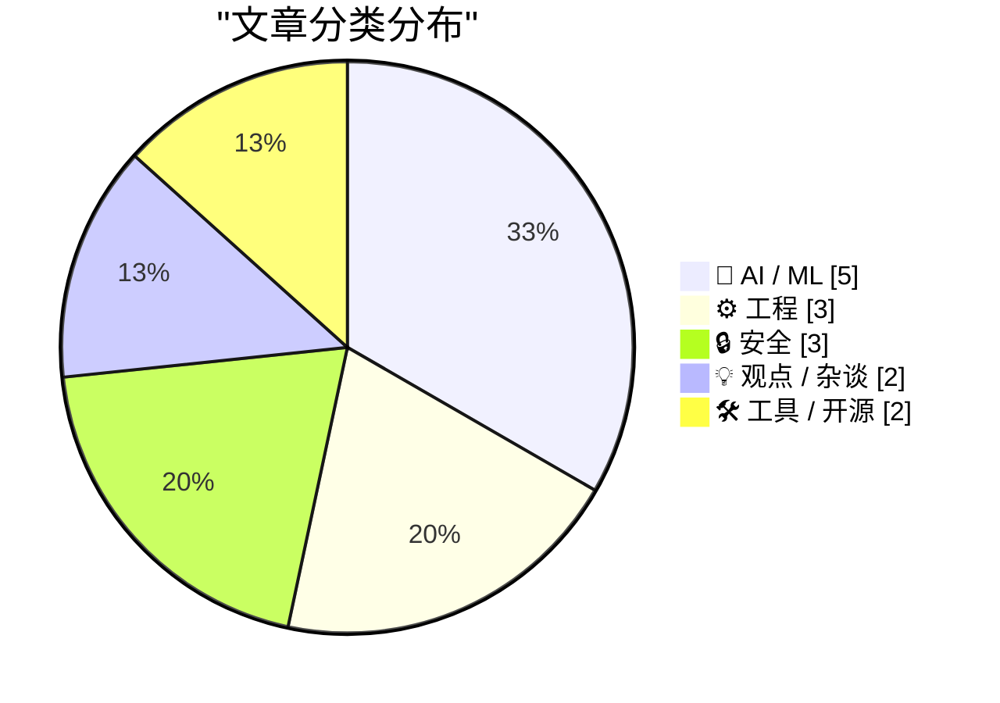
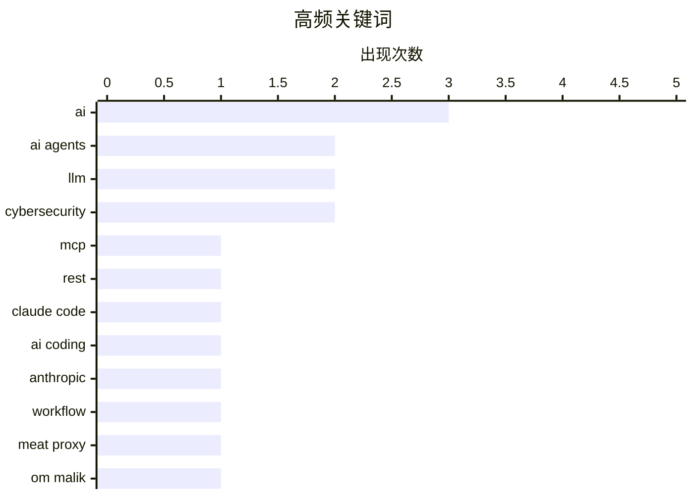

# 📰 Aug 4, 2026

> 来自 Karpathy 推荐的 92 个顶级技术博客，AI 精选 Top 15

## 📝 今日看点

AI 智能体正从简单的对话交互转向深层的协议集成与任务重构，开发者需在 MCP 协议应用与“肉身代理”陷阱之间寻找新的平衡。与此同时，算力成本的指数级增长预期与开发者工具开源化的讨论，揭示了技术演进背后的资源焦虑与透明度诉求。在追求极致效率的过程中，科技巨头的安全矛盾与权力神话也促使行业重新审视技术与人的本质关系。

---

## 🏆 今日必读

🥇 **MCP vs. REST：将智能体连接到 API 的正确方式**

[[Sponsor] MCP vs. REST: The Right Way to Connect Agents to Your API](https://workos.com/blog/mcp-vs-rest?utm_source=daringfireball&amp;utm_medium=newsletter&amp;utm_campaign=q32026) — daringfireball.net · 10 小时前 · 🤖 AI / ML

> 随着 AI 智能体（Agents）的兴起，开发者面临在 MCP（模型上下文协议）和 REST 之间做选择的困惑。实际上两者并非竞争关系，而是互补的层级结构：MCP 负责服务智能体，而 REST 负责服务开发者。高效的 MCP 服务器通常在内部调用 REST 接口，但不应机械地转换每个端点，而应围绕智能体的任务目标进行设计。此外，部署 MCP 服务器还需配套 OAuth 2.1 等安全授权机制，WorkOS AuthKit 等工具已提供相关支持。

💡 **为什么值得读**: 厘清了 AI 时代 API 协议的新演进方向，为开发者提供了将现有服务接入 AI 生态的架构思路。

🏷️ MCP, REST, AI agents

🥈 **Anthropic 负责人谈 Claude Code：如何让 AI 重写自身应用**

[Boris Cherny on Trying to Get Claude Code to Rewrite the Claude App](https://www.ycrootaccess.com/p/boris-cherny-building-claude-code) — daringfireball.net · 1 天前 · 🤖 AI / ML

> Anthropic 的 Claude Code 负责人 Boris Cherny 分享了引导 AI 完成高难度任务的经验。他认为现在的核心技能已从“提示词工程”转向如何定义任务边界，并让 AI 能够自我验证工作成果。通过将看似“过难”的任务拆解，并建立验证机制，开发者可以显著提升 AI 处理复杂逻辑的成功率。这种方法论在尝试让 Claude Code 重写 Claude 自身应用的过程中得到了验证。

💡 **为什么值得读**: 揭示了 AI 编程从“写代码”向“设计验证闭环”的范式转移，对高级开发者极具启发。

🏷️ Claude Code, LLM, AI coding, Anthropic

🥉 **拒绝做“肉身代理”：不要盲目搬运 AI 输出**

[Don't be a meat proxy](https://simonwillison.net/2026/Aug/3/dont-be-a-meat-proxy/#atom-everything) — simonwillison.net · 9 小时前 · 🤖 AI / ML

> 程序员 Niklas Gruhn 提出了“肉身代理”（meat proxy）这一新词，讽刺那些在工作中直接复制粘贴 AI 生成内容给同事的行为。他强调，使用 AI 提效无可厚非，但直接转发输出会丧失个人的信用和价值。真正的价值在于阅读、理解并验证 AI 的结果，最后用自己的语言重新表述。这种“二次加工”不仅是质量保证，更是证明你已履行职责的凭证。

💡 **为什么值得读**: 警示 AI 时代的职场人，避免因过度依赖工具而丧失核心竞争力。

🏷️ AI, workflow, meat proxy

---

## 📊 数据概览

| 扫描源 | 抓取文章 | 时间范围 | 精选 |
|:---:|:---:|:---:|:---:|
| 79/92 | 2455 篇 → 28 篇 | 48h | **15 篇** |

### 分类分布



### 高频关键词



<details>
<summary>📈 纯文本关键词图（终端友好）</summary>

```
ai            │ ████████████████████ 3
ai agents     │ █████████████░░░░░░░ 2
llm           │ █████████████░░░░░░░ 2
cybersecurity │ █████████████░░░░░░░ 2
mcp           │ ███████░░░░░░░░░░░░░ 1
rest          │ ███████░░░░░░░░░░░░░ 1
claude code   │ ███████░░░░░░░░░░░░░ 1
ai coding     │ ███████░░░░░░░░░░░░░ 1
anthropic     │ ███████░░░░░░░░░░░░░ 1
workflow      │ ███████░░░░░░░░░░░░░ 1
```

</details>

### 🏷️ 话题标签

**ai**(3) · **ai agents**(2) · **llm**(2) · cybersecurity(2) · mcp(1) · rest(1) · claude code(1) · ai coding(1) · anthropic(1) · workflow(1) · meat proxy(1) · om malik(1) · tech culture(1) · journalism(1) · coding(1) · ai economics(1) · compute(1) · scaling laws(1) · com(1) · windows(1)

---

## 🤖 AI / ML

### 1. MCP vs. REST：将智能体连接到 API 的正确方式

[[Sponsor] MCP vs. REST: The Right Way to Connect Agents to Your API](https://workos.com/blog/mcp-vs-rest?utm_source=daringfireball&amp;utm_medium=newsletter&amp;utm_campaign=q32026) — **daringfireball.net** · 10 小时前 · ⭐ 26/30

> 随着 AI 智能体（Agents）的兴起，开发者面临在 MCP（模型上下文协议）和 REST 之间做选择的困惑。实际上两者并非竞争关系，而是互补的层级结构：MCP 负责服务智能体，而 REST 负责服务开发者。高效的 MCP 服务器通常在内部调用 REST 接口，但不应机械地转换每个端点，而应围绕智能体的任务目标进行设计。此外，部署 MCP 服务器还需配套 OAuth 2.1 等安全授权机制，WorkOS AuthKit 等工具已提供相关支持。

🏷️ MCP, REST, AI agents

---

### 2. Anthropic 负责人谈 Claude Code：如何让 AI 重写自身应用

[Boris Cherny on Trying to Get Claude Code to Rewrite the Claude App](https://www.ycrootaccess.com/p/boris-cherny-building-claude-code) — **daringfireball.net** · 1 天前 · ⭐ 26/30

> Anthropic 的 Claude Code 负责人 Boris Cherny 分享了引导 AI 完成高难度任务的经验。他认为现在的核心技能已从“提示词工程”转向如何定义任务边界，并让 AI 能够自我验证工作成果。通过将看似“过难”的任务拆解，并建立验证机制，开发者可以显著提升 AI 处理复杂逻辑的成功率。这种方法论在尝试让 Claude Code 重写 Claude 自身应用的过程中得到了验证。

🏷️ Claude Code, LLM, AI coding, Anthropic

---

### 3. 拒绝做“肉身代理”：不要盲目搬运 AI 输出

[Don't be a meat proxy](https://simonwillison.net/2026/Aug/3/dont-be-a-meat-proxy/#atom-everything) — **simonwillison.net** · 9 小时前 · ⭐ 25/30

> 程序员 Niklas Gruhn 提出了“肉身代理”（meat proxy）这一新词，讽刺那些在工作中直接复制粘贴 AI 生成内容给同事的行为。他强调，使用 AI 提效无可厚非，但直接转发输出会丧失个人的信用和价值。真正的价值在于阅读、理解并验证 AI 的结果，最后用自己的语言重新表述。这种“二次加工”不仅是质量保证，更是证明你已履行职责的凭证。

🏷️ AI, workflow, meat proxy

---

### 4. 智能体编程技巧：如何高效利用 AI Agent 写代码

[Agentic coding techniques](https://micahflee.com/agentic-coding-techniques/) — **micahflee.com** · 16 小时前 · ⭐ 25/30

> Micah Lee 分享了他在实际开发中使用 AI 智能体（Agents）的经验。他指出，相比于在每个 App 中强塞 AI 或生成低质量内容，智能体编程是目前最实用的 AI 应用场景之一。成功的关键在于使用者必须具备深厚的编程功底，并对 AI 生成的每一行代码进行严格审查。文章探讨了如何通过合理的任务分配和反馈循环，让 AI 真正成为提升生产力的助手而非累赘。

🏷️ AI agents, LLM, coding

---

### 5. 为什么更聪明的 AI 模型可能导致算力价格飙升 10 倍

[Why smarter AI models could drive up compute prices 10x](https://www.dwarkesh.com/p/why-compute-might-get-10x-more-expensive-video) — **dwarkesh.com** · 15 小时前 · ⭐ 25/30

> Dwarkesh Patel 探讨了 AI 算力成本可能迎来剧烈上涨的逻辑，挑战了“算力会越来越便宜”的常识。随着模型智能程度的提升，训练和推理所需的计算资源呈指数级增长，这可能终结“廉价算力”时代。文章分析了模型规模与性能提升之间的边际效应，以及这种趋势对初创公司和算力市场的潜在冲击。如果这一预测成真，算力将成为比现在更加稀缺和昂贵的战略资源。

🏷️ AI economics, compute, scaling laws

---

## ⚙️ 工程

### 6. 创建伪敏捷包装器：技术上敏捷但受限于宿主单元（第一部分）

[Creating a fake agile wrapper that is technically agile but is not useful outside its home apartment, part 1](https://devblogs.microsoft.com/oldnewthing/20260803-00/?p=112582) — **devblogs.microsoft.com/oldnewthing** · 18 小时前 · ⭐ 24/30

> Windows 开发专家 Raymond Chen 探讨了 COM（组件对象模型）中一种特殊的引用处理技巧。在处理 COM 对象时，开发者有时需要一种介于强引用和弱引用之间的机制。文章介绍了一种“伪敏捷”（Fake Agile）包装器的实现方案，使其在技术指标上符合敏捷性要求，但在实际使用中仍受限于其创建时的套间（Apartment）。这种方案解决了在特定多线程环境下，既要保持引用有效性又要遵守套间限制的难题。

🏷️ COM, Windows, C++, threading

---

### 7. 开发者工具必须开源：exe.dev 的观点

[Devtools must be open source (exe.dev)](https://simonwillison.net/2026/Aug/3/devtools-must-be-open-source-exedev/#atom-everything) — **simonwillison.net** · 17 小时前 · ⭐ 23/30

> Simon Willison 评论了关于开发者工具必须开源的讨论，指出开源的核心价值在于社区的共同维护和审查透明度。即使是专家级程序员，也往往依赖于“他人可以修改代码”这一安全垫，而非每次都亲自修改。文章强调，对于开发者生命周期中至关重要的工具，闭源带来的黑盒效应和供应商锁定是不可接受的风险。开源不仅是自由，更是对工具长久生命力和安全性的保障。

🏷️ open source, devtools, software freedom

---

### 8. 《理解“人为错误”实地指南》书评：超越对个体的指责

[Book Review: The Field Guide to Understanding 'Human Error' by Sidney Dekker ★★★★☆](https://shkspr.mobi/blog/2026/08/book-review-the-field-guide-to-understanding-human-error-by-sidney-dekker/) — **shkspr.mobi** · 21 小时前 · ⭐ 22/30

> 事故并非由所谓的“人为错误”引起，而是系统性缺陷、激励机制错位和不切实际的流程共同导致的必然结果。操作者并非安全系统的破坏者，而是复杂系统中应对不确定性的关键环节。本书挑战了传统的“坏苹果”理论，强调安全管理应从惩罚个人转向优化系统架构。通过分析系统性诱因，读者可以重新审视组织内的安全文化与流程设计。这种视角对于构建高可用性和容错系统至关重要。

🏷️ human error, system design, safety culture, SRE

---

## 🔒 安全

### 9. The Information 揭秘：苹果公司在机密工作中使用 iCloud 的反常做法

[The Information on Apple’s Unusual Use of iCloud for Confidential Work](https://www.theinformation.com/articles/apple-icloud-policy-fueled-employee-leaks-ahead-openai-suit?rc=jfy0lk) — **daringfireball.net** · 11 小时前 · ⭐ 23/30

> 据 The Information 报道，苹果公司在内部安全管理上存在一种矛盾的做法：鼓励新员工将个人 Apple ID 与公司提供的 iCloud 账户关联。通过这种方式，员工可以跨设备分享内部机密文档，但也导致了多起严重的泄密事件。这种个人与工作账户的混用引发了法律纠纷，并使数据隔离变得极其困难。这种做法在极度重视隐私和安全的苹果公司内部显得尤为反常，暴露了其在云端协作与安全边界之间的权衡困境。

🏷️ Apple, iCloud, security

---

### 10. Pluralistic 每日精选：二元论（2026年8月3日）

[Pluralistic: Dualism (03 Aug 2026)](https://pluralistic.net/2026/08/03/andor/) — **pluralistic.net** · 1 天前 · ⭐ 23/30

> Cory Doctorow 在本期专栏中探讨了技术领域的“二元论”与矛盾，涵盖了从版权到网络安全的多个议题。内容涉及英国防火墙的倒塌、虚拟宠物中的 DRM 限制，以及 Getty Images 对 47,000 张照片的版权滥用。作者还尖锐地批评了“实名制”政策在保护隐私方面的彻底失败，并分享了关于远程黑进重型卡车等安全风险。整篇文章通过一系列离散的链接，勾勒出数字时代个人权利与企业控制之间的博弈。

🏷️ cybersecurity, DRM, tech policy, hacking

---

### 11. 尼泊尔政府正式加入 Have I Been Pwned 泄露监测服务

[Welcoming the Nepalese Government to Have I Been Pwned](https://www.troyhunt.com/welcoming-the-nepalese-government-to-have-i-been-pwned/) — **troyhunt.com** · 1 天前 · ⭐ 21/30

> 尼泊尔成为第 47 个加入 Have I Been Pwned (HIBP) 免费政府服务的国家。尼泊尔国家网络安全中心 (NCSC) 现在可以利用 HIBP 的数据，实时监控其政府域名的电子邮件泄露情况。这一合作旨在帮助政府部门及时发现暴露的凭据，从而防范潜在的网络攻击。HIBP 的这一服务已成为全球多国政府加强公共部门网络防御的重要基础设施。通过主动监测，政府能够更快速地响应数据泄露事件并保护敏感账户。

🏷️ HIBP, data breach, cybersecurity

---

## 💡 观点 / 杂谈

### 12. Om Malik 的遗作：神话、神话体系与人

[Om Malik’s Final Essay: ‘The Myth, the Mythos and the Man’](https://om.co/2026/06/07/the-myth-the-mythos-and-the-man/) — **daringfireball.net** · 12 小时前 · ⭐ 25/30

> 科技评论家 Om Malik 在去世前夕发表了这篇最后的散文，深入探讨了权力、技术与个人影响力的交织。文章将现代科技巨头（如 Anthropic 的 Dario）与奥古斯都等历史人物进行类比，剖析了科技圈如何构建自己的“神话体系”。作者以敏锐的洞察力反思了这些体系背后的真实人性，这不仅是一篇行业评论，更是一位资深观察者对科技时代的临终告白。他在文中感叹，权力的更迭与神话的塑造在历史上不断重演。

🏷️ Om Malik, tech culture, journalism

---

### 13. 引用 Steve Yegge：当框架开发陷入“再加两个功能”的陷阱

[Quoting Steve Yegge](https://simonwillison.net/2026/Aug/4/steve-yegge/#atom-everything) — **simonwillison.net** · 8 小时前 · ⭐ 21/30

> Steve Yegge 揭示了其内部框架 Gas Town 在 Opus 4.7 版本开发中崩溃的教训。该框架原本旨在实现高度复用，却在演进过程中陷入了“永无止境的微调”循环，导致项目无法收敛并交付实际价值。这种“再加两个功能”的强迫症使得开发重心从业务需求偏移到了框架自身的过度设计上。案例警示开发者，过度追求工具的通用性往往会演变成阻碍生产力的技术债。最终，项目在 4.7 版本因为无法聚焦核心工作而分崩离析。

🏷️ Steve Yegge, AI, software architecture

---

## 🛠 工具 / 开源

### 14. TerminalWidget 1.0：将命令行输出转化为精美的桌面小组件

[TerminalWidget 1.0](https://terminalwidget.app/) — **daringfireball.net** · 6 小时前 · ⭐ 21/30

> 开发者 Brett Terpstra 推出的新应用 TerminalWidget 1.0，支持将命令、脚本、API 和快捷指令的输出直接渲染为 macOS 和 iOS 桌面小组件。该工具不仅支持富文本格式，还内置了进度条、折线图（Sparklines）和图像显示功能。用户可以通过简单的脚本调用，将复杂的监控数据或自动化结果可视化。这款售价 19.99 美元的通用应用，为开发者提供了一种轻量级的仪表盘构建方案。它填补了命令行自动化与图形化系统界面之间的鸿沟。

🏷️ macOS, widget, terminal

---

### 15. Agent Fone：一款能让你通过对话直接生成 App 的 AI 智能手机

[Agent Fone](https://fail.xyz/phone/) — **daringfireball.net** · 1 天前 · ⭐ 21/30

> Agent Fone 是一款极具野心的智能手机，其核心理念是让用户直接在设备上创建自定义软件。不同于仅搭载 AI 助手的手机，它允许用户通过描述创意并回答几个问题，即时生成专属的 App 或小组件。该项目旨在释放那些“只有自己需要”的微型应用创意，打破传统应用开发的门槛。用户不再受限于应用商店的既有软件，而是可以根据特定场景定制工具。目前该项目正在探索 AI 驱动的个性化软件生态新范式。

🏷️ AI, smartphone, software development, Agent Fone

---

*生成于 2026-08-04 08:50 | 扫描 79 源 → 获取 2455 篇 → 精选 15 篇*
*基于 [Hacker News Popularity Contest 2025](https://refactoringenglish.com/tools/hn-popularity/) RSS 源列表，由 [Andrej Karpathy](https://x.com/karpathy) 推荐*
