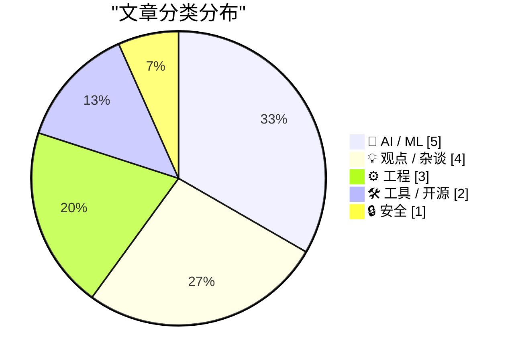
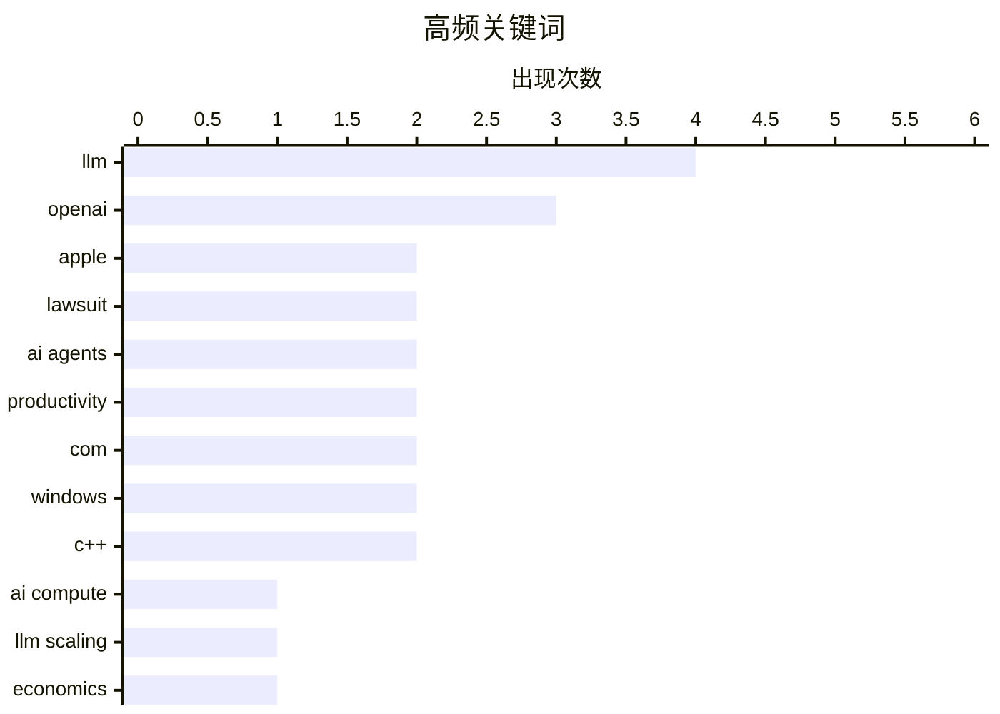

# 📰 Aug 5, 2026

> 来自 Karpathy 推荐的 92 个顶级技术博客，AI 精选 Top 15

## 📝 今日看点

今日技术圈聚焦 AI 推理能力的演进及其引发的连锁反应，算力瓶颈与行业泡沫风险成为讨论核心。与此同时，AI 智能体协议与编程范式的革新正重塑开发流程，强调人机协作中的专业性与工具化。此外，苹果与 OpenAI 围绕商业机密的法律博弈，标志着大模型竞争已进入知识产权的深水区。

---

## 🏆 今日必读

🥇 **为什么更智能的 AI 模型可能导致算力价格上涨 10 倍**

[Why smarter AI models could drive up compute prices 10x](https://www.dwarkesh.com/p/why-compute-might-get-10x-more-expensive-video) — dwarkesh.com · 1 天前 · 🤖 AI / ML

> 文章探讨了 AI 模型演进对算力成本的潜在冲击，指出推理侧算力可能成为新的瓶颈。随着类似 OpenAI o1 的推理模型普及，模型在回答问题时会消耗更多“思考时间”，这使得算力需求从训练阶段转向推理阶段。如果高质量推理需求爆发，即便硬件性能持续提升，算力单价仍可能因供需失衡而飙升。作者认为我们正进入一个算力从廉价商品转变为稀缺溢价资源的时代。

💡 **为什么值得读**: 深入分析了 AI 扩展定律从训练转向推理的经济影响，是理解未来 AI 算力市场走势的必读参考。

🏷️ AI compute, LLM scaling, economics, GPU

🥈 **LLM 工具发布新版本：支持推理轨迹、OpenAI 响应 API 及服务器端工具**

[New release of LLM adds support for reasoning traces, OpenAI Responses, server-side tools, and smarter logging](https://simonwillison.net/2026/Aug/4/new-release-of-llm/#atom-everything) — simonwillison.net · 8 小时前 · 🛠 工具 / 开源

> Simon Willison 发布了 LLM 0.32 版本，这是该命令行工具自发布以来最重要的更新。新版本增加了对“推理轨迹”（Reasoning Traces）的可见支持，允许用户查看 o1 等模型的思考过程。技术上，它集成了 OpenAI Responses API 以获取更丰富的元数据，并重新设计了基于内容寻址的 SQLite 日志系统。此外，新版本还支持服务器端提供商工具，并同步更新了 llm-anthropic 插件。

💡 **为什么值得读**: LLM 命令行工具用户必读，详细介绍了如何利用新版本观测和管理现代推理模型的复杂输出。

🏷️ LLM, CLI, OpenAI, reasoning

🥉 **OpenAI 回应苹果诉讼及初步禁令申请：苹果搞错了**

[★ OpenAI Responds to Apple’s Lawsuit and Motion for Preliminary Injunction: ‘Apple Is Getting This Wrong’](https://daringfireball.net/2026/08/openai_apple_is_getting_this_wrong) — daringfireball.net · 9 小时前 · 🤖 AI / ML

> OpenAI 通过官方博客公开回应了苹果发起的商业秘密诉讼，称苹果的指控存在误导。苹果此前向法院申请初步禁令，试图阻止两名前员工及 OpenAI 访问或使用所谓的机密信息。OpenAI 辩称这仅是标准的人才流动，而非窃取技术，并对苹果采取博客形式回应高额诉讼的罕见举动进行了评论。这场法律斗争反映了科技巨头之间在 AI 顶尖人才争夺上的白热化竞争。

💡 **为什么值得读**: 跟踪 AI 行业两大巨头之间法律博弈的最新进展，揭示了人才流动背后的知识产权冲突。

🏷️ OpenAI, Apple, lawsuit, legal

---

## 📊 数据概览

| 扫描源 | 抓取文章 | 时间范围 | 精选 |
|:---:|:---:|:---:|:---:|
| 84/92 | 2537 篇 → 35 篇 | 48h | **15 篇** |

### 分类分布



### 高频关键词



<details>
<summary>📈 纯文本关键词图（终端友好）</summary>

```
llm          │ ████████████████████ 4
openai       │ ███████████████░░░░░ 3
apple        │ ██████████░░░░░░░░░░ 2
lawsuit      │ ██████████░░░░░░░░░░ 2
ai agents    │ ██████████░░░░░░░░░░ 2
productivity │ ██████████░░░░░░░░░░ 2
com          │ ██████████░░░░░░░░░░ 2
windows      │ ██████████░░░░░░░░░░ 2
c++          │ ██████████░░░░░░░░░░ 2
ai compute   │ █████░░░░░░░░░░░░░░░ 1
```

</details>

### 🏷️ 话题标签

**llm**(4) · **openai**(3) · **apple**(2) · lawsuit(2) · ai agents(2) · productivity(2) · com(2) · windows(2) · c++(2) · ai compute(1) · llm scaling(1) · economics(1) · gpu(1) · cli(1) · reasoning(1) · legal(1) · mcp(1) · rest(1) · api(1) · coding(1)

---

## 🤖 AI / ML

### 1. 为什么更智能的 AI 模型可能导致算力价格上涨 10 倍

[Why smarter AI models could drive up compute prices 10x](https://www.dwarkesh.com/p/why-compute-might-get-10x-more-expensive-video) — **dwarkesh.com** · 1 天前 · ⭐ 27/30

> 文章探讨了 AI 模型演进对算力成本的潜在冲击，指出推理侧算力可能成为新的瓶颈。随着类似 OpenAI o1 的推理模型普及，模型在回答问题时会消耗更多“思考时间”，这使得算力需求从训练阶段转向推理阶段。如果高质量推理需求爆发，即便硬件性能持续提升，算力单价仍可能因供需失衡而飙升。作者认为我们正进入一个算力从廉价商品转变为稀缺溢价资源的时代。

🏷️ AI compute, LLM scaling, economics, GPU

---

### 2. OpenAI 回应苹果诉讼及初步禁令申请：苹果搞错了

[★ OpenAI Responds to Apple’s Lawsuit and Motion for Preliminary Injunction: ‘Apple Is Getting This Wrong’](https://daringfireball.net/2026/08/openai_apple_is_getting_this_wrong) — **daringfireball.net** · 9 小时前 · ⭐ 25/30

> OpenAI 通过官方博客公开回应了苹果发起的商业秘密诉讼，称苹果的指控存在误导。苹果此前向法院申请初步禁令，试图阻止两名前员工及 OpenAI 访问或使用所谓的机密信息。OpenAI 辩称这仅是标准的人才流动，而非窃取技术，并对苹果采取博客形式回应高额诉讼的罕见举动进行了评论。这场法律斗争反映了科技巨头之间在 AI 顶尖人才争夺上的白热化竞争。

🏷️ OpenAI, Apple, lawsuit, legal

---

### 3. MCP 与 REST：将智能体连接到 API 的正确方式

[[Sponsor] MCP vs. REST: The Right Way to Connect Agents to Your API](https://workos.com/blog/mcp-vs-rest?utm_source=daringfireball&amp;utm_medium=newsletter&amp;utm_campaign=q32026) — **daringfireball.net** · 1 天前 · ⭐ 25/30

> 文章对比了模型上下文协议（MCP）与传统的 REST 架构在 AI 智能体场景下的应用。REST 主要服务于人类开发者，而 MCP 则是为智能体理解和调用工具而设计的层，两者并非竞争关系而是互补关系。高效的 MCP 实现应围绕智能体的目标进行设计，而非简单地将每个 REST 端点映射为工具。此外，部署 MCP 服务器还需配套 OAuth 2.1 等现代认证标准以确保安全性。

🏷️ MCP, REST, API, AI agents

---

### 4. 智能体编程技术实践

[Agentic coding techniques](https://micahflee.com/agentic-coding-techniques/) — **micahflee.com** · 1 天前 · ⭐ 25/30

> 作者分享了使用 AI 智能体进行软件开发的实际经验，强调了“智能体编程”与生成低质量代码（Slop）的区别。核心方案在于建立一个“人机协作循环”，由智能体负责编写、测试和修复代码，但必须由具备专业知识的人员进行严格审查。文章指出，开发者应保持架构师的角色，利用智能体处理繁琐任务而非完全脱手。这种方法能显著提升开发效率，前提是用户能识别并纠正 AI 的潜在错误。

🏷️ LLM, AI agents, coding, productivity

---

### 5. PipeNetwork/minimax-h3-mlx：在 Mac 上运行 MiniMax 多模态模型

[PipeNetwork/minimax-h3-mlx](https://simonwillison.net/2026/Aug/4/minimax-h3-mlx/#atom-everything) — **simonwillison.net** · 13 小时前 · ⭐ 21/30

> 介绍了将 MiniMax-H3 模型移植到 Apple Silicon MLX 框架的开源项目。MiniMax-H3 是一款全能模态生成系统，支持文本、图像、音频和视频的跨模态输入。该模型具备强大的生成能力，能够产出最长 15 秒且包含同步音频的视频内容。通过 MLX 优化，开发者可以在 Mac 设备上本地高效运行这一复杂模型，无需依赖云端算力。这一进展降低了高性能多模态 AI 的使用门槛。

🏷️ MiniMax, MLX, LLM, Apple Silicon

---

## 💡 观点 / 杂谈

### 6. 不要做“肉身代理”

[Don't be a meat proxy](https://simonwillison.net/2026/Aug/3/dont-be-a-meat-proxy/#atom-everything) — **simonwillison.net** · 1 天前 · ⭐ 23/30

> Niklas Gruhn 提出了“肉身代理”（Meat Proxy）这一新词，指代那些盲目复制粘贴 AI 输出给同事的人。文章认为，未经阅读、理解和验证就转发 AI 生成的内容是毫无价值的，甚至会损害职业信誉。人类的价值在于对信息进行过滤、验证并用自己的语言重新表述，这本身就是一种完成工作的“证明”。作者呼吁在 AI 时代，人们应保持批判性思考，而非沦为 AI 的搬运工。

🏷️ AI ethics, LLM, productivity

---

### 7. AI 需求泡沫分析

[The AI Demand Bubble](https://www.wheresyoured.at/the-ai-demand-bubble/) — **wheresyoured.at** · 16 小时前 · ⭐ 23/30

> 文章深入分析了当前 AI 行业是否存在需求侧泡沫，质疑大规模基础设施投入与实际产出之间的脱节。作者对比了 NVIDIA 的芯片销量与 Anthropic 等 AI 公司的实际营收，指出目前的繁荣很大程度上建立在对未来的预期而非现有的盈利能力上。如果 AI 应用无法在短期内为企业带来显著的投资回报（ROI），庞大的算力需求可能会迅速萎缩。结论认为，我们正处于一个由基础设施驱动的扩张期，但终端用户需求的真实性仍待验证。

🏷️ AI bubble, tech economy, market analysis

---

### 8. 开发者工具必须开源

[Devtools must be open source (exe.dev)](https://simonwillison.net/2026/Aug/3/devtools-must-be-open-source-exedev/#atom-everything) — **simonwillison.net** · 1 天前 · ⭐ 22/30

> 探讨了开发者工具开源的必要性，强调开源不仅是赋予用户检查和修改代码的自由。虽然大多数开发者（甚至是专家）很少亲自修改源码，但开源的真正价值在于可以依赖社区中的其他人进行审计和改进。这种“可审计性”是建立技术信任的核心，确保工具不会因为商业变动或停止维护而导致开发者陷入困境。闭源工具在底层基础设施中构成了单点故障风险，而开源则保障了开发者的长期自主权。

🏷️ open source, DevTools, software freedom

---

### 9. 多元化：后美国时代的计算与互联网

[Pluralistic: Post-American compute for a post-American Internet (04 Aug 2026)](https://pluralistic.net/2026/08/04/technology-freedom-cooperative/) — **pluralistic.net** · 21 小时前 · ⭐ 22/30

> 探讨了在波多黎各、欧盟、加拿大和墨西哥等地构建协作式人权计算基础设施的紧迫性。文章批判了当前由美国主导的互联网架构，主张通过去中心化和合作模式来实现真正的技术自由。内容涵盖了从德国反色情扫描到无人机交付现实等多个社会技术议题。作者特别指出，当前的“AI 编程机器人”更多是营销噱头而非技术突破，并呼吁建立不依赖于单一霸权的技术主权。

🏷️ infrastructure, digital rights, privacy, decentralization

---

## ⚙️ 工程

### 10. 创建技术上敏捷但仅限本地套间使用的伪敏捷包装器（第二部分）

[Creating a fake agile wrapper that is technically agile but is not useful outside its home apartment, part 2](https://devblogs.microsoft.com/oldnewthing/20260804-00/?p=112586) — **devblogs.microsoft.com/oldnewthing** · 18 小时前 · ⭐ 24/30

> 这是探讨 Windows COM 组件开发中“敏捷性”问题的深度技术文章。本部分重点介绍了如何利用全局接口表（Global Interface Table, GIT）来存储接口引用。通过这种方式，开发者可以创建一个在技术上符合敏捷（Agile）标准的对象，但其内部逻辑仍被限制在特定的套间（Apartment）中运行。这种“伪敏捷”包装器解决了 COM 线程模型中跨套间调用的复杂性问题。

🏷️ COM, Windows, C++, threading

---

### 11. 创建技术上敏捷但仅限本地套间使用的伪敏捷包装器（第一部分）

[Creating a fake agile wrapper that is technically agile but is not useful outside its home apartment, part 1](https://devblogs.microsoft.com/oldnewthing/20260803-00/?p=112582) — **devblogs.microsoft.com/oldnewthing** · 1 天前 · ⭐ 24/30

> 文章讨论了在 COM 编程中寻找一种介于“强引用”和“弱引用”之间的引用处理方式。核心问题在于如何处理那些绑定在特定线程套间中的对象，使其能够安全地被其他线程感知。作者提出了构建一个包装器的构想，该包装器对外表现为敏捷对象，以规避 COM 列集（Marshaling）的限制。这为后续使用 GIT 解决跨线程访问问题奠定了理论基础。

🏷️ COM, Windows, C++, memory management

---

### 12. 书评：Sidney Dekker 的《理解“人为错误”现场指南》

[Book Review: The Field Guide to Understanding 'Human Error' by Sidney Dekker ★★★★☆](https://shkspr.mobi/blog/2026/08/book-review-the-field-guide-to-understanding-human-error-by-sidney-dekker/) — **shkspr.mobi** · 1 天前 · ⭐ 22/30

> 评述了 Sidney Dekker 的经典著作，挑战了将“人为错误”视为事故主因的传统观念。书中指出，大多数灾难实际上源于系统设计缺陷、激励机制错位以及不切实际的业务流程。人类并非需要被防范的系统威胁，而是复杂系统中努力维持运行的参与者。通过修复系统结构而非指责个人，组织才能从根本上提升安全性。该书为理解复杂系统故障和建立容错文化提供了重要的理论框架。

🏷️ human error, systems thinking, safety culture, SRE

---

## 🛠 工具 / 开源

### 13. LLM 工具发布新版本：支持推理轨迹、OpenAI 响应 API 及服务器端工具

[New release of LLM adds support for reasoning traces, OpenAI Responses, server-side tools, and smarter logging](https://simonwillison.net/2026/Aug/4/new-release-of-llm/#atom-everything) — **simonwillison.net** · 8 小时前 · ⭐ 26/30

> Simon Willison 发布了 LLM 0.32 版本，这是该命令行工具自发布以来最重要的更新。新版本增加了对“推理轨迹”（Reasoning Traces）的可见支持，允许用户查看 o1 等模型的思考过程。技术上，它集成了 OpenAI Responses API 以获取更丰富的元数据，并重新设计了基于内容寻址的 SQLite 日志系统。此外，新版本还支持服务器端提供商工具，并同步更新了 llm-anthropic 插件。

🏷️ LLM, CLI, OpenAI, reasoning

---

### 14. Bending Spoons 以 13 亿美元收购 Airtable

[Bending Spoons to Buy Airtable for $1.3 Billion](https://techcrunch.com/2026/08/04/bending-spoons-to-buy-airtable-for-1-28b/) — **daringfireball.net** · 17 小时前 · ⭐ 21/30

> 报道了意大利软件公司 Bending Spoons 以 12.8 亿美元现金收购协作数据库平台 Airtable 的重大交易。Airtable 在 2021 年的估值曾高达 110 亿美元，且累计融资额超过 14 亿美元。此次收购价格仅为巅峰估值的 11% 左右，甚至低于其历史总融资额。这笔交易标志着 SaaS 行业独角兽估值泡沫的剧烈破裂，也反映了当前科技市场整合与资本退出的残酷现状。

🏷️ Airtable, acquisition, SaaS, Bending Spoons

---

## 🔒 安全

### 15. 苹果在商业秘密案中寻求针对 OpenAI 的初步禁令

[Apple Seeks Preliminary Injunction Against OpenAI in Trade Secrets Case](https://www.reuters.com/legal/litigation/apple-seeks-preliminary-injunction-against-openai-trade-secrets-case-2026-08-04/) — **daringfireball.net** · 16 小时前 · ⭐ 23/30

> 根据路透社报道，苹果公司已正式向美国法官申请初步禁令，禁止两名前员工及 OpenAI 访问或披露其机密信息。苹果同时申请了“加速取证”，要求被告提交与涉嫌窃取专有技术相关的文档。此案的核心在于苹果认为其核心商业秘密在员工跳槽至 OpenAI 的过程中遭到了非法泄露。法院对该禁令的裁决将对 AI 行业的知识产权保护和人才流动产生深远影响。

🏷️ Apple, OpenAI, trade secrets, lawsuit

---

*生成于 2026-08-05 08:47 | 扫描 84 源 → 获取 2537 篇 → 精选 15 篇*
*基于 [Hacker News Popularity Contest 2025](https://refactoringenglish.com/tools/hn-popularity/) RSS 源列表，由 [Andrej Karpathy](https://x.com/karpathy) 推荐*
