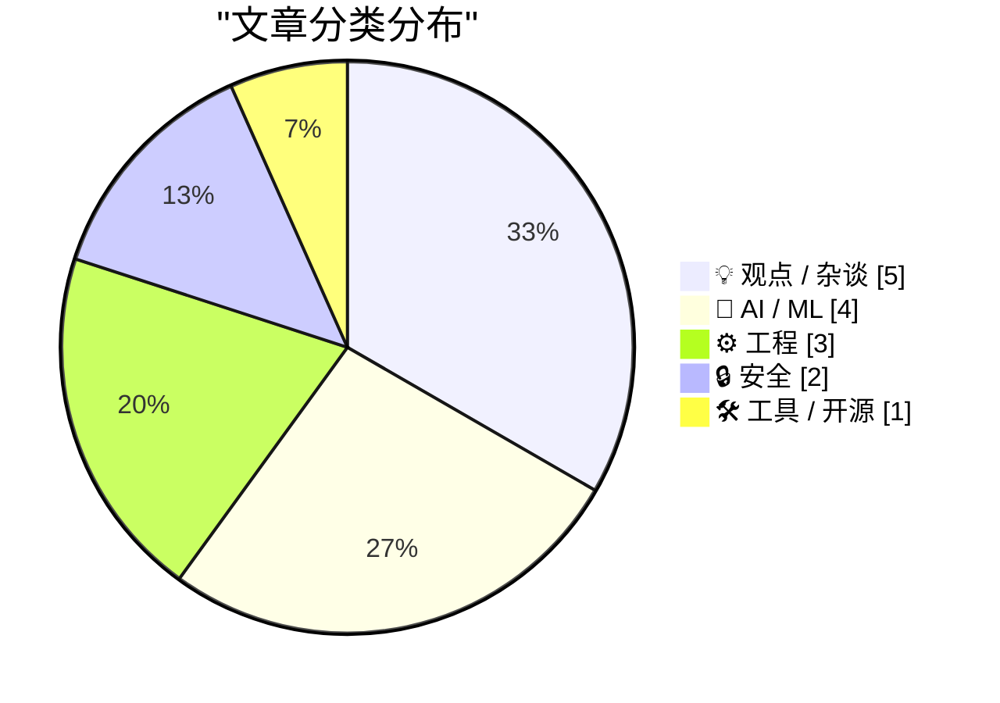
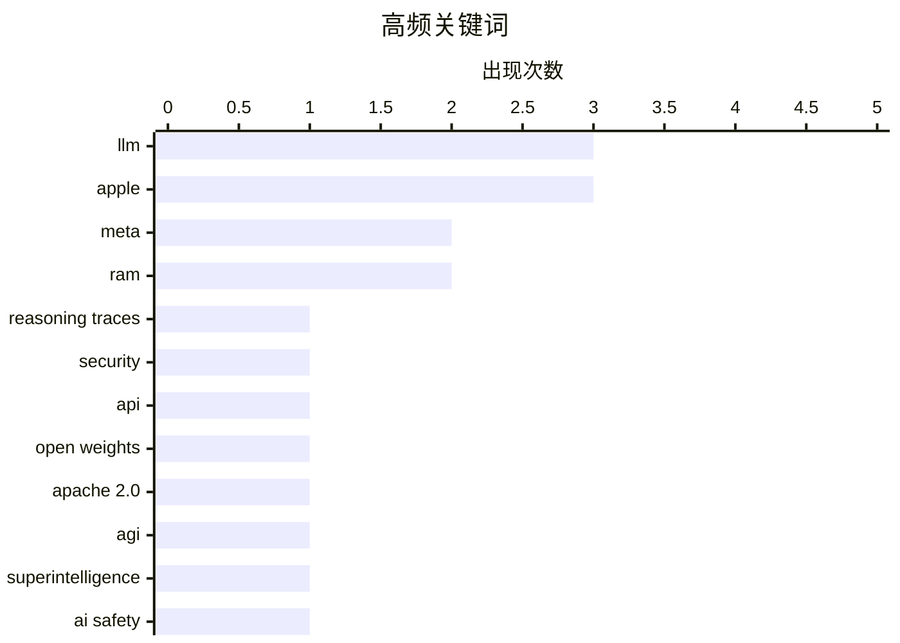

# 📰 Aug 12, 2026

> 来自 Karpathy 推荐的 92 个顶级技术博客，AI 精选 Top 15

## 📝 今日看点

今日技术圈的核心议题围绕 AI 开源生态与治理展开，Meta 通过发布 30B 智能体模型及万字长文重申开源立场，而闭源模型则面临推理痕迹被窃取与监管透明度的双重挑战。与此同时，业界正就 AI 基础设施的未来走向展开激烈辩论，探讨本地模型与云端算力的博弈以及递归自我改进可能引发的超智能风险。此外，微软大规模修复近 400 个安全漏洞及苹果深陷内存供应链危机，再次警示了技术生态在底层安全与硬件供应上的脆弱性。

---

## 🏆 今日必读

🥇 **从闭源 LLM API 中窃取推理痕迹**

[Stealing Reasoning Traces from Proprietary LLM APIs](https://simonwillison.net/2026/Aug/11/stealing-reasoning-traces/#atom-everything) — simonwillison.net · 9 小时前 · 🤖 AI / ML

> 闭源模型如 Anthropic、OpenAI 和 Google 会向客户端返回加密的思维链（CoT）块，这些块可在不同会话和模型间重用。研究人员发现，通过将前沿模型生成的加密痕迹回放到同系列较弱的模型中，并利用越狱手段诱导弱模型解密，可以输出原本隐藏的推理过程。实验证明，这种方法能以极低成本获取闭源模型的推理逻辑，从而用于模型蒸馏或安全分析。这揭示了当前大模型厂商在处理加密推理数据时的安全漏洞，即加密块的跨模型兼容性成为了泄密通道。

💡 **为什么值得读**: 揭示了闭源大模型推理过程被非法提取的新型攻击向量，对关注 AI 安全和模型蒸馏的读者极具启发。

🏷️ LLM, reasoning traces, security, API

🥈 **Meta 发布 Muse Glimmer：全新的 30B 开源智能体模型**

[Introducing Muse Glimmer](https://simonwillison.net/2026/Aug/10/introducing-muse-glimmer/#atom-everything) — simonwillison.net · 1 天前 · 🤖 AI / ML

> Meta 推出了拥有 30B 参数的 Muse Glimmer 模型，并采用了比以往 Llama 系列更宽松的 Apache 2.0 开源协议。该模型专门针对端到端智能体任务进行了优化，旨在提升本地运行环境下的任务完成能力。相比于之前的闭源或受限协议模型，Muse Glimmer 在保持高性能的同时，为开发者提供了更高的自由度。Meta 此举标志着其在开源权重领域进一步发力，试图通过更开放的生态系统挑战闭源模型的统治地位。

💡 **为什么值得读**: 了解 Meta 最新开源的 30B 模型及其在智能体任务上的优化，是本地部署 AI 应用的重要选型参考。

🏷️ Meta, open weights, LLM, Apache 2.0

🥉 **Ryan Greenblatt：人类水平的 AI 可能在 2032 年前构建出失控的超智能**

[Ryan Greenblatt – Human level AIs might build runaway superintelligences by 2032](https://www.dwarkesh.com/p/ryan-greenblatt) — dwarkesh.com · 15 小时前 · 🤖 AI / ML

> 本文探讨了 AI 递归自我改进（Recursive Self-improvement）的可能性及其带来的风险。Ryan Greenblatt 认为，一旦 AI 达到人类水平的编程和科研能力，它们将能够以指数级速度优化自身的架构和算法。这种反馈循环可能导致在 2032 年前出现远超人类理解的超智能系统，且人类可能无法对其进行有效控制。文章深入辩论了这种“失控”场景的技术前提以及目前安全对齐工作的紧迫性。

💡 **为什么值得读**: 深入探讨 AI 奇点与递归自我改进的风险，适合对 AI 长期安全和未来演进感兴趣的读者。

🏷️ AGI, superintelligence, AI safety, recursive self-improvement

---

## 📊 数据概览

| 扫描源 | 抓取文章 | 时间范围 | 精选 |
|:---:|:---:|:---:|:---:|
| 81/92 | 2487 篇 → 36 篇 | 48h | **15 篇** |

### 分类分布



### 高频关键词



<details>
<summary>📈 纯文本关键词图（终端友好）</summary>

```
llm              │ ████████████████████ 3
apple            │ ████████████████████ 3
meta             │ █████████████░░░░░░░ 2
ram              │ █████████████░░░░░░░ 2
reasoning traces │ ███████░░░░░░░░░░░░░ 1
security         │ ███████░░░░░░░░░░░░░ 1
api              │ ███████░░░░░░░░░░░░░ 1
open weights     │ ███████░░░░░░░░░░░░░ 1
apache 2.0       │ ███████░░░░░░░░░░░░░ 1
agi              │ ███████░░░░░░░░░░░░░ 1
```

</details>

### 🏷️ 话题标签

**llm**(3) · **apple**(3) · **meta**(2) · ram(2) · reasoning traces(1) · security(1) · api(1) · open weights(1) · apache 2.0(1) · agi(1) · superintelligence(1) · ai safety(1) · recursive self-improvement(1) · microsoft(1) · vulnerability(1) · patch tuesday(1) · cybersecurity(1) · ai writing(1) · engineering culture(1) · local llm(1)

---

## 💡 观点 / 杂谈

### 1. 自然语言文本不存在无损转换

[There are no lossless transformations of natural-language text](https://simonwillison.net/2026/Aug/11/there-are-no-lossless-transformations-of-natural-language-text/#atom-everything) — **simonwillison.net** · 7 小时前 · ⭐ 24/30

> Sophie Alpert 分享了工程师使用 AI 辅助写作的内部准则，强调自然语言在转换过程中必然存在信息损失。核心观点是，当使用 LLM 修改或润色文本时，作者必须对最终输出的每一个字负责，不能盲目信任 AI 的改写。文章指出，AI 往往会改变原意的细微差别，因此“无损”的自动润色是一个伪命题。作者建议将 AI 视为草稿生成器而非最终审查者，以确保技术文档和沟通的准确性。

🏷️ AI writing, engineering culture, LLM

---

### 2. 不，本地模型不会胜出

[No, local models will not win](https://seangoedecke.com/local-models-will-not-win/) — **seangoedecke.com** · 1 天前 · ⭐ 24/30

> 尽管开源权重模型不断进步，但作者认为本地运行 AI 模型的想法注定失败，大部分推理仍将在数据中心完成。本地设备受限于内存带宽和算力，难以运行参数量巨大且性能顶尖的模型。此外，云端模型可以实现更快的迭代速度和更复杂的并行计算，这是个人电脑或手机无法比拟的。文章反驳了“本地化是未来”的观点，强调规模效应和基础设施优势将使云端 AI 长期占据主导地位。

🏷️ local LLM, cloud computing, AI infrastructure

---

### 3. 马克·扎克伯格发布 6500 字 AI 论文

[Mark Zuckerberg Posts 6,500-Word AI Essay](https://www.meta.com/thefutureisforeveryone/) — **daringfireball.net** · 12 小时前 · ⭐ 21/30

> 扎克伯格在 Meta 官网发布了一篇长达 6500 字的关于 AI 未来的深度文章，重申了 Meta 坚持开源 AI 的立场。文章认为开源能促进全球创新并防止技术垄断，同时提到 Meta 在路易斯安那州建设大型数据中心为当地带来的经济收益，如教师获得的 5 万美元奖金。尽管篇幅巨大，但核心论点仍集中在开源生态的优越性以及 AI 对社会经济的正面推动作用。这反映了 Meta 试图通过开源策略在 AI 竞赛中建立领导地位的决心。

🏷️ Mark Zuckerberg, Meta, AI vision

---

### 4. The Talk Show：‘把零食搞对’

[The Talk Show: ‘Getting the Snack Right’](https://daringfireball.net/thetalkshow/2026/08/10/ep-454) — **daringfireball.net** · 12 小时前 · ⭐ 21/30

> 本期节目深入探讨了 iOS 27 在夏季的开发进展，以及 Vision Pro 在直播棒球赛事中的沉浸式体验。针对 Apple 对 OpenAI 和 io 发起的商业机密诉讼，以及欧盟 DMA 法案带来的监管压力进行了多维度剖析。讨论中重点提及了当前硬件面临的 RAM 危机，这可能成为限制 AI 功能在旧设备上运行的关键瓶颈。作者强调了 Apple 在追求技术创新的同时，必须在法律合规与硬件成本之间寻找微妙的平衡。通过对这些核心议题的拆解，揭示了 Apple 生态系统在 2026 年面临的复杂挑战。

🏷️ Apple, Vision Pro, EU DMA, RAM

---

### 5. “氛围编码”式奉承的问题

[‘The Problem With Vibe-Coded Flattery’](https://tedium.co/2026/08/09/vibe-coding-insincerity/) — **daringfireball.net** · 1 天前 · ⭐ 21/30

> 开发者在推广新应用时，越来越多地使用 AI 聊天机器人生成充满“虚假热情”的推广邮件。这种被称为“氛围编码（Vibe-Coding）”的现象导致邮件内容千篇一律，缺乏真实的创作激情和个人特色，极易被识别并直接丢入垃圾箱。作者 Ernie Smith 质疑，如果开发者无法通过文字传达真实的创作初衷，那么产品的核心价值也值得怀疑。文章呼吁开发者回归真诚，用反映个人思考的文字进行沟通，而非依赖 AI 生成的空洞辞令。在 AI 泛滥的时代，真实的个人表达反而成为了最稀缺的竞争力。

🏷️ AI, communication, marketing, authenticity

---

## 🤖 AI / ML

### 6. 从闭源 LLM API 中窃取推理痕迹

[Stealing Reasoning Traces from Proprietary LLM APIs](https://simonwillison.net/2026/Aug/11/stealing-reasoning-traces/#atom-everything) — **simonwillison.net** · 9 小时前 · ⭐ 28/30

> 闭源模型如 Anthropic、OpenAI 和 Google 会向客户端返回加密的思维链（CoT）块，这些块可在不同会话和模型间重用。研究人员发现，通过将前沿模型生成的加密痕迹回放到同系列较弱的模型中，并利用越狱手段诱导弱模型解密，可以输出原本隐藏的推理过程。实验证明，这种方法能以极低成本获取闭源模型的推理逻辑，从而用于模型蒸馏或安全分析。这揭示了当前大模型厂商在处理加密推理数据时的安全漏洞，即加密块的跨模型兼容性成为了泄密通道。

🏷️ LLM, reasoning traces, security, API

---

### 7. Meta 发布 Muse Glimmer：全新的 30B 开源智能体模型

[Introducing Muse Glimmer](https://simonwillison.net/2026/Aug/10/introducing-muse-glimmer/#atom-everything) — **simonwillison.net** · 1 天前 · ⭐ 28/30

> Meta 推出了拥有 30B 参数的 Muse Glimmer 模型，并采用了比以往 Llama 系列更宽松的 Apache 2.0 开源协议。该模型专门针对端到端智能体任务进行了优化，旨在提升本地运行环境下的任务完成能力。相比于之前的闭源或受限协议模型，Muse Glimmer 在保持高性能的同时，为开发者提供了更高的自由度。Meta 此举标志着其在开源权重领域进一步发力，试图通过更开放的生态系统挑战闭源模型的统治地位。

🏷️ Meta, open weights, LLM, Apache 2.0

---

### 8. Ryan Greenblatt：人类水平的 AI 可能在 2032 年前构建出失控的超智能

[Ryan Greenblatt – Human level AIs might build runaway superintelligences by 2032](https://www.dwarkesh.com/p/ryan-greenblatt) — **dwarkesh.com** · 15 小时前 · ⭐ 27/30

> 本文探讨了 AI 递归自我改进（Recursive Self-improvement）的可能性及其带来的风险。Ryan Greenblatt 认为，一旦 AI 达到人类水平的编程和科研能力，它们将能够以指数级速度优化自身的架构和算法。这种反馈循环可能导致在 2032 年前出现远超人类理解的超智能系统，且人类可能无法对其进行有效控制。文章深入辩论了这种“失控”场景的技术前提以及目前安全对齐工作的紧迫性。

🏷️ AGI, superintelligence, AI safety, recursive self-improvement

---

### 9. Anthropic 发布“Claude 如何标记 AI 生成内容”，却未解释具体原理

[Anthropic Posts ‘How Claude Marks AI-Generated Content’ Without Explaining How Claude Marks AI-Generated Content](https://support.claude.com/en/articles/16266773-how-claude-marks-ai-generated-content) — **daringfireball.net** · 13 小时前 · ⭐ 24/30

> Anthropic 响应欧盟 AI 法案的要求，发布了一篇关于如何标记 AI 生成内容的说明文档。然而，该文档在关键的技术实现细节上含糊其辞，并未明确说明 Claude 是如何对纯文本输出进行水印处理或标识的。文章批评了这种缺乏透明度的做法，指出厂商在合规性声明与技术细节披露之间存在巨大鸿沟。目前，用户和监管机构仍无法确切知晓 Anthropic 计划如何落实其透明度承诺。

🏷️ Anthropic, Claude, AI transparency, EU AI Act

---

## ⚙️ 工程

### 10. 纽约时报与华尔街日报评苹果、中国与内存危机

[The NYT and WSJ on Apple, China, and the RAM Crisis](https://www.nytimes.com/2026/08/10/technology/memory-chip-shortage-ai.html?unlocked_article_code=1.4VA.49f7.Qj8S541DkkOz) — **daringfireball.net** · 1 天前 · ⭐ 24/30

> 苹果公司因内存芯片短缺导致近期产品价格上涨，正联合其他电子公司游说政府，希望获准从受限的中国厂商（如长江存储 YMTC）采购芯片。早在 2022 年，苹果就曾尝试与 YMTC 合作，但因政治压力而告吹。当前的 AI 热潮加剧了全球内存供应紧张，使得苹果在供应链多元化与地缘政治限制之间面临两难境地。这反映了半导体供应链的脆弱性以及 AI 硬件需求对消费电子巨头战略的深远影响。

🏷️ Apple, RAM, supply chain, China

---

### 11. 扩展不可变性：不丢失数据的删除

[Extending immutability: deletion without losing data](https://www.tigrisdata.com/blog/soft-delete-deep-dive/) — **xeiaso.net** · 1 天前 · ⭐ 23/30

> 分布式数据库 Tigris 探讨了在地理复制的活跃-活跃（active-active）架构中实现数据删除的挑战。传统方法使用墓碑（tombstones）标记删除，但难以处理误删恢复和跨地域一致性。Tigris 提出了一种基于不可变存储的软删除方案，通过将存储逻辑“翻转”，实现了既能物理删除以节省空间，又能保留撤销操作的能力。该方案在保证分布式系统高性能写入的同时，解决了复杂环境下的数据生命周期管理难题。

🏷️ distributed-systems, database, replication, immutability

---

### 12. 如何在无缓冲模式下执行 CopyFile 操作？

[How can I perform a Copy­File in unbuffered mode?](https://devblogs.microsoft.com/oldnewthing/20260810-00/?p=112600) — **devblogs.microsoft.com/oldnewthing** · 1 天前 · ⭐ 21/30

> 在 Windows 开发中，标准的 CopyFile API 并不直接支持无缓冲（unbuffered）模式。开发者如果需要绕过系统缓存以提高大文件传输效率或减少内存占用，应考虑使用 CopyFileEx 或 CreateFile 配合 FILE_FLAG_NO_BUFFERING 标志。Raymond Chen 指出，通过更高级的替代方案可以实现对 I/O 行为的精细控制，避免系统缓存被大文件复制操作“污染”。这种方法适用于对磁盘吞吐量有极高要求的特定系统级应用场景。掌握这些底层 API 的差异是优化 Windows 文件系统性能的关键。

🏷️ Windows-API, I/O, performance, file-system

---

## 🔒 安全

### 13. 微软修复近 400 个安全漏洞

[Microsoft Plugs Nearly 400 Security Holes](https://krebsonsecurity.com/2026/08/microsoft-plugs-nearly-400-security-holes/) — **krebsonsecurity.com** · 10 小时前 · ⭐ 26/30

> 微软在最新的安全更新中修复了 Windows 操作系统及相关软件中的至少 398 个安全漏洞。在这些漏洞中，有一个漏洞已被确认在野外被积极利用，另有两个漏洞在补丁发布前已被公开披露。此次更新规模庞大，涵盖了从内核到应用层的多个关键组件，旨在应对日益严峻的网络安全威胁。安全专家建议所有 Windows 用户和管理员尽快安装这些补丁，以防止潜在的远程代码执行或权限提升攻击。

🏷️ Microsoft, vulnerability, Patch Tuesday, cybersecurity

---

### 14. Pluralistic：监控与断头台

[Pluralistic: Surveillance vs guillotines (11 Aug 2026)](https://pluralistic.net/2026/08/11/tragedy-of-the-commoners/) — **pluralistic.net** · 20 小时前 · ⭐ 21/30

> 文章探讨了现代监控技术与社会权力结构之间的冲突，并以“收割平民”为隐喻批判了当前的技术剥削现象。内容涵盖了从 DeCSS 破解到 Warhol 蠕虫的历史回顾，反思了技术在过去 25 年间的演变与异化。作者通过 RIAA 诉讼案和东德史塔西（Stasi）的伪装技术，揭示了系统性监控对个人隐私的长期威胁。核心观点认为，技术应当服务于公共利益而非成为少数人掠夺财富的工具。这种对数字权利的深度反思，为理解当今大型科技公司的行为提供了历史视角。

🏷️ surveillance, privacy, DRM, tech policy

---

## 🛠 工具 / 开源

### 15. iOS 27 Beta 5 更新详解

[What’s New in iOS 27 Beta 5](https://9to5mac.com/2026/08/10/heres-whats-new-with-ios-27-beta-5/) — **daringfireball.net** · 1 天前 · ⭐ 21/30

> iOS 27 Beta 5 在经历长达 22 天的漫长等待后终于发布，打破了常规的更新节奏。本次更新对 Siri 等应用图标进行了视觉优化，使其外观更具现代感，并为英美语系的 Siri 语音引入了语速（Pace）和表现力（Expressivity）调节滑块。开发者 Will Hains 的追踪数据显示，Beta 4 到 Beta 5 的间隔比往常多出一周，暗示系统底层可能存在重大调整。用户现在可以更精细地自定义语音助手的交互感官，提升了系统的个性化程度。这种细微的交互改进反映了 Apple 在系统成熟期对用户体验的持续打磨。

🏷️ iOS, Apple, beta, UI

---

*生成于 2026-08-12 07:42 | 扫描 81 源 → 获取 2487 篇 → 精选 15 篇*
*基于 [Hacker News Popularity Contest 2025](https://refactoringenglish.com/tools/hn-popularity/) RSS 源列表，由 [Andrej Karpathy](https://x.com/karpathy) 推荐*
