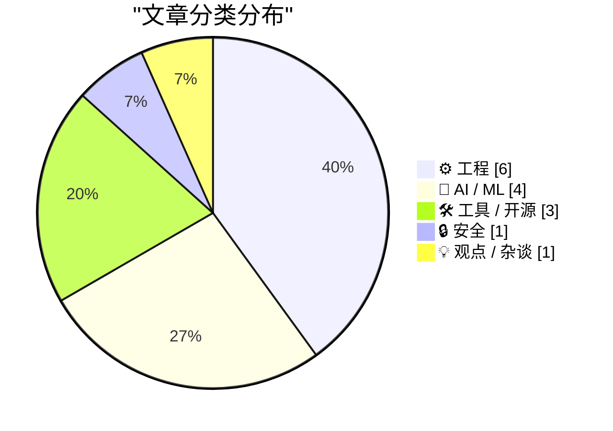
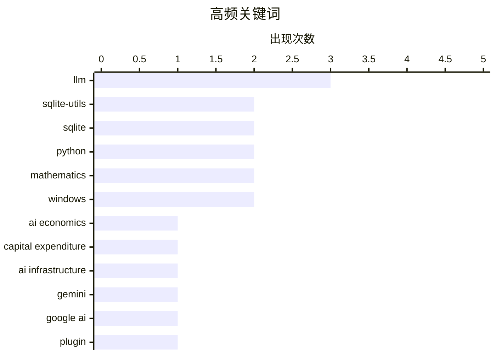

# 📰 Aug 15, 2026

> 来自 Karpathy 推荐的 92 个顶级技术博客，AI 精选 Top 15

## 📝 今日看点

今日技术圈一方面继续追问生成式 AI 的真实成本与可持续商业模式，算力、数据中心和推理基础设施成为焦点；另一方面，AI 正从模型能力展示走向具体实践，既用于发现数学结构，也被应用于强化学习和复杂系统模拟。开发者工具持续快速迭代，从 Gemini 模型接入到 SQLite API 修复，生态更新更强调效率与稳定性。同时，广告追踪透明度、隐私保护、版权与内容治理等议题升温，技术基础设施与社会规则的博弈更加直接。

---

## 🏆 今日必读

🥇 **高级版：AI 到底需要多少钱？**

[Premium: How Much Money Does AI Need?](https://www.wheresyoured.at/premium-how-much-money-does-ai-need/) — wheresyoured.at · 12 小时前 · 🤖 AI / ML

> 文章聚焦生成式 AI 行业实现可持续发展所需的真实资金规模。作者指出，自己采用长篇论证的形式，是因为 AI 的资本、基础设施和商业化问题无法用简短观点充分解释。讨论的核心将是训练与推理算力、数据中心建设、模型研发及持续运营所带来的高额成本。标题所提出的问题直指 AI 热潮中的关键矛盾：市场预期能否覆盖长期、密集且不断增长的资本投入。作者的核心立场是，评估 AI 不能只看产品能力或融资规模，而应严肃核算其整体经济需求。

💡 **为什么值得读**: 适合希望穿透融资叙事、从成本结构和资本回报角度判断 AI 行业可持续性的读者。

🏷️ AI economics, capital expenditure, AI infrastructure, LLM

🥈 **llm-gemini 0.33**

[llm-gemini 0.33](https://simonwillison.net/2026/Aug/13/llm-gemini/) — simonwillison.net · 1 天前 · 🛠 工具 / 开源

> llm-gemini 0.33 为 Simon Willison 的 LLM 命令行工具 Gemini 插件增加了新一代 Google 模型支持。该版本接入当天发布的 Gemini 3.7 Flash，同时支持 gemini-3.6-flash 与 gemini-3.5-flash-lite。插件还新增两个 Gemini 嵌入模型，使开发者可在同一 LLM 工具链中调用文本生成与向量嵌入能力。此次发布距离上一个版本已有一段时间，重点是跟进 Gemini 模型家族的最新可用选项。核心价值在于让现有 `llm` 用户以统一的插件接口快速试用和切换这些 Gemini 模型。

💡 **为什么值得读**: 对于使用命令行测试模型、构建 RAG 或比较不同 Gemini 版本的开发者，这是最直接的升级入口。

🏷️ Gemini, LLM, Google AI, plugin

🥉 **谁在追踪你？用这项新服务查出来**

[Who’s Tracking You? Use This New Service to Find Out](https://krebsonsecurity.com/2026/08/whos-tracking-you-use-this-new-service-to-find-out/) — krebsonsecurity.com · 17 小时前 · 🔒 安全

> DecryptAds 是一项免费的广告技术情报服务，用于识别网站广告和移动应用数据收集背后的实体。广告投放和追踪相关信息原本部分公开，但格式分散、难以解析，且大量数据长期掌握在大型广告平台手中。DecryptAds 通过抓取并关联这些 adtech 数据，将广告标识、数据流向及相关公司关系整理为可查询的信息。服务的目标是降低用户、研究人员和记者理解数字广告追踪链条的门槛。其核心观点是，广告技术生态不应因信息复杂而逃避外部审查。

💡 **为什么值得读**: 它把原本只有广告平台和专业研究者较容易获得的追踪关系数据变成可操作的公开调查工具。

🏷️ privacy, ad tracking, data harvesting, mobile apps

---

## 📊 数据概览

| 扫描源 | 抓取文章 | 时间范围 | 精选 |
|:---:|:---:|:---:|:---:|
| 84/92 | 2540 篇 → 37 篇 | 48h | **15 篇** |

### 分类分布



### 高频关键词



<details>
<summary>📈 纯文本关键词图（终端友好）</summary>

```
llm                 │ ████████████████████ 3
sqlite-utils        │ █████████████░░░░░░░ 2
sqlite              │ █████████████░░░░░░░ 2
python              │ █████████████░░░░░░░ 2
mathematics         │ █████████████░░░░░░░ 2
windows             │ █████████████░░░░░░░ 2
ai economics        │ ███████░░░░░░░░░░░░░ 1
capital expenditure │ ███████░░░░░░░░░░░░░ 1
ai infrastructure   │ ███████░░░░░░░░░░░░░ 1
gemini              │ ███████░░░░░░░░░░░░░ 1
```

</details>

### 🏷️ 话题标签

**llm**(3) · **sqlite-utils**(2) · **sqlite**(2) · python(2) · mathematics(2) · windows(2) · ai economics(1) · capital expenditure(1) · ai infrastructure(1) · gemini(1) · google ai(1) · plugin(1) · privacy(1) · ad tracking(1) · data harvesting(1) · mobile apps(1) · capital formation(1) · copyright(1) · internet censorship(1) · digital rights(1)

---

## ⚙️ 工程

### 1. 这个博客是如何构建的

[How This Blog Is Built](https://nesbitt.io/2026/08/14/how-this-blog-is-built.html) — **nesbitt.io** · 18 小时前 · ⭐ 23/30

> 文章完整拆解 nesbitt.io 背后的自定义静态站点生成器、内容处理流水线与边缘部署方案。重点不在通用 CMS 配置，而是展示一个博客如何从内容源经过构建流程生成静态页面。部署层采用 edge deployment，意味着站点交付能力被纳入整体架构设计。自定义生成器让作者可以按自己的内容模型和发布需求控制构建细节。核心观点是，个人技术博客可以通过轻量、可控的静态生成与边缘部署组合获得透明且高效的发布系统。

🏷️ static site generator, content pipeline, edge deployment, web architecture

---

### 2. NASA 的水手 9 号探测器如何编码图像

[How NASA’s Mariner 9 probe encoded images](https://www.johndcook.com/blog/2026/08/13/mariner-hadamard/) — **johndcook.com** · 1 天前 · ⭐ 21/30

> 1971 年，NASA 的水手 9 号探测器拍摄火星图像，并需要在远距离传回地球时抵抗通信噪声。为避免接收端图像严重损坏，任务使用基于 Hadamard 矩阵的纠错编码。具体采用的是参数为 `(32, 6, 16)` 的 Hadamard 码，即每个码字长度为 32、编码 6 个信息位，最小距离为 16。较大的最小距离使接收端能够检测并纠正传输中的部分错误。文章说明了抽象编码理论如何成为深空探测图像可靠传输的工程基础。

🏷️ NASA, Mariner 9, error correction, image encoding

---

### 3. 打印列表

[Printing Lists](https://matklad.github.io/2026/08/14/printing-lists.html) — **matklad.github.io** · 1 天前 · ⭐ 21/30

> 逗号分隔列表的输出常被写成“先输出元素，再在非末尾元素后输出逗号”的分支逻辑，容易让循环主体变得冗长。文章提出一个简洁习惯用法：在每个元素之前尝试输出逗号，但第一个元素不输出。实现通常通过维护首元素标志、迭代器位置，或让分隔符初始为空并在首次迭代后设为逗号来完成。这样循环的核心只保留“输出分隔符、输出元素”两个稳定步骤，避免尾随逗号和特殊末元素处理。核心观点是，把分隔符绑定到后续元素之前，能使列表打印代码更直接、更不易出错。

🏷️ printing lists, programming idioms, formatting, code clarity

---

### 4. 强制 ARM64X 可执行文件以指定架构运行

[Forcing an ARM64X executable to run as a specific architecture](https://devblogs.microsoft.com/oldnewthing/20260814-00/?p=112613) — **devblogs.microsoft.com/oldnewthing** · 14 小时前 · ⭐ 19/30

> ARM64X 是 Windows 中可同时承载 ARM64 与 x64 代码的混合可执行格式，系统通常会根据运行环境选择合适的代码路径。文章说明，调用方可以请求目标机器架构，从而影响 ARM64X 进程实际以哪一种架构执行。该能力适用于兼容性排查、测试特定代码路径，以及需要明确控制 x64 仿真或原生 ARM64 行为的场景。重点不在修改二进制文件本身，而在于通过 Windows 提供的架构请求机制选择运行目标。结论是，ARM64X 的运行架构并非完全由系统隐式决定，开发者可以显式提出架构偏好。

🏷️ ARM64X, Windows, executable, architecture

---

### 5. 用于管理 LPPROC_THREAD_ATTRIBUTE_LIST 的小型辅助类

[A little helper class for managing LPPROC_THREAD_ATTRIBUTE_LISTs](https://devblogs.microsoft.com/oldnewthing/20260813-00/?p=112611) — **devblogs.microsoft.com/oldnewthing** · 1 天前 · ⭐ 19/30

> Windows 创建进程时可通过 `PROC_THREAD_ATTRIBUTE_LIST` 传递扩展属性，但其初始化、存储分配和释放流程较繁琐，且容易遗漏资源清理。文章提供一个 RAII 风格的 C++ 包装类来管理 `LPPROC_THREAD_ATTRIBUTE_LIST` 生命周期。该包装类将属性列表所需缓冲区的分配、`InitializeProcThreadAttributeList` 初始化以及 `DeleteProcThreadAttributeList` 清理封装在对象构造和析构过程中。调用代码因此可以专注于添加进程或线程属性，并在异常路径和早期返回时自动释放资源。作者的核心建议是，将这类手工资源协议封装为小而明确的 RAII 类型，以降低 Windows API 使用的出错率。

🏷️ Windows, C++, RAII, process attributes

---

### 6. 构造 Hadamard 矩阵

[Constructing Hadamard matrices](https://www.johndcook.com/blog/2026/08/13/constructing-hadamard-matrices/) — **johndcook.com** · 1 天前 · ⭐ 19/30

> Hadamard 矩阵是元素仅为 `1` 或 `-1` 的正交矩阵，其行或列两两正交；2 阶矩阵是最基本示例。文章回顾了命名史中的 Stigler 定律：James Joseph Sylvester 在 Jacques Hadamard 之前就研究过这类矩阵。Sylvester 给出递归扩展思路：若 `H` 是 Hadamard 矩阵，可通过由 `H`、`H`、`H` 和 `-H` 组成的分块矩阵构造出更高阶的 Hadamard 矩阵。该构造会将矩阵阶数加倍，因此可以从低阶样例系统地产生一系列 2 的幂阶矩阵。核心结论是，分块正交结构提供了简洁、可验证的 Hadamard 矩阵递归构造方法。

🏷️ Hadamard matrices, linear algebra, orthogonal matrices, mathematics

---

## 🤖 AI / ML

### 7. 高级版：AI 到底需要多少钱？

[Premium: How Much Money Does AI Need?](https://www.wheresyoured.at/premium-how-much-money-does-ai-need/) — **wheresyoured.at** · 12 小时前 · ⭐ 25/30

> 文章聚焦生成式 AI 行业实现可持续发展所需的真实资金规模。作者指出，自己采用长篇论证的形式，是因为 AI 的资本、基础设施和商业化问题无法用简短观点充分解释。讨论的核心将是训练与推理算力、数据中心建设、模型研发及持续运营所带来的高额成本。标题所提出的问题直指 AI 热潮中的关键矛盾：市场预期能否覆盖长期、密集且不断增长的资本投入。作者的核心立场是，评估 AI 不能只看产品能力或融资规模，而应严肃核算其整体经济需求。

🏷️ AI economics, capital expenditure, AI infrastructure, LLM

---

### 8. Hadamard 码与球面打包

[Hadamard Codes and Sphere Packing](https://www.johndcook.com/blog/2026/08/13/hadamard-sphere-packing/) — **johndcook.com** · 1 天前 · ⭐ 22/30

> 文章从新发现的 Hadamard 矩阵出发，解释 Hadamard 码与球面打包之间的联系。Levent Alpöge 及其同事宣布借助 Claude AI 发现了一个新的 Hadamard 矩阵，这一事件促成作者进一步讨论其应用意义。Hadamard 矩阵可用于构造纠错码，而码字间的距离关系又可转换为高维球面上点的分布问题。文章还关联 NASA 使用 Hadamard 码进行通信的实际案例。核心观点是，看似抽象的正交矩阵结构同时连接了组合数学、几何优化和可靠通信。

🏷️ Hadamard codes, sphere packing, Claude AI, mathematics

---

### 9. 训练强化学习模型玩 Bonk.io

[Training a Reinforcement Learning Model to Play Bonk.io](https://blog.pixelmelt.dev/training-a-reinforcement-learning-model-to-play-bonk-io/) — **blog.pixelmelt.dev** · 1 小时前 · ⭐ 22/30

> 文章记录了为网页物理游戏 Bonk.io 训练强化学习模型的技术过程。作者首先逆向分析游戏，以重新实现其物理引擎，为可控训练环境提供基础。随后在这个复现环境中训练神经网络，使其学习游戏中的动作决策。方案的关键在于先还原环境动力学，再让强化学习代理在可重复模拟中获取训练数据。核心观点是，面对封闭的网页游戏，物理复现是训练可靠游戏智能体的重要前置工作。

🏷️ reinforcement learning, Bonk.io, physics engine, neural network

---

### 10. 不要分类，让模型幻觉生成！

[Don't classify. Hallucinate!](https://simonwillison.net/2026/Aug/14/dont-classify-hallucinate/) — **simonwillison.net** · 6 小时前 · ⭐ 19/30

> 为旧博客内容补标签时，Simon Willison 面临标签库过大的问题：其博客已有 1,856 个标签，无法合理地一次全部交给 LLM 做候选分类。Doug Turnbull 提出的替代方案是不向模型提供既有标签表，而是让模型根据文章内容自由生成若干标签。随后将生成标签与现有标签体系做匹配、规范化或人工复核，而不是要求模型在庞大封闭集合中直接选择。该方法把高成本的多标签分类问题转化为开放式生成加后处理，利用 LLM 擅长联想和命名的能力。作者认可这种看似“幻觉”的输出策略，认为它在超大标签集合下可能比直接分类更实用。

🏷️ LLM, classification, hallucination, content tagging

---

## 🛠 工具 / 开源

### 11. llm-gemini 0.33

[llm-gemini 0.33](https://simonwillison.net/2026/Aug/13/llm-gemini/) — **simonwillison.net** · 1 天前 · ⭐ 24/30

> llm-gemini 0.33 为 Simon Willison 的 LLM 命令行工具 Gemini 插件增加了新一代 Google 模型支持。该版本接入当天发布的 Gemini 3.7 Flash，同时支持 gemini-3.6-flash 与 gemini-3.5-flash-lite。插件还新增两个 Gemini 嵌入模型，使开发者可在同一 LLM 工具链中调用文本生成与向量嵌入能力。此次发布距离上一个版本已有一段时间，重点是跟进 Gemini 模型家族的最新可用选项。核心价值在于让现有 `llm` 用户以统一的插件接口快速试用和切换这些 Gemini 模型。

🏷️ Gemini, LLM, Google AI, plugin

---

### 12. sqlite-utils 4.2

[sqlite-utils 4.2](https://simonwillison.net/2026/Aug/13/sqlite-utils/) — **simonwillison.net** · 1 天前 · ⭐ 23/30

> sqlite-utils 4.2 集中改进了 Python API 中的 `table.transform()` 功能。该功能通过创建新表、复制旧数据，再删除并替换原表的方式，支持 SQLite 中较复杂的 `ALTER TABLE` 类操作。新版本增强了 `transform()` 在转换过程中的保留行为，目标是使表结构调整更完整、更可靠。相比直接受限于 SQLite 原生 DDL 能力的做法，这种重建表的策略可以覆盖更多复杂变更场景。核心结论是，sqlite-utils 正在把高风险、繁琐的 SQLite schema migration 封装为更易用的高级接口。

🏷️ sqlite-utils, SQLite, table transformation, Python

---

### 13. sqlite-utils 4.2.1

[sqlite-utils 4.2.1](https://simonwillison.net/2026/Aug/13/sqlite-utils-2/) — **simonwillison.net** · 1 天前 · ⭐ 21/30

> sqlite-utils 4.2.1 是针对 4.2 的紧急修复版本，解决了会导致程序崩溃的问题。故障来自新加入的 `from typing_extensions import Self` 导入。由于 `typing-extensions` 没有被列入 sqlite-utils 的依赖项，部分安装环境在导入时会缺少该包并直接失败。4.2.1 的重点是恢复包的正常可用性，而不是增加功能。核心结论是，类型标注相关依赖同样必须被正确声明，否则会成为实际运行时故障。

🏷️ sqlite-utils, SQLite, Python, bug fix

---

## 🔒 安全

### 14. 谁在追踪你？用这项新服务查出来

[Who’s Tracking You? Use This New Service to Find Out](https://krebsonsecurity.com/2026/08/whos-tracking-you-use-this-new-service-to-find-out/) — **krebsonsecurity.com** · 17 小时前 · ⭐ 24/30

> DecryptAds 是一项免费的广告技术情报服务，用于识别网站广告和移动应用数据收集背后的实体。广告投放和追踪相关信息原本部分公开，但格式分散、难以解析，且大量数据长期掌握在大型广告平台手中。DecryptAds 通过抓取并关联这些 adtech 数据，将广告标识、数据流向及相关公司关系整理为可查询的信息。服务的目标是降低用户、研究人员和记者理解数字广告追踪链条的门槛。其核心观点是，广告技术生态不应因信息复杂而逃避外部审查。

🏷️ privacy, ad tracking, data harvesting, mobile apps

---

## 💡 观点 / 杂谈

### 15. Pluralistic：资本形成（2026 年 8 月 14 日）

[Pluralistic: Capital formation (14 Aug 2026)](https://pluralistic.net/2026/08/14/one-chokable-throat/) — **pluralistic.net** · 17 小时前 · ⭐ 24/30

> 本期 Pluralistic 的主线是“资本形成”，并提出“走向合法化也意味着走向主流化”的判断。文章以链接汇编形式收录版权、审查、隐私保护年龄验证、公共表达和创作者权益等议题。重点条目包括伦敦 Copyfighters 与 Speaker's Corner、TSA 对口红的限制、Long Beach 对摄影师的处置，以及中国网络审查与 David Cameron 的关联。作者还明确反对所谓“隐私保护的年龄验证”，以“delenda est”表达应彻底废弃的立场。整体观点是，资本、平台规则和法律制度会共同塑造公共空间与数字权利，必须持续接受批判性审视。

🏷️ capital formation, copyright, internet censorship, digital rights

---

*生成于 2026-08-15 04:29 | 扫描 84 源 → 获取 2540 篇 → 精选 15 篇*
*基于 [Hacker News Popularity Contest 2025](https://refactoringenglish.com/tools/hn-popularity/) RSS 源列表，由 [Andrej Karpathy](https://x.com/karpathy) 推荐*
