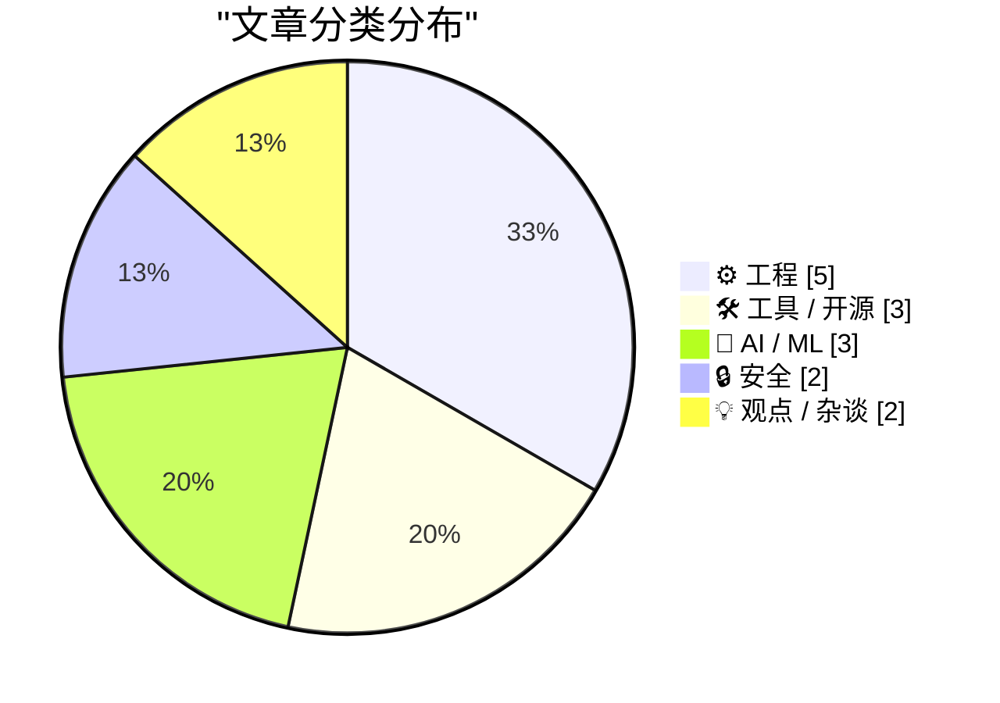
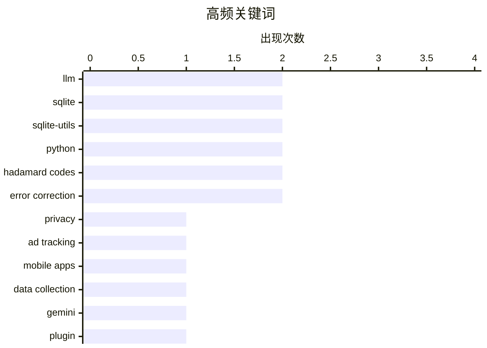

# 📰 Aug 15, 2026

> 来自 Karpathy 推荐的 92 个顶级技术博客，AI 精选 Top 15

## 📝 今日看点

今日技术圈的焦点，一边是生成式 AI 的现实成本与资本需求持续受到审视，另一边则是模型应用从简单调用走向强化学习、自动标注等更复杂的工程实践。围绕 Gemini、SQLite 等工具的更新显示，AI 能力与开发者基础设施仍在快速迭代，可靠性和兼容性成为落地关键。与此同时，广告追踪透明化和 ARM64X 架构控制等话题，凸显隐私治理与多架构计算生态的重要性。

---

## 🏆 今日必读

🥇 **谁在追踪你？用这项新服务查出来**

[Who’s Tracking You? Use This New Service to Find Out](https://krebsonsecurity.com/2026/08/whos-tracking-you-use-this-new-service-to-find-out/) — krebsonsecurity.com · 17 小时前 · 🔒 安全

> 在线广告和移动应用中的数据收集者长期难以辨认，相关信息虽半公开，却分散在大型广告技术平台的封闭体系中。免费服务 DecryptAds 会抓取并关联广告技术生态中的数据，使用户能够快速查看网站广告展示背后的实体。它试图将广告主、追踪器和数据收集参与方之间原本难以解析的关系可视化。该工具降低了调查数字广告供应链和个人数据流向的门槛。作者的核心观点是，广告技术透明度不应只掌握在大型平台手中，公众现在有了更直接的审计工具。

💡 **为什么值得读**: 对隐私研究者、安全从业者和关注应用数据滥用的普通用户而言，DecryptAds 提供了一个可实际操作的追踪溯源入口。

🏷️ privacy, ad tracking, mobile apps, data collection

🥈 **llm-gemini 0.33**

[llm-gemini 0.33](https://simonwillison.net/2026/Aug/13/llm-gemini/) — simonwillison.net · 1 天前 · 🛠 工具 / 开源

> llm-gemini 0.33 是 Simon Willison 的 LLM 命令行及插件生态中面向 Google Gemini 的一次更新。该版本加入对 Gemini 3.7 Flash 的支持，同时覆盖 gemini-3.6-flash 与 gemini-3.5-flash-lite 模型。更新还纳入两种 Gemini 嵌入模型，使插件不仅能调用生成模型，也能用于向量化和语义检索工作流。该版本距离上一次 llm-gemini 发布已有一段时间，重点是跟进 Google 最新模型阵容。核心结论是，使用 LLM 工具链的开发者现在可以通过统一插件接口尝试最新 Gemini Flash 系列及嵌入能力。

💡 **为什么值得读**: 需要在脚本、终端或现有 LLM 工作流中快速接入 Gemini 3.7 Flash 和嵌入模型的开发者，应关注这一版本的兼容性更新。

🏷️ Gemini, LLM, plugin, Google AI

🥉 **AI 到底需要多少钱？**

[Premium: How Much Money Does AI Need?](https://www.wheresyoured.at/premium-how-much-money-does-ai-need/) — wheresyoured.at · 12 小时前 · 💡 观点 / 杂谈

> 文章聚焦生成式 AI 产业为维持训练、推理和基础设施扩张究竟需要多少资本这一问题。作者先回应外界对其长篇分析风格的批评，认为复杂的商业与资本问题不能靠过度简化的短文得出可靠结论。讨论预计会从 AI 公司、模型研发、数据中心和算力投入之间的资金需求出发，审视行业叙事与财务现实的落差。标题直接指向一个关键风险：AI 的技术热度并不自动解决其巨额持续融资和回报压力。作者的核心立场是，判断 AI 行业前景必须严肃计算资本形成、成本结构与可持续性，而不能只接受增长叙事。

💡 **为什么值得读**: 这类分析能帮助读者把 AI 竞争从模型能力排行榜拉回现金流、资本开支和商业回报这些更决定行业走向的变量。

🏷️ AI economics, infrastructure, capital expenditure, AI industry

---

## 📊 数据概览

| 扫描源 | 抓取文章 | 时间范围 | 精选 |
|:---:|:---:|:---:|:---:|
| 83/92 | 2528 篇 → 37 篇 | 48h | **15 篇** |

### 分类分布



### 高频关键词



<details>
<summary>📈 纯文本关键词图（终端友好）</summary>

```
llm              │ ████████████████████ 2
sqlite           │ ████████████████████ 2
sqlite-utils     │ ████████████████████ 2
python           │ ████████████████████ 2
hadamard codes   │ ████████████████████ 2
error correction │ ████████████████████ 2
privacy          │ ██████████░░░░░░░░░░ 1
ad tracking      │ ██████████░░░░░░░░░░ 1
mobile apps      │ ██████████░░░░░░░░░░ 1
data collection  │ ██████████░░░░░░░░░░ 1
```

</details>

### 🏷️ 话题标签

**llm**(2) · **sqlite**(2) · **sqlite-utils**(2) · python(2) · hadamard codes(2) · error correction(2) · privacy(1) · ad tracking(1) · mobile apps(1) · data collection(1) · gemini(1) · plugin(1) · google ai(1) · ai economics(1) · infrastructure(1) · capital expenditure(1) · ai industry(1) · reinforcement learning(1) · game physics(1) · neural network(1)

---

## ⚙️ 工程

### 1. 这个博客是如何构建的

[How This Blog Is Built](https://nesbitt.io/2026/08/14/how-this-blog-is-built.html) — **nesbitt.io** · 18 小时前 · ⭐ 21/30

> 文章完整拆解 nesbitt.io 背后的自定义静态站点生成器、内容处理流水线和边缘部署方案。实现并未依赖现成博客平台，而是围绕内容生成、构建产物和部署环节组合出一套定制化系统。静态站点生成负责将内容转为可发布页面，内容流水线负责组织和处理写作素材，边缘部署则负责将站点快速交付给访问者。文章的价值在于呈现一个真实个人网站从源码到线上服务的工程边界。作者的核心观点是，自定义静态架构可以在保持简单发布体验的同时，提供对内容和交付链路的完全控制。

🏷️ static site generator, content pipeline, edge deployment, web architecture

---

### 2. 强制 ARM64X 可执行文件以指定架构运行

[Forcing an ARM64X executable to run as a specific architecture](https://devblogs.microsoft.com/oldnewthing/20260814-00/?p=112613) — **devblogs.microsoft.com/oldnewthing** · 14 小时前 · ⭐ 19/30

> 文章说明 ARM64X 可执行文件可以请求目标机器按指定的体系结构运行。ARM64X 的设计目标之一是在 Windows 的 ARM64 环境中支持不同架构代码的兼容与协同，因此运行时架构选择会影响加载和执行路径。作者聚焦的不是重新编译二进制文件，而是如何在启动或调用时明确指定目标机器架构。该机制对于调试混合架构兼容性、验证特定执行路径或处理过渡期应用部署很有价值。核心结论是，ARM64X 的运行架构并非总由系统隐式决定，开发者可以主动提出架构请求。

🏷️ ARM64X, Windows, executable, architecture

---

### 3. NASA 的水手 9 号探测器如何编码图像

[How NASA’s Mariner 9 probe encoded images](https://www.johndcook.com/blog/2026/08/13/mariner-hadamard/) — **johndcook.com** · 1 天前 · ⭐ 18/30

> 1971 年 NASA 的水手 9 号探测器拍摄火星图像时，必须先对图像数据进行纠错编码，否则信号传回地球后会受到严重损坏。任务采用了基于哈达玛矩阵的哈达玛码，具体为 (32, 6, 16) 码。这个参数表示每 6 位信息被编码成 32 位码字，并具有 16 的最小汉明距离，从而允许接收端检测并纠正传输错误。文章通过这一历史案例展示，抽象的线性代数结构如何服务于深空通信中可靠传输图像的需求。核心结论是，哈达玛码在低信噪比、长距离通信场景中具有实际而重要的工程价值。

🏷️ Mariner 9, error correction, Hadamard codes, image transmission

---

### 4. 构造哈达玛矩阵

[Constructing Hadamard matrices](https://www.johndcook.com/blog/2026/08/13/constructing-hadamard-matrices/) — **johndcook.com** · 1 天前 · ⭐ 18/30

> 哈达玛矩阵是一种元素全部为 1 或 -1、且行列彼此正交的矩阵。文章从 2 阶哈达玛矩阵出发，介绍 James Joseph Sylvester 提出的递归构造方法：给定一个哈达玛矩阵 H，可以通过块矩阵组合生成更高阶的矩阵。该方法能够把已有阶数扩展为原来的 2 倍，并保持正交性质，因此可系统地产生 4、8、16 等阶数的哈达玛矩阵。文章也提到 Stigler 命名定律，指出 Sylvester 早于 Jacques Hadamard 研究这类矩阵。核心观点是，简单的块矩阵递归就能揭示哈达玛矩阵背后的构造规律，并为其在编码和通信中的应用奠定基础。

🏷️ Hadamard matrices, linear algebra, Sylvester, coding theory

---

### 5. IBM 5170 PC/AT

[IBM 5170 PC/AT](https://dfarq.homeip.net/ibm-5170-pc-at/?utm_source=rss&#038;utm_medium=rss&#038;utm_campaign=ibm-5170-pc-at) — **dfarq.homeip.net** · 1 天前 · ⭐ 18/30

> IBM 5170 PC/AT 于 1984 年 8 月 14 日发布，是 IBM 个人电脑发展史上的重要机型。它被认为是最后一代采用开放架构的 IBM PC，并凭借更强的性能成为 1984 年至约 1987 年年中间速度最快、价格也最高的个人电脑之一。PC/AT 的设计影响了后续大量兼容机，尤其是其总线、扩展能力和硬件生态，为 IBM PC 兼容机市场的形成提供了重要基础。文章从复古计算机视角回顾这款设备为何在今天仍然受欢迎，并将其历史地位与当时的性能和市场定位联系起来。核心观点是，PC/AT 的意义不仅在于怀旧，还在于它代表了开放架构 PC 从 IBM 产品走向广泛兼容生态的关键阶段。

🏷️ IBM PC, PC/AT, retro computing, open architecture

---

## 🛠 工具 / 开源

### 6. llm-gemini 0.33

[llm-gemini 0.33](https://simonwillison.net/2026/Aug/13/llm-gemini/) — **simonwillison.net** · 1 天前 · ⭐ 24/30

> llm-gemini 0.33 是 Simon Willison 的 LLM 命令行及插件生态中面向 Google Gemini 的一次更新。该版本加入对 Gemini 3.7 Flash 的支持，同时覆盖 gemini-3.6-flash 与 gemini-3.5-flash-lite 模型。更新还纳入两种 Gemini 嵌入模型，使插件不仅能调用生成模型，也能用于向量化和语义检索工作流。该版本距离上一次 llm-gemini 发布已有一段时间，重点是跟进 Google 最新模型阵容。核心结论是，使用 LLM 工具链的开发者现在可以通过统一插件接口尝试最新 Gemini Flash 系列及嵌入能力。

🏷️ Gemini, LLM, plugin, Google AI

---

### 7. sqlite-utils 4.2

[sqlite-utils 4.2](https://simonwillison.net/2026/Aug/13/sqlite-utils/) — **simonwillison.net** · 1 天前 · ⭐ 22/30

> sqlite-utils 4.2 的重点是增强 Python API 中 `table.transform()` 对复杂 SQLite 表结构变更的支持。`transform()` 的实现方式是创建新表、复制原表数据，再删除并替换旧表，从而绕开 SQLite 原生 `ALTER TABLE` 的能力限制。该版本围绕这一工作流加入了多项改进，使复杂迁移可以通过更高层的 API 完成。文章特别强调数据复制与替换表的机制，说明变更不仅是简单修改元数据。作者的核心观点是，可靠地封装“重建表”策略，能让 SQLite 的复杂 schema 演进更易用且更安全。

🏷️ SQLite, sqlite-utils, table transform, Python

---

### 8. sqlite-utils 4.2.1

[sqlite-utils 4.2.1](https://simonwillison.net/2026/Aug/13/sqlite-utils-2/) — **simonwillison.net** · 1 天前 · ⭐ 20/30

> sqlite-utils 4.2.1 是针对 4.2 的紧急修复版本，解决了一个会导致程序崩溃的问题。问题源于代码使用了 `from typing_extensions import Self`，但 `typing-extensions` 没有被声明为 sqlite-utils 的依赖。结果是在缺少该包的环境中，导入或运行相关代码可能直接失败。4.2.1 的修复重点是补齐这一依赖关系，恢复安装后的可用性。作者传达的结论是，类型注解相关包即使看似只是开发辅助，也必须在运行时实际导入时被正确声明为生产依赖。

🏷️ SQLite, sqlite-utils, bugfix, Python

---

## 🤖 AI / ML

### 9. 训练强化学习模型玩 Bonk.io

[Training a Reinforcement Learning Model to Play Bonk.io](https://blog.pixelmelt.dev/training-a-reinforcement-learning-model-to-play-bonk-io/) — **blog.pixelmelt.dev** · 1 小时前 · ⭐ 23/30

> 文章记录了如何拆解网页游戏 Bonk.io、重实现其物理引擎，并在模拟环境中训练神经网络控制角色。核心技术路径不是直接对网页界面进行端到端学习，而是先复现游戏中关键的物理行为，建立更适合大量试验的训练环境。随后可利用强化学习让模型在状态、动作和奖励反馈中学习移动与对抗策略。这个过程同时涉及网页游戏逆向分析、物理仿真一致性和强化学习训练设计。作者表明，将真实游戏机制转化为可控模拟器，是让 RL 代理有效学习复杂交互的重要前提。

🏷️ reinforcement learning, game physics, neural network, Bonk.io

---

### 10. 别做分类，让模型幻觉出来！

[Don't classify. Hallucinate!](https://simonwillison.net/2026/Aug/14/dont-classify-hallucinate/) — **simonwillison.net** · 6 小时前 · ⭐ 20/30

> 文章讨论如何为大量未标记的旧博客内容补充标签，难点在于该博客已有 1,856 个标签，无法一次性全部交给 LLM 做候选分类。Doug Turnbull 提出的方案是不向模型提供既有标签列表，而是要求模型根据内容自由生成标签。生成结果随后可以与现有标签体系进行匹配或归并，避免在超大类别集合上进行传统多分类。该方法把“从固定标签中选一个”的分类问题，转为开放式生成再对齐的问题。作者认为，在类别目录过大且标签语义本身可推断时，适度利用模型的生成倾向反而比强行分类更实用。

🏷️ LLM, classification, hallucination, tagging

---

### 11. 哈达玛码与球体堆积

[Hadamard Codes and Sphere Packing](https://www.johndcook.com/blog/2026/08/13/hadamard-sphere-packing/) — **johndcook.com** · 1 天前 · ⭐ 18/30

> 哈达玛矩阵不仅用于构造正交结构，也能生成适合通信系统的纠错码。文章将哈达玛码解释为高维空间中的点集，并联系到球体堆积问题：码字之间的汉明距离越大，接收端就越容易区分受到噪声干扰的信号。哈达玛矩阵提供了具有良好距离性质的码字，因此能够在有限传输带宽下提升数据恢复能力。文章还以 NASA 的深空通信应用为背景，说明这一数学结构如何从抽象的矩阵理论延伸到实际工程。核心观点是，哈达玛矩阵的价值不仅在于构造方便，还在于它同时连接了纠错编码、几何学和通信技术。

🏷️ Hadamard codes, sphere packing, Claude, error correction

---

## 🔒 安全

### 12. 谁在追踪你？用这项新服务查出来

[Who’s Tracking You? Use This New Service to Find Out](https://krebsonsecurity.com/2026/08/whos-tracking-you-use-this-new-service-to-find-out/) — **krebsonsecurity.com** · 17 小时前 · ⭐ 25/30

> 在线广告和移动应用中的数据收集者长期难以辨认，相关信息虽半公开，却分散在大型广告技术平台的封闭体系中。免费服务 DecryptAds 会抓取并关联广告技术生态中的数据，使用户能够快速查看网站广告展示背后的实体。它试图将广告主、追踪器和数据收集参与方之间原本难以解析的关系可视化。该工具降低了调查数字广告供应链和个人数据流向的门槛。作者的核心观点是，广告技术透明度不应只掌握在大型平台手中，公众现在有了更直接的审计工具。

🏷️ privacy, ad tracking, mobile apps, data collection

---

### 13. 供应商安全问卷

[Supplier Security Questionnaire](https://nesbitt.io/2026/08/13/supplier-security-questionnaire.html) — **nesbitt.io** · 1 天前 · ⭐ 18/30

> 文章围绕供应商安全问卷这一常见的第三方风险管理工具展开，预计完成时间为 20 分钟。此类问卷通常用于收集供应商在身份与访问控制、数据保护、漏洞管理、事件响应和合规认证等方面的安全信息。通过标准化问题，采购方可以在合作前识别供应商的安全控制缺口，并将答案纳入供应商准入、分级和持续审查流程。问卷的价值不只是完成合规文档，还在于建立可比较的风险记录，帮助企业决定是否需要额外合同条款、技术验证或审计。核心观点是，供应商安全评估应成为第三方风险管理流程的一部分，而不是一次性的形式审查。

🏷️ vendor security, security questionnaire, risk assessment, compliance

---

## 💡 观点 / 杂谈

### 14. AI 到底需要多少钱？

[Premium: How Much Money Does AI Need?](https://www.wheresyoured.at/premium-how-much-money-does-ai-need/) — **wheresyoured.at** · 12 小时前 · ⭐ 24/30

> 文章聚焦生成式 AI 产业为维持训练、推理和基础设施扩张究竟需要多少资本这一问题。作者先回应外界对其长篇分析风格的批评，认为复杂的商业与资本问题不能靠过度简化的短文得出可靠结论。讨论预计会从 AI 公司、模型研发、数据中心和算力投入之间的资金需求出发，审视行业叙事与财务现实的落差。标题直接指向一个关键风险：AI 的技术热度并不自动解决其巨额持续融资和回报压力。作者的核心立场是，判断 AI 行业前景必须严肃计算资本形成、成本结构与可持续性，而不能只接受增长叙事。

🏷️ AI economics, infrastructure, capital expenditure, AI industry

---

### 15. Pluralistic：资本形成（2026 年 8 月 14 日）

[Pluralistic: Capital formation (14 Aug 2026)](https://pluralistic.net/2026/08/14/one-chokable-throat/) — **pluralistic.net** · 17 小时前 · ⭐ 19/30

> 这期 Pluralistic 通讯以“资本形成”为主线，讨论企业“走向正规化”如何同时意味着被主流资本和制度逻辑塑造。文章汇集多个链接与评论，主题覆盖伦敦 Copyfighters、美国 TSA 与口红事件、长滩摄影权争议、中国互联网审查、版权与万智牌套牌，以及所谓“保护隐私的年龄验证”。其中对“隐私保护型年龄验证”的态度明确且强烈，认为这一说法仍值得警惕和反对。通讯还列出了 Edinburgh、Sydney、Melbourne、Brighton、London 和 South Bend 等即将到访活动。核心观点是，技术、版权、监管与资本议题彼此交织，不能脱离权力结构孤立看待。

🏷️ capital formation, copyright, internet censorship, policy

---

*生成于 2026-08-15 04:24 | 扫描 83 源 → 获取 2528 篇 → 精选 15 篇*
*基于 [Hacker News Popularity Contest 2025](https://refactoringenglish.com/tools/hn-popularity/) RSS 源列表，由 [Andrej Karpathy](https://x.com/karpathy) 推荐*
