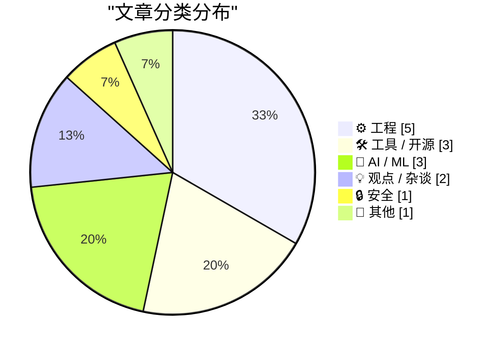
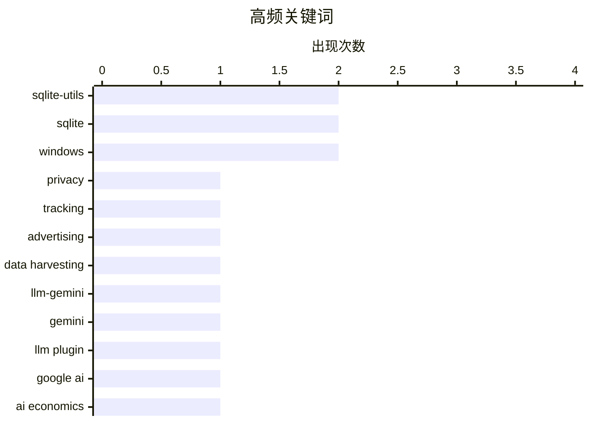

# 📰 Aug 15, 2026

> 来自 Karpathy 推荐的 92 个顶级技术博客，AI 精选 Top 15

## 📝 今日看点

今日技术圈的焦点仍集中在 AI 的能力扩张与成本边界：一边是 Gemini 等新模型快速进入开发工具链，另一边是强化学习落地到复杂交互环境，同时资本投入与商业可持续性正受到更严肃的审视。数据透明与数字权利也在升温，广告技术追踪链条的可见性成为对抗平台信息壁垒的重要议题。工程侧则体现出务实趋势，从自建静态发布体系到 SQLite 演进、ARM64X 兼容控制，开发者持续强化基础设施的可控性与可靠性。

---

## 🏆 今日必读

🥇 **谁在追踪你？用这项新服务查出来**

[Who’s Tracking You? Use This New Service to Find Out](https://krebsonsecurity.com/2026/08/whos-tracking-you-use-this-new-service-to-find-out/) — krebsonsecurity.com · 18 小时前 · 🔒 安全

> 在线广告和移动应用中的数据收集主体往往难以识别，相关信息虽然半公开，却长期分散在大型广告平台的围墙之内。免费服务 DecryptAds 会抓取并关联广告技术（adtech）数据。它将原本难以解析的广告投放与数据追踪信息整理为可查询的关联视图。用户可以更快识别网站广告背后的实体，以及可能从日常应用中收集数据的参与方。核心观点是，广告技术生态的透明度不应只掌握在大型平台手中，公众也应能低成本审视追踪链条。

💡 **为什么值得读**: 对隐私研究、安全分析和广告技术审计感兴趣的读者，可以借此获得一个可实际使用的追踪主体调查工具。

🏷️ privacy, tracking, advertising, data harvesting

🥈 **llm-gemini 0.33**

[llm-gemini 0.33](https://simonwillison.net/2026/Aug/13/llm-gemini/) — simonwillison.net · 1 天前 · 🛠 工具 / 开源

> llm-gemini 0.33 为 LLM 命令行工具的 Gemini 插件补齐了新一代 Google 模型支持。该版本加入当日发布的 Gemini 3.7 Flash。它同时支持 gemini-3.6-flash、gemini-3.5-flash-lite，以及两款 Gemini embedding 嵌入模型。更新意味着用户可以在既有 llm 工作流中调用更多兼顾速度、成本和语义检索能力的 Gemini 模型。核心结论是，插件通过及时跟进模型目录，让 Gemini 的新能力能够直接进入本地命令行和自动化流程。

💡 **为什么值得读**: 使用 Simon Willison 的 `llm` 工具或计划将 Gemini 接入脚本化工作流的人，可快速确认 0.33 可用的模型范围。

🏷️ llm-gemini, Gemini, LLM plugin, Google AI

🥉 **高级内容：AI 到底需要多少钱？**

[Premium: How Much Money Does AI Need?](https://www.wheresyoured.at/premium-how-much-money-does-ai-need/) — wheresyoured.at · 14 小时前 · 🤖 AI / ML

> 文章围绕人工智能产业继续扩张所需的资金规模展开讨论。作者先回应读者对篇幅过长的反馈，明确表示长文仍是其完整论证复杂问题的必要形式。标题指向对 AI 融资、资本投入与商业可持续性的质疑。给出的内容片段未展示具体财务模型、公司数据或最终测算结论，因此无法可靠还原其完整论证。作者的基本立场是，理解 AI 的经济问题需要比简短评论更充分的推理和上下文。

💡 **为什么值得读**: 适合想从批判性长文视角审视 AI 资本需求与产业经济账，而不满足于融资新闻标题的人。

🏷️ AI economics, compute costs, AI funding, infrastructure

---

## 📊 数据概览

| 扫描源 | 抓取文章 | 时间范围 | 精选 |
|:---:|:---:|:---:|:---:|
| 85/92 | 2558 篇 → 37 篇 | 48h | **15 篇** |

### 分类分布



### 高频关键词



<details>
<summary>📈 纯文本关键词图（终端友好）</summary>

```
sqlite-utils    │ ████████████████████ 2
sqlite          │ ████████████████████ 2
windows         │ ████████████████████ 2
privacy         │ ██████████░░░░░░░░░░ 1
tracking        │ ██████████░░░░░░░░░░ 1
advertising     │ ██████████░░░░░░░░░░ 1
data harvesting │ ██████████░░░░░░░░░░ 1
llm-gemini      │ ██████████░░░░░░░░░░ 1
gemini          │ ██████████░░░░░░░░░░ 1
llm plugin      │ ██████████░░░░░░░░░░ 1
```

</details>

### 🏷️ 话题标签

**sqlite-utils**(2) · **sqlite**(2) · **windows**(2) · privacy(1) · tracking(1) · advertising(1) · data harvesting(1) · llm-gemini(1) · gemini(1) · llm plugin(1) · google ai(1) · ai economics(1) · compute costs(1) · ai funding(1) · infrastructure(1) · capital formation(1) · copyright(1) · internet censorship(1) · digital rights(1) · static site generator(1)

---

## ⚙️ 工程

### 1. 这个博客是如何构建的

[How This Blog Is Built](https://nesbitt.io/2026/08/14/how-this-blog-is-built.html) — **nesbitt.io** · 20 小时前 · ⭐ 23/30

> 文章完整拆解了 nesbitt.io 背后的自定义静态站点生成器、内容处理管线和边缘部署方案。重点不在某个现成博客框架的配置，而在自建生成与发布体系的实现路径。内容管线负责将源内容转换为静态站点可部署的产物。边缘部署则承担面向访问者的快速交付。核心观点是，个人博客可以通过定制化静态生成与边缘基础设施获得可控、简洁的发布系统。

🏷️ static site generator, content pipeline, edge deployment, web architecture

---

### 2. 强制 ARM64X 可执行文件以指定架构运行

[Forcing an ARM64X executable to run as a specific architecture](https://devblogs.microsoft.com/oldnewthing/20260814-00/?p=112613) — **devblogs.microsoft.com/oldnewthing** · 16 小时前 · ⭐ 21/30

> 文章说明 ARM64X 可执行文件可以请求目标机器以特定架构运行。ARM64X 的设计目标之一是支持 ARM64 与 x64 兼容场景，因此实际执行架构可能并非开发者预期。该机制允许调用方显式指定目标机器架构，从而影响加载和运行路径。问题的关键在于理解 Windows 对混合架构二进制文件的架构选择规则。核心结论是，ARM64X 的架构选择并非完全不可控，应用可以发出明确的目标架构请求。

🏷️ ARM64X, Windows, architecture, executable

---

### 3. 打印列表

[Printing Lists](https://matklad.github.io/2026/08/14/printing-lists.html) — **matklad.github.io** · 1 天前 · ⭐ 21/30

> 文章讨论生成逗号分隔列表时的一种简洁输出惯用法。其做法是在输出每个元素之前，先按条件输出逗号。由于第一个元素前不输出分隔符，这种写法避免了处理“最后一个元素”或事后删除尾随逗号的特殊逻辑。该模式尤其适合流式输出，因为不必预先知道列表长度或缓存全部元素。核心观点是，把分隔符附着到后续元素之前，通常能让列表格式化代码更短且更稳健。

🏷️ programming, formatting, lists, code idioms

---

### 4. 用于管理 LPPROC_THREAD_ATTRIBUTE_LIST 的小型辅助类

[A little helper class for managing LPPROC_THREAD_ATTRIBUTE_LISTs](https://devblogs.microsoft.com/oldnewthing/20260813-00/?p=112611) — **devblogs.microsoft.com/oldnewthing** · 1 天前 · ⭐ 19/30

> 文章介绍了一个用于管理 Windows API 中 LPPROC_THREAD_ATTRIBUTE_LIST 的小型 C++ 辅助类。该对象采用 RAII 风格，将属性列表的初始化、资源分配和清理绑定到对象生命周期中，减少手动调用相关 API 时的资源管理负担。这个封装尤其适合需要配置进程或线程创建属性的代码，可降低异常路径、提前返回或初始化失败造成资源泄漏的风险。文章的核心观点是，即使是结构复杂、生命周期不直观的 Win32 数据结构，也值得用轻量级 RAII 包装器建立清晰的所有权边界。

🏷️ Windows, C++, RAII, process attributes

---

### 5. NASA 的水手 9 号探测器如何编码图像

[How NASA’s Mariner 9 probe encoded images](https://www.johndcook.com/blog/2026/08/13/mariner-hadamard/) — **johndcook.com** · 1 天前 · ⭐ 19/30

> NASA 的水手 9 号探测器于 1971 年拍摄火星图像时，必须先使用纠错码编码，才能抵抗深空传输中的噪声和数据损坏。探测器采用了基于哈达玛矩阵的 Hadamard code，具体参数为 (32, 6, 16)，将6位信息编码成32位码字。码字之间的较大汉明距离使地面接收端能够识别并纠正部分传输错误，从而恢复原始图像数据。文章展示了抽象的矩阵结构如何服务于真实的 NASA 深空通信任务，也说明可靠图像传输依赖的不只是相机和天线，还包括精心设计的编码方案。

🏷️ NASA, Mariner 9, error correction, image encoding

---

## 🛠 工具 / 开源

### 6. llm-gemini 0.33

[llm-gemini 0.33](https://simonwillison.net/2026/Aug/13/llm-gemini/) — **simonwillison.net** · 1 天前 · ⭐ 24/30

> llm-gemini 0.33 为 LLM 命令行工具的 Gemini 插件补齐了新一代 Google 模型支持。该版本加入当日发布的 Gemini 3.7 Flash。它同时支持 gemini-3.6-flash、gemini-3.5-flash-lite，以及两款 Gemini embedding 嵌入模型。更新意味着用户可以在既有 llm 工作流中调用更多兼顾速度、成本和语义检索能力的 Gemini 模型。核心结论是，插件通过及时跟进模型目录，让 Gemini 的新能力能够直接进入本地命令行和自动化流程。

🏷️ llm-gemini, Gemini, LLM plugin, Google AI

---

### 7. sqlite-utils 4.2

[sqlite-utils 4.2](https://simonwillison.net/2026/Aug/13/sqlite-utils/) — **simonwillison.net** · 1 天前 · ⭐ 22/30

> sqlite-utils 4.2 的主要改进集中在 Python API 中的 `table.transform()`。该功能通过新建表、复制数据、删除旧表并以新表替换的方式，支持复杂的 SQLite `ALTER TABLE` 操作。4.2 进一步改进了这一转换流程中的数据或表结构保留行为。该设计规避了 SQLite 原生模式变更能力有限的问题，同时让调用方以更高层 API 执行迁移。核心结论是，`transform()` 正成为 sqlite-utils 处理复杂表结构演进的关键机制。

🏷️ sqlite-utils, SQLite, table transformation, Python API

---

### 8. sqlite-utils 4.2.1

[sqlite-utils 4.2.1](https://simonwillison.net/2026/Aug/13/sqlite-utils-2/) — **simonwillison.net** · 1 天前 · ⭐ 20/30

> sqlite-utils 4.2.1 是针对 4.2 的紧急修复版本，用于解决会导致程序崩溃的缺陷。问题源于代码新增了 `from typing_extensions import Self`。但 `typing-extensions` 没有被列入 sqlite-utils 的依赖项，导致缺少该包的环境在导入或运行时失败。4.2.1 修正了这一依赖管理问题，以恢复包在常规安装环境中的可用性。核心结论是，类型注解相关的运行时导入同样必须被明确声明为发布依赖。

🏷️ sqlite-utils, SQLite, bug fix, release

---

## 🤖 AI / ML

### 9. 高级内容：AI 到底需要多少钱？

[Premium: How Much Money Does AI Need?](https://www.wheresyoured.at/premium-how-much-money-does-ai-need/) — **wheresyoured.at** · 14 小时前 · ⭐ 24/30

> 文章围绕人工智能产业继续扩张所需的资金规模展开讨论。作者先回应读者对篇幅过长的反馈，明确表示长文仍是其完整论证复杂问题的必要形式。标题指向对 AI 融资、资本投入与商业可持续性的质疑。给出的内容片段未展示具体财务模型、公司数据或最终测算结论，因此无法可靠还原其完整论证。作者的基本立场是，理解 AI 的经济问题需要比简短评论更充分的推理和上下文。

🏷️ AI economics, compute costs, AI funding, infrastructure

---

### 10. 训练强化学习模型玩 Bonk.io

[Training a Reinforcement Learning Model to Play Bonk.io](https://blog.pixelmelt.dev/training-a-reinforcement-learning-model-to-play-bonk-io/) — **blog.pixelmelt.dev** · 3 小时前 · ⭐ 23/30

> 文章研究如何让强化学习模型学会玩网页物理游戏 Bonk.io。实现首先对游戏进行逆向分析，以重新实现其物理引擎。这个可控的物理模拟环境随后用于训练神经网络，而不是直接依赖浏览器中的原始游戏运行时。该方法将网页游戏自动化问题拆分为物理复现、环境构建和策略学习三个部分。核心结论是，准确复刻游戏动力学能够为强化学习训练提供更稳定、更高效的实验基础。

🏷️ reinforcement learning, game physics, neural network, Bonk.io

---

### 11. 不要分类，去“幻觉”生成标签！

[Don't classify. Hallucinate!](https://simonwillison.net/2026/Aug/14/dont-classify-hallucinate/) — **simonwillison.net** · 8 小时前 · ⭐ 19/30

> 面对博客中多达1,856个标签，直接把全部标签交给大语言模型并要求其从中分类匹配，可能超出上下文长度并降低判断质量。Doug Turnbull提出的方案是让模型直接为文章生成候选标签，而不是要求它从既有标签列表中进行严格分类。提示词还要求模型只输出标签、不附带解释，以便结果可以直接进入后续处理流程。这个思路把“从巨大类别集合中选择”改写为“根据内容生成合理标签”，更适合自动整理历史内容，但仍需要额外的规范化或去重步骤来控制标签数量和一致性。

🏷️ classification, hallucination, LLM, metadata

---

## 💡 观点 / 杂谈

### 12. Pluralistic：资本形成（2026 年 8 月 14 日）

[Pluralistic: Capital formation (14 Aug 2026)](https://pluralistic.net/2026/08/14/one-chokable-throat/) — **pluralistic.net** · 19 小时前 · ⭐ 23/30

> 这期 Pluralistic 的主线是“资本形成”，并提出“走向合法化就意味着走向主流化”的判断。文章以链接汇编形式覆盖伦敦 Copyfighters、TSA 与口红、长滩摄影权利、中国与 David Cameron 的互联网审查、McMansion Hell、万智牌套牌版权等议题。目录还明确批评所谓“隐私保护的年龄验证”，以“delenda est”表达应被废除的强烈立场。内容横跨版权、隐私、审查、公共空间与互联网治理，并附有作者近期和未来公开活动信息。核心观点是，资本、平台与制度化治理如何改变边缘实践和个人权利，值得持续警惕。

🏷️ capital formation, copyright, internet censorship, digital rights

---

### 13. Google 的“Material 3”设计说明有 93.3% 令人尴尬

[Google’s ‘Material 3’ Design Write-Up Is 93.3 Percent Embarrassing](https://design.google/library/expressive-material-design-google-research) — **daringfireball.net** · 13 小时前 · ⭐ 19/30

> 文章以讽刺口吻批评 Google 关于 Material 3 UI 设计语言的官方说明，认为其中不少设计决策把视觉新鲜感置于可用性和平台惯例之上。作者特别指出，在使用鼠标的桌面浏览器中，文本选择时本应显示为 I-beam 的光标被改成了圆形，这削弱了用户对交互状态的识别。文章还质疑 Google 公开展示一个笨拙的待办事项应用，以及设计文档中对“有趣”视觉效果的过度强调。核心观点是，Material 3 的表达性设计并没有充分证明其改动能改善实际交互，部分变化反而偏离了成熟的用户界面约定。

🏷️ Material Design, UI design, Google, design critique

---

## 🔒 安全

### 14. 谁在追踪你？用这项新服务查出来

[Who’s Tracking You? Use This New Service to Find Out](https://krebsonsecurity.com/2026/08/whos-tracking-you-use-this-new-service-to-find-out/) — **krebsonsecurity.com** · 18 小时前 · ⭐ 25/30

> 在线广告和移动应用中的数据收集主体往往难以识别，相关信息虽然半公开，却长期分散在大型广告平台的围墙之内。免费服务 DecryptAds 会抓取并关联广告技术（adtech）数据。它将原本难以解析的广告投放与数据追踪信息整理为可查询的关联视图。用户可以更快识别网站广告背后的实体，以及可能从日常应用中收集数据的参与方。核心观点是，广告技术生态的透明度不应只掌握在大型平台手中，公众也应能低成本审视追踪链条。

🏷️ privacy, tracking, advertising, data harvesting

---

## 📝 其他

### 15. 哈达玛码与球堆积

[Hadamard Codes and Sphere Packing](https://www.johndcook.com/blog/2026/08/13/hadamard-sphere-packing/) — **johndcook.com** · 1 天前 · ⭐ 20/30

> 哈达玛矩阵不仅能用于构造误差校正码，还可以从几何角度解释为单位球面上的高效点集排列。矩阵的正交行向量经过适当缩放后，可对应球面上两两距离相同的点，从而形成与球堆积问题相关的编码结构。文章说明哈达玛码如何利用这些大距离码字提高噪声信道中的判别能力，并将离散编码问题联系到球面打包这一几何问题。核心观点是，哈达玛矩阵的实用价值不仅在于代数构造，也在于它揭示了编码理论与高维几何之间的直接联系。

🏷️ Hadamard codes, sphere packing, Claude AI, mathematics

---

*生成于 2026-08-15 06:14 | 扫描 85 源 → 获取 2558 篇 → 精选 15 篇*
*基于 [Hacker News Popularity Contest 2025](https://refactoringenglish.com/tools/hn-popularity/) RSS 源列表，由 [Andrej Karpathy](https://x.com/karpathy) 推荐*
