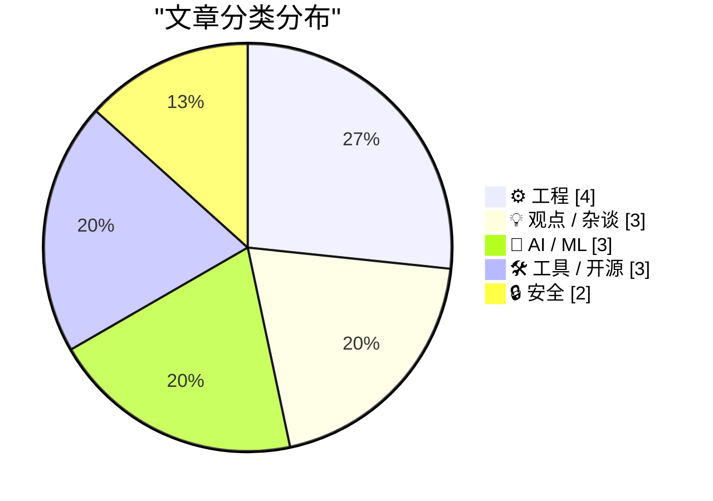
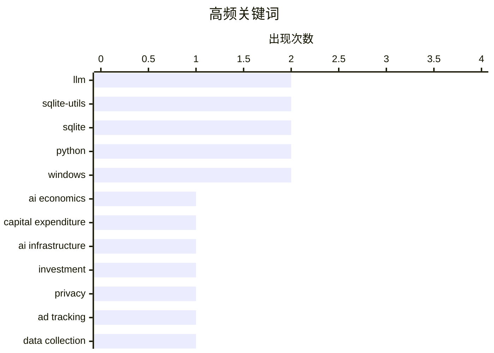

# 📰 Aug 15, 2026

> 来自 Karpathy 推荐的 92 个顶级技术博客，AI 精选 Top 15

## 📝 今日看点

今日技术圈的焦点仍在生成式 AI 的产业化：从训练和推理所需的巨额资本，到大规模标签生成、强化学习训练和新模型工具接入，讨论正从“模型能做什么”转向“如何以可持续成本把能力落地”。与此同时，AI 正深度参与工程与科研流程，既被用于内容处理和自动化，也开始辅助数学发现，推动工具链和方法论同步演进。另一条重要主线是数字基础设施的透明与自主：广告追踪揭露、隐私与资本权力的讨论，以及定制化发布和轻量数据库工具，都反映出开发者对数据控制权和可维护系统的持续重视。

---

## 🏆 今日必读

🥇 **高级版：AI 到底需要多少钱？**

[Premium: How Much Money Does AI Need?](https://www.wheresyoured.at/premium-how-much-money-does-ai-need/) — wheresyoured.at · 16 小时前 · 💡 观点 / 杂谈

> 文章聚焦生成式 AI 产业需要投入多少资本，以及这种资本需求是否与其商业前景相匹配。作者以长期、论证密集的写作方式展开，认为要理解 AI 的经济现实，不能只看模型能力或短期融资新闻。核心问题是训练、推理、数据中心和基础设施等持续成本，究竟会如何塑造 AI 公司的商业模式与行业集中度。标题所指向的结论是，AI 的资金需求本身已是评估该行业可持续性和权力结构的关键变量。所提供节选未包含具体财务数据、公司案例或完整论证细节。

💡 **为什么值得读**: 适合希望跳出产品演示与估值叙事，从资本开支和商业可持续性角度审视 AI 热潮的读者。

🏷️ AI economics, capital expenditure, AI infrastructure, investment

🥈 **谁在追踪你？用这项新服务查出来**

[Who’s Tracking You? Use This New Service to Find Out](https://krebsonsecurity.com/2026/08/whos-tracking-you-use-this-new-service-to-find-out/) — krebsonsecurity.com · 20 小时前 · 🔒 安全

> DecryptAds 是一项免费的广告技术分析服务，用于识别网站广告和移动应用数据收集背后的实体。广告投放、追踪器和数据流向的部分信息原本已半公开，但数据格式分散、难以解析，并且长期被大型广告平台掌握。DecryptAds 通过抓取并关联这些 adtech 数据，将广告主、追踪方和相关实体的信息集中呈现出来。它降低了研究人员、记者和普通用户调查在线追踪生态的门槛。文章的核心观点是，广告技术的透明度不应只掌握在大平台手中，公开可查询的数据关联服务能强化外部监督。

💡 **为什么值得读**: 它提供了一个可直接使用的调查工具，能把抽象的隐私追踪问题转化为对具体公司和数据关系的核查。

🏷️ privacy, ad tracking, data collection, mobile apps

🥉 **别分类，直接幻觉生成！**

[Don't classify. Hallucinate!](https://simonwillison.net/2026/Aug/14/dont-classify-hallucinate/) — simonwillison.net · 10 小时前 · 🤖 AI / ML

> 文章讨论如何为拥有 1,856 个标签的旧博客内容自动补标签，而不是将全部候选标签一次性交给 LLM 做分类。传统分类提示需要提供固定标签集合；当标签数量很大时，会造成上下文负担、成本上升，并限制模型发现合适新标签的能力。Doug Turnbull 的方案是不给模型任何现有标签列表，直接要求它根据文章内容生成可能的标签。随后再将模型输出与已有标签体系进行匹配或人工审查，从而把“幻觉式生成”变成候选召回阶段。核心结论是，在超大标签库场景中，先开放生成候选、再做规范化处理，往往比封闭式多分类更实用。

💡 **为什么值得读**: 这个思路为 LLM 驱动的内容归档提供了一个简单但反直觉的检索与分类架构，尤其适合标签空间过大的知识库。

🏷️ LLM, classification, hallucination, tagging

---

## 📊 数据概览

| 扫描源 | 抓取文章 | 时间范围 | 精选 |
|:---:|:---:|:---:|:---:|
| 84/92 | 2540 篇 → 37 篇 | 48h | **15 篇** |

### 分类分布



### 高频关键词



<details>
<summary>📈 纯文本关键词图（终端友好）</summary>

```
llm                 │ ████████████████████ 2
sqlite-utils        │ ████████████████████ 2
sqlite              │ ████████████████████ 2
python              │ ████████████████████ 2
windows             │ ████████████████████ 2
ai economics        │ ██████████░░░░░░░░░░ 1
capital expenditure │ ██████████░░░░░░░░░░ 1
ai infrastructure   │ ██████████░░░░░░░░░░ 1
investment          │ ██████████░░░░░░░░░░ 1
privacy             │ ██████████░░░░░░░░░░ 1
```

</details>

### 🏷️ 话题标签

**llm**(2) · **sqlite-utils**(2) · **sqlite**(2) · python(2) · windows(2) · ai economics(1) · capital expenditure(1) · ai infrastructure(1) · investment(1) · privacy(1) · ad tracking(1) · data collection(1) · mobile apps(1) · classification(1) · hallucination(1) · tagging(1) · gemini(1) · plugin(1) · google(1) · reinforcement learning(1)

---

## ⚙️ 工程

### 1. 这个博客是如何构建的

[How This Blog Is Built](https://nesbitt.io/2026/08/14/how-this-blog-is-built.html) — **nesbitt.io** · 22 小时前 · ⭐ 21/30

> 文章完整拆解 nesbitt.io 背后的自定义静态站点生成器、内容处理流水线和边缘部署架构。站点没有依赖现成 CMS 或通用静态站点框架，而是围绕作者的内容组织与发布需求构建专用系统。内容流水线负责将源内容转换为最终页面，静态生成器负责页面构建和站点结构，边缘部署负责把生成结果高效发布到访问者附近。该案例说明个人博客的技术架构可以在可维护性、性能和定制能力之间做针对性取舍。核心观点是，端到端自建发布系统的价值不在于重复造轮子，而在于让内容模型与部署方式精确匹配站点需求。

🏷️ static site generator, content pipeline, edge deployment, web infrastructure

---

### 2. 强制 ARM64X 可执行文件以指定架构运行

[Forcing an ARM64X executable to run as a specific architecture](https://devblogs.microsoft.com/oldnewthing/20260814-00/?p=112613) — **devblogs.microsoft.com/oldnewthing** · 18 小时前 · ⭐ 18/30

> ARM64X 可执行文件能够同时承载面向不同 ARM64 兼容环境的代码，因此其实际运行架构可能需要由调用方明确控制。文章聚焦 Windows 中请求目标机器架构的机制，用于强制此类程序以指定架构启动。该能力可帮助开发者验证不同架构代码路径，并避免由系统默认选择带来的兼容性或调试歧义。核心观点是：面对 ARM64X 的多架构特性，应通过显式目标架构请求获得可预测的执行行为。

🏷️ ARM64X, Windows, executable, architecture

---

### 3. 打印列表

[Printing Lists](https://matklad.github.io/2026/08/14/printing-lists.html) — **matklad.github.io** · 1 天前 · ⭐ 18/30

> 逗号分隔列表的输出看似简单，却常因首元素、尾随分隔符和条件分支产生多余代码。文章给出一种简洁惯用法：在打印每个元素之前，按需先打印逗号。这样可将分隔符处理统一到循环内部，并避免最后一个元素后的尾随逗号。该模式尤其适合 Rust 等强调迭代器与显式输出控制的语言场景。核心观点是：将分隔符视为“元素前缀”而非“元素后缀”，能让列表格式化逻辑更短且更不易出错。

🏷️ programming, list formatting, code idioms, output

---

### 4. 管理 LPPROC_THREAD_ATTRIBUTE_LIST 的小型辅助类

[A little helper class for managing LPPROC_THREAD_ATTRIBUTE_LISTs](https://devblogs.microsoft.com/oldnewthing/20260813-00/?p=112611) — **devblogs.microsoft.com/oldnewthing** · 1 天前 · ⭐ 17/30

> Windows 创建进程时，`LPPROC_THREAD_ATTRIBUTE_LIST` 用于携带扩展的进程与线程属性，但其初始化、内存管理和清理流程较为繁琐。文章提出一个 RAII 风格的 C++ 包装类，将资源申请、属性列表初始化和析构释放封装为对象生命周期的一部分。该设计可降低手动调用 Win32 API 时发生泄漏、遗漏清理或错误处理不完整的风险。包装类的目标是让调用方专注于设置属性，而非反复处理底层资源管理样板代码。核心观点是：对具有显式所有权规则的 Win32 句柄或结构，RAII 是提高异常安全性和可维护性的合适边界。

🏷️ Windows, C++, RAII, process creation

---

## 💡 观点 / 杂谈

### 5. 高级版：AI 到底需要多少钱？

[Premium: How Much Money Does AI Need?](https://www.wheresyoured.at/premium-how-much-money-does-ai-need/) — **wheresyoured.at** · 16 小时前 · ⭐ 25/30

> 文章聚焦生成式 AI 产业需要投入多少资本，以及这种资本需求是否与其商业前景相匹配。作者以长期、论证密集的写作方式展开，认为要理解 AI 的经济现实，不能只看模型能力或短期融资新闻。核心问题是训练、推理、数据中心和基础设施等持续成本，究竟会如何塑造 AI 公司的商业模式与行业集中度。标题所指向的结论是，AI 的资金需求本身已是评估该行业可持续性和权力结构的关键变量。所提供节选未包含具体财务数据、公司案例或完整论证细节。

🏷️ AI economics, capital expenditure, AI infrastructure, investment

---

### 6. Pluralistic：资本形成（2026 年 8 月 14 日）

[Pluralistic: Capital formation (14 Aug 2026)](https://pluralistic.net/2026/08/14/one-chokable-throat/) — **pluralistic.net** · 21 小时前 · ⭐ 20/30

> 这期 Pluralistic 的主线是“资本形成”：企业走向合规和主流市场后，资本与制度会如何改变其行为。作者汇集了多条技术、版权、言论自由、隐私和公共权力相关新闻，包括伦敦 Copyfighters、TSA 与口红、长滩摄影者权利、中国互联网审查、McMansion Hell，以及为万智牌套牌主张版权等议题。隐私议题特别点名“保护隐私的年龄验证”，并以拉丁语 `delenda est` 表明强烈反对态度。文章也列出爱丁堡、悉尼、墨尔本、布莱顿、伦敦和南本德等即将进行的公开活动。核心观点是，资本、平台规则和监管措施常以正常化或保护为名扩张控制，因此需要从具体案例持续审视其后果。

🏷️ copyright, internet policy, surveillance, capital formation

---

### 7. 别成为生产力游客

[Don't Become a Productivity Tourist](https://www.joanwestenberg.com/p/dont-become-a-productivity-tourist) — **joanwestenberg.com** · 1 天前 · ⭐ 17/30

> 文章批评不断尝试新工具、新方法和新工作流，却很少长期坚持执行的“生产力游客”心态。作者提出“如果你的工作流让你觉得无聊，它可能正在奏效”的判断，指出稳定重复往往比持续寻求新鲜感更能带来产出。频繁调整系统会消耗注意力，并把改善流程本身误当成完成工作。真正有效的工作流应足够简单、可靠且可重复，即使它不再令人兴奋。核心观点是：生产力来自长期执行少数有效习惯，而不是不断消费新的效率技巧。

🏷️ productivity, workflow, focus, habits

---

## 🤖 AI / ML

### 8. 别分类，直接幻觉生成！

[Don't classify. Hallucinate!](https://simonwillison.net/2026/Aug/14/dont-classify-hallucinate/) — **simonwillison.net** · 10 小时前 · ⭐ 22/30

> 文章讨论如何为拥有 1,856 个标签的旧博客内容自动补标签，而不是将全部候选标签一次性交给 LLM 做分类。传统分类提示需要提供固定标签集合；当标签数量很大时，会造成上下文负担、成本上升，并限制模型发现合适新标签的能力。Doug Turnbull 的方案是不给模型任何现有标签列表，直接要求它根据文章内容生成可能的标签。随后再将模型输出与已有标签体系进行匹配或人工审查，从而把“幻觉式生成”变成候选召回阶段。核心结论是，在超大标签库场景中，先开放生成候选、再做规范化处理，往往比封闭式多分类更实用。

🏷️ LLM, classification, hallucination, tagging

---

### 9. 训练一个玩 Bonk.io 的强化学习模型

[Training a Reinforcement Learning Model to Play Bonk.io](https://blog.pixelmelt.dev/training-a-reinforcement-learning-model-to-play-bonk-io/) — **blog.pixelmelt.dev** · 5 小时前 · ⭐ 22/30

> 文章记录了为网页物理游戏 Bonk.io 训练强化学习模型的工程过程。关键挑战不只是选择神经网络或强化学习算法，而是先逆向分析游戏机制，并重新实现可供大规模训练的物理引擎。通过独立仿真环境，训练过程可以避开浏览器游戏实时运行、环境控制和样本采集效率方面的限制。模型在重建后的物理规则中学习控制角色，目标是掌握 Bonk.io 所需的运动与碰撞策略。作者的核心观点是，针对复杂网页游戏，可靠的环境复刻和物理建模通常是强化学习项目成败的基础。

🏷️ reinforcement learning, Bonk.io, physics engine, neural network

---

### 10. Hadamard 码与球面打包

[Hadamard Codes and Sphere Packing](https://www.johndcook.com/blog/2026/08/13/hadamard-sphere-packing/) — **johndcook.com** · 1 天前 · ⭐ 19/30

> 文章解释 Hadamard 矩阵如何导出 Hadamard 码，并与高维空间中的球面打包问题建立联系。写作动机来自 Levent Alpöge 及其合作者借助 Claude AI 发现新的 Hadamard 矩阵，也延续了对这类矩阵构造方法及其应用的讨论。Hadamard 码利用矩阵行或列之间的正交性，使不同码字保持很大的汉明距离，从而具有纠错能力。将二元码映射到高维球面后，码字间距离对应球面点集的分离程度，因此可以构造球面打包。文章还提到 NASA 曾使用 Hadamard 码，说明这一数学结构具有工程通信价值。核心观点是，Hadamard 矩阵并非纯粹的组合数学对象，其正交结构同时服务于纠错编码和几何优化。

🏷️ Hadamard codes, sphere packing, Claude, error correction

---

## 🛠 工具 / 开源

### 11. llm-gemini 0.33

[llm-gemini 0.33](https://simonwillison.net/2026/Aug/13/llm-gemini/) — **simonwillison.net** · 1 天前 · ⭐ 22/30

> llm-gemini 0.33 是 Simon Willison 的 LLM 插件更新，重点加入对 Google 新发布 Gemini 3.7 Flash 的支持。该版本同时支持 gemini-3.6-flash、gemini-3.5-flash-lite，以及两个 Gemini 嵌入模型。更新使使用 `llm` 命令行工具或其插件生态的开发者能够调用更多 Gemini 模型层级，覆盖快速生成、轻量推理和向量嵌入等任务。版本发布紧随 Gemini 3.7 Flash 的上线，反映出插件对上游模型 API 的快速适配。核心价值在于把新模型能力以统一的 LLM 插件接口暴露给现有工作流。

🏷️ Gemini, LLM, plugin, Google

---

### 12. sqlite-utils 4.2

[sqlite-utils 4.2](https://simonwillison.net/2026/Aug/13/sqlite-utils/) — **simonwillison.net** · 1 天前 · ⭐ 21/30

> sqlite-utils 4.2 集中改进了 Python API 中的 `table.transform()` 功能。该功能通过新建表、迁移数据、删除旧表并替换为新表的方式，实现 SQLite 中较复杂的 `ALTER TABLE` 操作。新版本扩展了 `transform()` 的能力，并改进其在表结构变换过程中对既有数据库对象和数据的保留行为。该设计把 SQLite 原生 DDL 不易直接支持的迁移操作封装成更安全、可编程的高层接口。核心结论是，复杂 SQLite schema migration 应由可重建表并复制数据的机制处理，而不应依赖零散的手工 SQL 变更。

🏷️ sqlite-utils, SQLite, table transformation, Python

---

### 13. sqlite-utils 4.2.1

[sqlite-utils 4.2.1](https://simonwillison.net/2026/Aug/13/sqlite-utils-2/) — **simonwillison.net** · 1 天前 · ⭐ 19/30

> sqlite-utils 4.2.1 是针对 4.2 的紧急修复版本，解决了一个会导致程序崩溃的问题。问题源于代码新增了 `from typing_extensions import Self`，但 `typing-extensions` 没有被列入 sqlite-utils 的安装依赖。对于未恰好安装该包的用户，导入或运行相关代码会触发模块缺失错误。4.2.1 通过补齐依赖声明修复了这个发布配置缺陷。核心结论是，即便功能代码正确，Python 包的依赖元数据遗漏也会立即破坏终端用户的安装和运行体验。

🏷️ sqlite-utils, SQLite, bugfix, Python

---

## 🔒 安全

### 14. 谁在追踪你？用这项新服务查出来

[Who’s Tracking You? Use This New Service to Find Out](https://krebsonsecurity.com/2026/08/whos-tracking-you-use-this-new-service-to-find-out/) — **krebsonsecurity.com** · 20 小时前 · ⭐ 23/30

> DecryptAds 是一项免费的广告技术分析服务，用于识别网站广告和移动应用数据收集背后的实体。广告投放、追踪器和数据流向的部分信息原本已半公开，但数据格式分散、难以解析，并且长期被大型广告平台掌握。DecryptAds 通过抓取并关联这些 adtech 数据，将广告主、追踪方和相关实体的信息集中呈现出来。它降低了研究人员、记者和普通用户调查在线追踪生态的门槛。文章的核心观点是，广告技术的透明度不应只掌握在大平台手中，公开可查询的数据关联服务能强化外部监督。

🏷️ privacy, ad tracking, data collection, mobile apps

---

### 15. 供应商安全问卷

[Supplier Security Questionnaire](https://nesbitt.io/2026/08/13/supplier-security-questionnaire.html) — **nesbitt.io** · 1 天前 · ⭐ 18/30

> 供应商安全问卷用于在采购或合作前评估第三方对数据、系统和运营风险的控制能力。文章以约 20 分钟的预计完成时间为目标，强调将安全评估设计成可快速完成的流程。问卷通常需要覆盖访问控制、数据保护、事件响应、基础设施安全与合规责任等可验证事项。其价值不在于收集泛泛的安全承诺，而在于形成后续风险判断、补充证据与合同约束的输入。核心观点是：有效的供应商尽调应在信息充分和填写负担之间保持平衡。

🏷️ vendor security, security questionnaire, third-party risk, compliance

---

*生成于 2026-08-15 08:13 | 扫描 84 源 → 获取 2540 篇 → 精选 15 篇*
*基于 [Hacker News Popularity Contest 2025](https://refactoringenglish.com/tools/hn-popularity/) RSS 源列表，由 [Andrej Karpathy](https://x.com/karpathy) 推荐*
