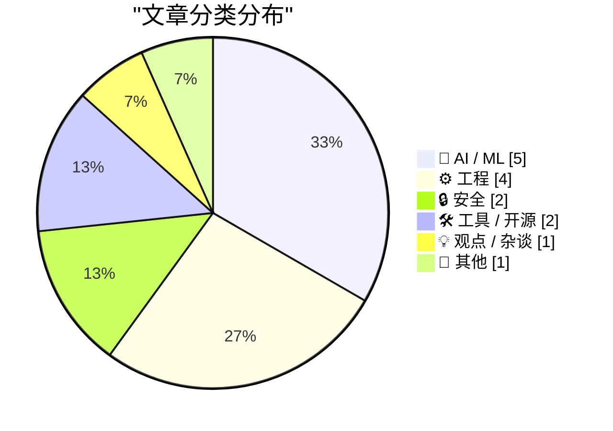
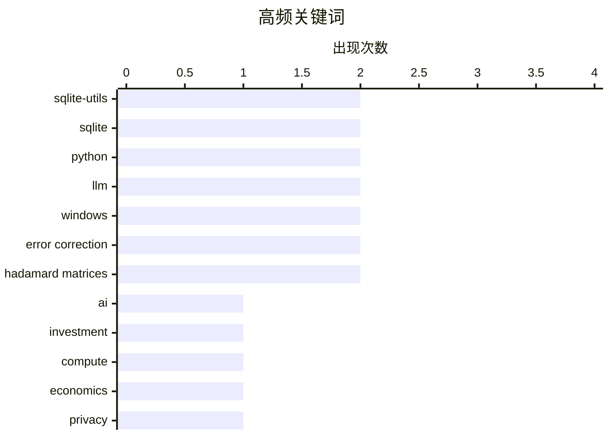

# 📰 Aug 15, 2026

> 来自 Karpathy 推荐的 92 个顶级技术博客，AI 精选 Top 15

## 📝 今日看点

今日技术圈的焦点正从“AI 能做什么”转向“AI 如何持续赚钱”：巨额基础设施投入、模型成本与商业化路径成为核心拷问。与此同时，LLM 正在加速嵌入开发工具、内容治理和科研探索，应用策略也开始从传统分类转向更灵活的生成式工作流。工程侧则继续强调可控与高效，从数据库结构迁移、边缘部署到 ARM64X 兼容性和可重复的强化学习模拟环境，底层能力仍是规模化创新的关键。

---

## 🏆 今日必读

🥇 **AI 需要多少钱？**

[Premium: How Much Money Does AI Need?](https://www.wheresyoured.at/premium-how-much-money-does-ai-need/) — wheresyoured.at · 16 小时前 · 🤖 AI / ML

> 文章聚焦生成式 AI 行业究竟需要投入多少资本，以及巨额融资背后的商业可持续性问题。作者以其一贯的长篇论证方式，试图拆解 AI 基础设施、模型训练和产品商业化之间的资金需求。核心关切不只是模型能力，而是收入增长能否覆盖持续攀升的算力、数据中心和运营成本。文章的标题将问题直接指向 AI 热潮的经济账本：现有投入规模是否与真实回报相匹配。作者认为，理解 AI 的未来不能只看技术演示和融资新闻，还必须严肃审视其资本需求与盈利路径。

💡 **为什么值得读**: 适合希望跳出模型能力叙事、从资本效率和商业基本面评估 AI 热潮的人阅读。

🏷️ AI, investment, compute, economics

🥈 **谁在追踪你？用这项新服务查出来**

[Who’s Tracking You? Use This New Service to Find Out](https://krebsonsecurity.com/2026/08/whos-tracking-you-use-this-new-service-to-find-out/) — krebsonsecurity.com · 20 小时前 · 🔒 安全

> DecryptAds 是一项免费的广告技术透明度服务，用于识别网站广告和移动应用数据收集背后的实体。它抓取并关联原本半公开、但难以解析的 adtech 数据，让用户能更快追溯广告主、数据收集者及相关公司。过去，这类信息大多被大型广告平台掌握，普通用户很难跨平台梳理；DecryptAds 试图把这些分散数据转化为可查询的关系图谱。该服务的价值在于降低广告追踪调查的门槛，使隐私研究人员、记者和普通用户都能审视数字广告生态。核心观点是，广告追踪信息不应继续被平台壁垒遮蔽，公开数据经过关联后可以形成有效监督。

💡 **为什么值得读**: 它提供了可实际使用的隐私调查工具，适合想弄清个人数据被哪些公司收集和利用的人。

🏷️ privacy, ad tracking, mobile apps, data brokers

🥉 **sqlite-utils 4.2**

[sqlite-utils 4.2](https://simonwillison.net/2026/Aug/13/sqlite-utils/) — simonwillison.net · 1 天前 · 🛠 工具 / 开源

> sqlite-utils 4.2 重点增强了 Python API 中的 `table.transform()`，面向 SQLite 表结构的复杂变更操作。该机制通过创建新表、复制原数据、删除旧表并以新表替换的方式，实现 SQLite 原生 `ALTER TABLE` 难以覆盖的迁移需求。新版改进了这一转换流程对表结构和相关对象的保留能力，降低复杂 schema 变更丢失元数据的风险。相比手写迁移脚本，`transform()` 将重建表这一常见但容易出错的流程封装为高层 API。该版本的核心价值是让 sqlite-utils 更适合作为 SQLite 数据库演进和自动化维护工具。

💡 **为什么值得读**: 对维护 SQLite schema 的开发者而言，这个版本直接改善了复杂迁移最繁琐、最容易出错的部分。

🏷️ sqlite-utils, SQLite, table transformation, Python

---

## 📊 数据概览

| 扫描源 | 抓取文章 | 时间范围 | 精选 |
|:---:|:---:|:---:|:---:|
| 83/92 | 2515 篇 → 37 篇 | 48h | **15 篇** |

### 分类分布



### 高频关键词



<details>
<summary>📈 纯文本关键词图（终端友好）</summary>

```
sqlite-utils      │ ████████████████████ 2
sqlite            │ ████████████████████ 2
python            │ ████████████████████ 2
llm               │ ████████████████████ 2
windows           │ ████████████████████ 2
error correction  │ ████████████████████ 2
hadamard matrices │ ████████████████████ 2
ai                │ ██████████░░░░░░░░░░ 1
investment        │ ██████████░░░░░░░░░░ 1
compute           │ ██████████░░░░░░░░░░ 1
```

</details>

### 🏷️ 话题标签

**sqlite-utils**(2) · **sqlite**(2) · **python**(2) · llm(2) · windows(2) · error correction(2) · hadamard matrices(2) · ai(1) · investment(1) · compute(1) · economics(1) · privacy(1) · ad tracking(1) · mobile apps(1) · data brokers(1) · table transformation(1) · gemini(1) · plugin(1) · google(1) · classification(1)

---

## 🤖 AI / ML

### 1. AI 需要多少钱？

[Premium: How Much Money Does AI Need?](https://www.wheresyoured.at/premium-how-much-money-does-ai-need/) — **wheresyoured.at** · 16 小时前 · ⭐ 25/30

> 文章聚焦生成式 AI 行业究竟需要投入多少资本，以及巨额融资背后的商业可持续性问题。作者以其一贯的长篇论证方式，试图拆解 AI 基础设施、模型训练和产品商业化之间的资金需求。核心关切不只是模型能力，而是收入增长能否覆盖持续攀升的算力、数据中心和运营成本。文章的标题将问题直接指向 AI 热潮的经济账本：现有投入规模是否与真实回报相匹配。作者认为，理解 AI 的未来不能只看技术演示和融资新闻，还必须严肃审视其资本需求与盈利路径。

🏷️ AI, investment, compute, economics

---

### 2. llm-gemini 0.33

[llm-gemini 0.33](https://simonwillison.net/2026/Aug/13/llm-gemini/) — **simonwillison.net** · 1 天前 · ⭐ 22/30

> llm-gemini 0.33 为 Simon Willison 的 LLM 命令行生态新增 Google Gemini 3.7 Flash 支持。版本同时覆盖 `gemini-3.6-flash`、`gemini-3.5-flash-lite`，并加入两种 Gemini embedding 模型，使文本生成与向量检索能力可以通过同一插件调用。该更新缩短了新 Gemini 模型发布到本地 CLI、脚本和插件工作流可用之间的时间差。对于已使用 `llm` 工具链的用户，模型选择可直接扩展而无需自行封装 Google API。作者的重点是持续将 Gemini 的快速模型和嵌入能力纳入统一、可组合的命令行接口。

🏷️ Gemini, LLM, plugin, Google

---

### 3. 不要分类，直接“幻觉”！

[Don't classify. Hallucinate!](https://simonwillison.net/2026/Aug/14/dont-classify-hallucinate/) — **simonwillison.net** · 10 小时前 · ⭐ 21/30

> 文章提出一种为旧内容自动打标签的 LLM 策略：不要把完整标签列表交给模型分类，而是让模型先自行生成候选标签。案例中的博客已有 1,856 个标签，数量过多，不适合一次性作为候选集输入模型进行传统多分类。Doug Turnbull 的方案要求模型只输出它认为匹配的标签名称，再将这些候选结果与现有标签集合进行后续匹配或校验。该方法利用模型的语言知识缩小候选范围，避免长上下文标签列表带来的成本、噪声和选择困难。核心观点是，在超大标签体系下，受控的“生成式猜测”可能比穷举式分类更实用。

🏷️ LLM, classification, hallucination, tagging

---

### 4. 训练强化学习模型玩 Bonk.io

[Training a Reinforcement Learning Model to Play Bonk.io](https://blog.pixelmelt.dev/training-a-reinforcement-learning-model-to-play-bonk-io/) — **blog.pixelmelt.dev** · 5 小时前 · ⭐ 21/30

> 文章记录了为网页物理游戏 Bonk.io 训练强化学习模型的过程。实现路线先逆向分析游戏，再重新实现其物理引擎，以构造可高速运行、可重复训练的模拟环境。神经网络并非直接在浏览器中低效试错，而是在重建后的物理系统内学习控制策略。关键难点包括从原游戏行为中还原动力学规则，并让模拟环境与真实游戏足够一致，避免策略只适用于仿真。文章表明，针对缺少官方训练接口的在线游戏，逆向工程加模拟器是强化学习落地的重要前提。

🏷️ reinforcement learning, physics engine, Bonk.io, neural network

---

### 5. Hadamard 码与球面打包

[Hadamard Codes and Sphere Packing](https://www.johndcook.com/blog/2026/08/13/hadamard-sphere-packing/) — **johndcook.com** · 1 天前 · ⭐ 20/30

> 文章解释 Hadamard 矩阵如何连接纠错编码中的 Hadamard 码与高维空间中的球面打包问题。写作动机来自 Levent Alpöge 及其同事借助 Claude AI 发现新的 Hadamard 矩阵，也延续了作者此前对 Hadamard 矩阵构造方法的介绍。Hadamard 矩阵的行或列具有高度正交性，这种结构可转化为彼此距离较远的码字，并对应在球面上安排相互分离点的方案。文章还提到 NASA 曾使用 Hadamard 矩阵，说明其不仅是组合数学对象，也具有工程通信应用。核心观点是，Hadamard 矩阵的价值来自同一正交结构在编码理论、几何打包和实际系统中的多重表现。

🏷️ Hadamard codes, Claude AI, sphere packing, error correction

---

## ⚙️ 工程

### 6. 这个博客是如何构建的

[How This Blog Is Built](https://nesbitt.io/2026/08/14/how-this-blog-is-built.html) — **nesbitt.io** · 22 小时前 · ⭐ 21/30

> 文章完整拆解 nesbitt.io 背后的自定义静态站点生成器、内容处理流水线和边缘部署架构。重点不在套用现成博客平台，而是展示如何把内容构建、静态产物生成与 edge deployment 组合成一套可控的发布系统。自定义生成器使站点能够按作者的内容模型和构建需求组织，而内容管线负责将源内容转化为可部署页面。边缘部署则让静态站点的分发更贴近访问者，并简化发布后的服务层。作者传达的结论是，博客基础设施可以保持简洁，但仍能通过定制化流水线获得更强的掌控力。

🏷️ static site generator, content pipeline, edge deployment, web development

---

### 7. 强制 ARM64X 可执行文件以指定架构运行

[Forcing an ARM64X executable to run as a specific architecture](https://devblogs.microsoft.com/oldnewthing/20260814-00/?p=112613) — **devblogs.microsoft.com/oldnewthing** · 18 小时前 · ⭐ 20/30

> 文章说明如何要求 ARM64X 可执行文件以特定目标机器架构运行。ARM64X 是 Windows 为 ARM64 与 x64 兼容场景设计的混合二进制格式，因此同一可执行文件可能需要根据运行环境选择不同架构路径。作者聚焦系统提供的“目标机器架构”请求能力，用于覆盖或明确默认的架构选择。这个问题涉及 Windows 加载器、进程兼容性与混合架构二进制的行为，而不只是编译时的目标平台设置。结论是，在 ARM64X 场景中，开发者可以显式指定架构，从而更可控地测试和运行兼容代码路径。

🏷️ ARM64X, Windows, executable, architecture

---

### 8. NASA 的“水手 9 号”探测器如何编码图像

[How NASA’s Mariner 9 probe encoded images](https://www.johndcook.com/blog/2026/08/13/mariner-hadamard/) — **johndcook.com** · 1 天前 · ⭐ 18/30

> 1971 年执行火星摄影任务的 NASA“水手 9 号”探测器，必须在噪声通信链路上把图像可靠地传回地球。为降低传输错误造成的图像损坏，任务采用了基于 Hadamard 矩阵的纠错编码。具体使用的是参数为 (32, 6, 16) 的 Hadamard 码，即用长度 32 的码字表示 6 位信息，并具有最小距离 16 的纠错分离能力。这个案例说明，现代纠错编码的数学思想早已是深空通信可靠性的关键基础设施。

🏷️ NASA, Mariner 9, error correction, Hadamard matrices

---

### 9. 用于管理 LPPROC_THREAD_ATTRIBUTE_LIST 的小型辅助类

[A little helper class for managing LPPROC_THREAD_ATTRIBUTE_LISTs](https://devblogs.microsoft.com/oldnewthing/20260813-00/?p=112611) — **devblogs.microsoft.com/oldnewthing** · 1 天前 · ⭐ 17/30

> 文章处理 Windows 进程创建 API 中 LPPROC_THREAD_ATTRIBUTE_LIST 的资源管理问题。该结构用于向进程或线程指定扩展属性，但其初始化、内存分配和销毁流程容易因手工管理而遗漏清理或出现异常路径泄漏。作者给出一个遵循 RAII 风格的 C++ 包装类，将属性列表的生命周期绑定到对象生命周期，并让析构函数负责释放资源。核心观点是：对这类需要成对调用 Windows API 的资源，应优先封装为小而明确的 RAII 类型，而非让调用方重复处理清理细节。

🏷️ Windows, C++, RAII, processes

---

## 🔒 安全

### 10. 谁在追踪你？用这项新服务查出来

[Who’s Tracking You? Use This New Service to Find Out](https://krebsonsecurity.com/2026/08/whos-tracking-you-use-this-new-service-to-find-out/) — **krebsonsecurity.com** · 20 小时前 · ⭐ 24/30

> DecryptAds 是一项免费的广告技术透明度服务，用于识别网站广告和移动应用数据收集背后的实体。它抓取并关联原本半公开、但难以解析的 adtech 数据，让用户能更快追溯广告主、数据收集者及相关公司。过去，这类信息大多被大型广告平台掌握，普通用户很难跨平台梳理；DecryptAds 试图把这些分散数据转化为可查询的关系图谱。该服务的价值在于降低广告追踪调查的门槛，使隐私研究人员、记者和普通用户都能审视数字广告生态。核心观点是，广告追踪信息不应继续被平台壁垒遮蔽，公开数据经过关联后可以形成有效监督。

🏷️ privacy, ad tracking, mobile apps, data brokers

---

### 11. 供应商安全问卷

[Supplier Security Questionnaire](https://nesbitt.io/2026/08/13/supplier-security-questionnaire.html) — **nesbitt.io** · 1 天前 · ⭐ 19/30

> 文章聚焦企业在采购第三方软件或服务时使用的供应商安全问卷。完成该问卷预计需要 20 分钟，反映其目标是以较低的填写成本收集基础安全信息。供应商安全问卷通常用于评估访问控制、数据处理、事件响应、合规性与业务连续性等风险，但现有摘要未披露具体题目或评分标准。核心问题是如何在尽职调查的覆盖范围与供应商的响应负担之间取得平衡。

🏷️ vendor security, security questionnaire, compliance, risk assessment

---

## 🛠 工具 / 开源

### 12. sqlite-utils 4.2

[sqlite-utils 4.2](https://simonwillison.net/2026/Aug/13/sqlite-utils/) — **simonwillison.net** · 1 天前 · ⭐ 22/30

> sqlite-utils 4.2 重点增强了 Python API 中的 `table.transform()`，面向 SQLite 表结构的复杂变更操作。该机制通过创建新表、复制原数据、删除旧表并以新表替换的方式，实现 SQLite 原生 `ALTER TABLE` 难以覆盖的迁移需求。新版改进了这一转换流程对表结构和相关对象的保留能力，降低复杂 schema 变更丢失元数据的风险。相比手写迁移脚本，`transform()` 将重建表这一常见但容易出错的流程封装为高层 API。该版本的核心价值是让 sqlite-utils 更适合作为 SQLite 数据库演进和自动化维护工具。

🏷️ sqlite-utils, SQLite, table transformation, Python

---

### 13. sqlite-utils 4.2.1

[sqlite-utils 4.2.1](https://simonwillison.net/2026/Aug/13/sqlite-utils-2/) — **simonwillison.net** · 1 天前 · ⭐ 20/30

> sqlite-utils 4.2.1 是针对 4.2 的紧急修复版本，解决了一个会导致程序崩溃的问题。故障源于代码引入了 `from typing_extensions import Self`，但 `typing-extensions` 没有被列为 sqlite-utils 的安装依赖。结果是在未预装该包的环境中导入或运行相关代码时会失败。4.2.1 通过补齐依赖关系修复发布包与实际运行需求不一致的问题。该版本提醒库维护者：即使只是类型注解相关的运行时导入，也必须明确声明对应依赖。

🏷️ sqlite-utils, SQLite, bugfix, Python

---

## 💡 观点 / 杂谈

### 14. 资本形成

[Pluralistic: Capital formation (14 Aug 2026)](https://pluralistic.net/2026/08/14/one-chokable-throat/) — **pluralistic.net** · 20 小时前 · ⭐ 19/30

> 文章以“资本形成”为主线，审视反主流或独立实践在“正规化”后如何被主流商业体系吸纳。作者提出“走向合法化往往意味着走向主流化”，暗示制度认可、融资与规模化可能改变原本的价值取向和权力结构。链接汇集伦敦言论自由行动、TSA 对口红的执法争议、长滩摄影权利、中国互联网审查、版权与万智牌牌组等案例，连接了公共表达、知识产权、监控与平台治理问题。作者的核心立场是：面对集中化权力和以“隐私保护”为名的年龄验证等方案，应警惕其制造新的控制入口。

🏷️ copyright, capital formation, internet censorship, digital rights

---

## 📝 其他

### 15. 构造 Hadamard 矩阵

[Constructing Hadamard matrices](https://www.johndcook.com/blog/2026/08/13/constructing-hadamard-matrices/) — **johndcook.com** · 1 天前 · ⭐ 17/30

> Hadamard 矩阵是元素仅为 1 或 -1 的正交矩阵，不同行或列之间两两正交。文章从 2 阶 Hadamard 矩阵出发，说明 James Joseph Sylvester 在 Jacques Hadamard 之前就研究过这类矩阵，呼应 Stigler 的命名定律。Sylvester 构造法可将已有矩阵 H 扩展为更高阶的分块矩阵，从而递归地产生 2 的幂阶 Hadamard 矩阵。文章强调，递归分块构造既揭示了 Hadamard 矩阵的结构，也为纠错码、信号处理等应用提供了可计算的生成方法。

🏷️ Hadamard matrices, linear algebra, coding theory, Sylvester

---

*生成于 2026-08-15 08:09 | 扫描 83 源 → 获取 2515 篇 → 精选 15 篇*
*基于 [Hacker News Popularity Contest 2025](https://refactoringenglish.com/tools/hn-popularity/) RSS 源列表，由 [Andrej Karpathy](https://x.com/karpathy) 推荐*
