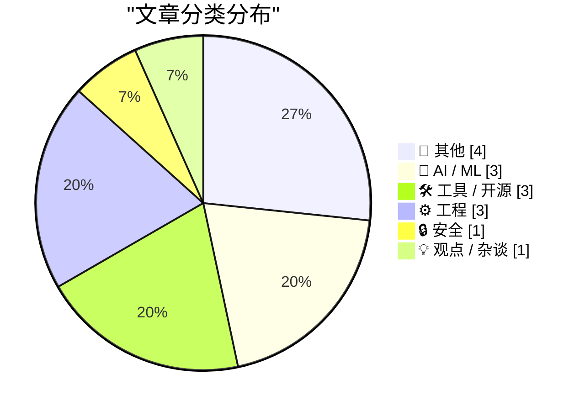
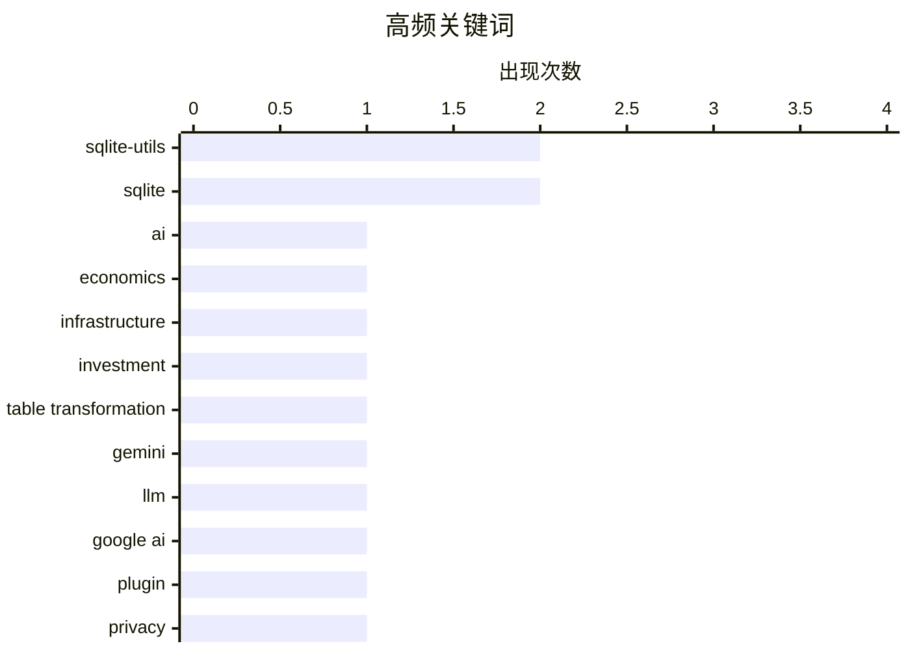

# 📰 Aug 15, 2026

> 来自 Karpathy 推荐的 92 个顶级技术博客，AI 精选 Top 15

## 📝 今日看点

今日技术圈的核心议题，一是人工智能持续吸收巨额资本，训练、算力、能源与推理服务带来的基础设施成本正成为商业可持续性的关键考验。二是大模型应用继续从“调用模型”走向深度工程化，覆盖新模型插件、强化学习环境构建以及自动生成内容标签等具体场景。与此同时，隐私与数据追踪问题受到更多关注，开发者也在通过开源工具、定制化内容流水线和边缘部署提升系统的自主性与透明度。

---

## 🏆 今日必读

🥇 **高级订阅：人工智能需要多少钱？**

[Premium: How Much Money Does AI Need?](https://www.wheresyoured.at/premium-how-much-money-does-ai-need/) — wheresyoured.at · 14 小时前 · 🤖 AI / ML

> 文章围绕人工智能产业究竟需要多少资金，以及当前巨额投入是否能够形成可持续回报展开分析。作者强调，AI 公司的成本不仅来自模型训练，还包括数据中心、GPU、能源、研发人员和持续推理服务等基础设施支出。文章试图把 AI 热潮放回资本形成和商业模式的框架中，检视企业融资规模、收入增长与长期盈利能力之间是否匹配。核心观点是，理解 AI 的真实资金需求，必须区分短期估值叙事与能够支撑基础设施投资的实际现金流。

💡 **为什么值得读**: 适合想判断 AI 投资热潮究竟建立在真实商业需求还是资本叙事之上的读者。

🏷️ AI, economics, infrastructure, investment

🥈 **sqlite-utils 4.2**

[sqlite-utils 4.2](https://simonwillison.net/2026/Aug/13/sqlite-utils/) — simonwillison.net · 1 天前 · 🛠 工具 / 开源

> sqlite-utils 4.2 重点改进了 Python API 中的 table.transform() 功能，用于执行 SQLite 原生 ALTER TABLE 难以支持的复杂表结构变更。该功能会创建新表、复制数据、删除旧表，再用新表替换旧表，从而实现更灵活的迁移操作。新版本还改进了 transform() 对现有表结构信息的保留能力，使迁移后的表更接近原始定义。对于使用 sqlite-utils 管理 SQLite 数据库模式的项目，这一版本主要提升了复杂迁移的可靠性和可控性。

💡 **为什么值得读**: 如果项目需要频繁修改 SQLite 表结构，版本说明中的 transform() 改进能直接降低迁移脚本的维护成本。

🏷️ sqlite-utils, SQLite, table transformation

🥉 **llm-gemini 0.33**

[llm-gemini 0.33](https://simonwillison.net/2026/Aug/13/llm-gemini/) — simonwillison.net · 1 天前 · 🛠 工具 / 开源

> llm-gemini 0.33 为 Simon Willison 的 LLM 插件增加了对新 Gemini 模型的支持。支持列表包括 Gemini 3.7 Flash、Gemini 3.6 Flash、Gemini 3.5 Flash Lite，以及两个 Gemini embedding 模型。该版本让 LLM 命令行工具能够直接调用这些生成模型和向量嵌入模型，覆盖文本生成与语义检索等场景。对于依赖 LLM 插件统一访问 Google Gemini 模型的用户，升级后可以使用最新的 Flash 系列能力。

💡 **为什么值得读**: 它提供了 Gemini 新模型在现有 LLM 工作流中的具体接入信息，适合需要快速跟进模型版本的开发者。

🏷️ Gemini, LLM, Google AI, plugin

---

## 📊 数据概览

| 扫描源 | 抓取文章 | 时间范围 | 精选 |
|:---:|:---:|:---:|:---:|
| 84/92 | 2540 篇 → 37 篇 | 48h | **15 篇** |

### 分类分布



### 高频关键词



<details>
<summary>📈 纯文本关键词图（终端友好）</summary>

```
sqlite-utils         │ ████████████████████ 2
sqlite               │ ████████████████████ 2
ai                   │ ██████████░░░░░░░░░░ 1
economics            │ ██████████░░░░░░░░░░ 1
infrastructure       │ ██████████░░░░░░░░░░ 1
investment           │ ██████████░░░░░░░░░░ 1
table transformation │ ██████████░░░░░░░░░░ 1
gemini               │ ██████████░░░░░░░░░░ 1
llm                  │ ██████████░░░░░░░░░░ 1
google ai            │ ██████████░░░░░░░░░░ 1
```

</details>

### 🏷️ 话题标签

**sqlite-utils**(2) · **sqlite**(2) · **ai**(1) · economics(1) · infrastructure(1) · investment(1) · table transformation(1) · gemini(1) · llm(1) · google ai(1) · plugin(1) · privacy(1) · tracking(1) · advertising(1) · data brokers(1) · reinforcement learning(1) · neural network(1) · game physics(1) · bonk.io(1) · bug fix(1)

---

## 📝 其他

### 1. 哈达玛码与球堆积

[Hadamard Codes and Sphere Packing](https://www.johndcook.com/blog/2026/08/13/hadamard-sphere-packing/) — **johndcook.com** · 1 天前 · ⭐ 20/30

> 文章从新发现的哈达玛矩阵出发，说明哈达玛矩阵如何构造，以及由此产生的哈达玛码与球堆积问题之间的联系。哈达玛码利用由正交矩阵生成的编码结构提高通信中的抗噪能力，而球堆积则提供了理解高维编码几何性质的视角。作者还以 NASA 的实际应用为例，说明这类看似抽象的离散数学工具如何服务于深空通信。文章的核心观点是，哈达玛矩阵连接了矩阵构造、纠错编码、几何优化和工程通信多个领域。

🏷️ Hadamard codes, sphere packing, Claude AI, coding theory

---

### 2. Ceramic Shield 2 确实名副其实

[Ceramic Shield 2 Is the Real Deal](https://www.tomsguide.com/phones/iphones/iphone-17-and-iphone-air-durability-testing-heres-how-the-new-iphones-stand-up-to-bending-scratching-and-dropping) — **daringfireball.net** · 1 天前 · ⭐ 18/30

> Tom’s Guide 对 iPhone 17 系列进行了弯折、刮擦和跌落等耐用性测试，其中 JerryRigEverything 的视频重点验证了 Ceramic Shield 2 的抗刮能力。测试显示，屏幕在莫氏硬度 7 级才留下轻微划痕，而普通玻璃通常在 5 或 6 级就会出现划痕。JerryRigEverything 评价 Ceramic Shield 2 是其测试过的表现最好的玻璃屏幕，基本印证了 Apple 对该材料耐用性的宣传。文章的核心结论是，Ceramic Shield 2 在抗刮方面确实带来了实际且明显的提升，但完整结论仍需结合跌落和弯折测试结果判断。

🏷️ Ceramic Shield 2, iPhone 17, scratch resistance, durability

---

### 3. NASA 的水手 9 号探测器如何编码图像

[How NASA’s Mariner 9 probe encoded images](https://www.johndcook.com/blog/2026/08/13/mariner-hadamard/) — **johndcook.com** · 1 天前 · ⭐ 18/30

> NASA 的水手 9 号探测器于 1971 年拍摄火星图像，并必须在传回地球前使用纠错编码，以避免信号传输中的噪声严重破坏图像。水手 9 号采用了基于 Hadamard 矩阵的纠错方案，具体是一个 (32, 6, 16) Hadamard 码。这个参数描述了编码后的码长、信息维度以及码字之间的距离，体现了方案在有限通信带宽下恢复受损数据的能力。文章通过航天通信这一具体案例，展示了抽象的矩阵结构如何服务于可靠的深空图像传输。

🏷️ NASA, Mariner 9, error correction, Mars images

---

### 4. 构造 Hadamard 矩阵

[Constructing Hadamard matrices](https://www.johndcook.com/blog/2026/08/13/constructing-hadamard-matrices/) — **johndcook.com** · 1 天前 · ⭐ 18/30

> Hadamard 矩阵是一种正交矩阵，所有元素只能取 1 或 -1，最小的例子是阶数为 2 的矩阵。文章介绍了如何从简单的 Hadamard 矩阵出发，通过 Sylvester 研究的递归构造方法生成更高阶矩阵。该方法本质上是利用分块矩阵保留行列之间的正交性，从而系统地扩大可构造矩阵的规模。文章还借 Stigler 定律指出，相关思想虽然以 Jacques Hadamard 命名，但更早由 James Joseph Sylvester 研究。

🏷️ Hadamard matrix, linear algebra, orthogonality, combinatorics

---

## 🤖 AI / ML

### 5. 高级订阅：人工智能需要多少钱？

[Premium: How Much Money Does AI Need?](https://www.wheresyoured.at/premium-how-much-money-does-ai-need/) — **wheresyoured.at** · 14 小时前 · ⭐ 26/30

> 文章围绕人工智能产业究竟需要多少资金，以及当前巨额投入是否能够形成可持续回报展开分析。作者强调，AI 公司的成本不仅来自模型训练，还包括数据中心、GPU、能源、研发人员和持续推理服务等基础设施支出。文章试图把 AI 热潮放回资本形成和商业模式的框架中，检视企业融资规模、收入增长与长期盈利能力之间是否匹配。核心观点是，理解 AI 的真实资金需求，必须区分短期估值叙事与能够支撑基础设施投资的实际现金流。

🏷️ AI, economics, infrastructure, investment

---

### 6. 训练强化学习模型玩 Bonk.io

[Training a Reinforcement Learning Model to Play Bonk.io](https://blog.pixelmelt.dev/training-a-reinforcement-learning-model-to-play-bonk-io/) — **blog.pixelmelt.dev** · 3 小时前 · ⭐ 24/30

> 项目通过逆向分析网页游戏 Bonk.io，重新实现其物理引擎，并让强化学习模型在这个环境中学习游戏策略。实现重点包括理解游戏的运动、碰撞和交互规则，以及将这些规则转换为神经网络可以训练的状态、动作和反馈。作者展示了从拆解游戏机制到构建训练环境，再到评估模型表现的完整过程。这个案例说明，强化学习效果不仅取决于模型结构，也高度依赖环境模拟是否足够准确。

🏷️ reinforcement learning, neural network, game physics, Bonk.io

---

### 7. 不要分类，让模型自由生成标签！

[Don't classify. Hallucinate!](https://simonwillison.net/2026/Aug/14/dont-classify-hallucinate/) — **simonwillison.net** · 8 小时前 · ⭐ 19/30

> 文章关注如何用大语言模型为尚未打标签的博客内容自动生成标签。面对博客已有 1,856 个标签、无法一次性全部塞进上下文的问题，Doug Turnbull 提出了不让模型从固定列表中分类，而是直接生成候选标签且不附带解释的方案。随后可以对生成结果进行整理、匹配或规范化，从而绕开超长标签列表带来的上下文限制。这个思路体现了“先生成、后校验”相较于直接分类在开放式元数据任务中的灵活性。

🏷️ classification, hallucination, blog tagging

---

## 🛠 工具 / 开源

### 8. sqlite-utils 4.2

[sqlite-utils 4.2](https://simonwillison.net/2026/Aug/13/sqlite-utils/) — **simonwillison.net** · 1 天前 · ⭐ 24/30

> sqlite-utils 4.2 重点改进了 Python API 中的 table.transform() 功能，用于执行 SQLite 原生 ALTER TABLE 难以支持的复杂表结构变更。该功能会创建新表、复制数据、删除旧表，再用新表替换旧表，从而实现更灵活的迁移操作。新版本还改进了 transform() 对现有表结构信息的保留能力，使迁移后的表更接近原始定义。对于使用 sqlite-utils 管理 SQLite 数据库模式的项目，这一版本主要提升了复杂迁移的可靠性和可控性。

🏷️ sqlite-utils, SQLite, table transformation

---

### 9. llm-gemini 0.33

[llm-gemini 0.33](https://simonwillison.net/2026/Aug/13/llm-gemini/) — **simonwillison.net** · 1 天前 · ⭐ 24/30

> llm-gemini 0.33 为 Simon Willison 的 LLM 插件增加了对新 Gemini 模型的支持。支持列表包括 Gemini 3.7 Flash、Gemini 3.6 Flash、Gemini 3.5 Flash Lite，以及两个 Gemini embedding 模型。该版本让 LLM 命令行工具能够直接调用这些生成模型和向量嵌入模型，覆盖文本生成与语义检索等场景。对于依赖 LLM 插件统一访问 Google Gemini 模型的用户，升级后可以使用最新的 Flash 系列能力。

🏷️ Gemini, LLM, Google AI, plugin

---

### 10. sqlite-utils 4.2.1

[sqlite-utils 4.2.1](https://simonwillison.net/2026/Aug/13/sqlite-utils-2/) — **simonwillison.net** · 1 天前 · ⭐ 23/30

> sqlite-utils 4.2.1 是针对 4.2 版本崩溃问题发布的修复版本。问题源于新增代码使用 typing_extensions 中的 Self 类型，却没有将 typing-extensions 声明为项目依赖。对于未预装该包的环境，导入或运行 sqlite-utils 可能因此失败。4.2.1 通过补充依赖声明修复了这一兼容性问题，使用 4.2 的用户应升级到该补丁版本。

🏷️ sqlite-utils, SQLite, bug fix

---

## ⚙️ 工程

### 11. 这个博客是如何构建的

[How This Blog Is Built](https://nesbitt.io/2026/08/14/how-this-blog-is-built.html) — **nesbitt.io** · 20 小时前 · ⭐ 22/30

> 文章完整拆解 nesbitt.io 背后的定制静态网站生成器、内容处理流水线和边缘部署架构。内容重点不只是页面展示，还包括文章如何从源文件经过转换、构建并发布到边缘节点。定制生成器说明作者根据自身内容模型和发布需求设计了专用工具，而不是完全依赖通用 CMS。整套方案体现了静态站点在性能、部署简洁性和可控性方面的优势。

🏷️ static site generator, content pipeline, edge deployment, web architecture

---

### 12. 强制 ARM64X 可执行文件以特定架构运行

[Forcing an ARM64X executable to run as a specific architecture](https://devblogs.microsoft.com/oldnewthing/20260814-00/?p=112613) — **devblogs.microsoft.com/oldnewthing** · 16 小时前 · ⭐ 18/30

> 文章聚焦于如何让 ARM64X 可执行文件按照指定的目标机器架构运行。ARM64X 是 Windows ARM 平台用于兼容不同执行架构的特殊 PE 可执行文件，默认运行方式可能不符合调试、兼容性测试或部署场景的需要。文中指出，可以请求目标机器架构，从而影响系统选择何种架构来加载和运行该程序。这个技巧适合需要验证 ARM64、ARM64EC 等架构行为的开发者，但具体使用方式和限制需要结合文章正文中的 Windows API 或启动配置说明。

🏷️ ARM64X, Windows, executable, architecture

---

### 13. 打印列表

[Printing Lists](https://matklad.github.io/2026/08/14/printing-lists.html) — **matklad.github.io** · 1 天前 · ⭐ 18/30

> 文章讨论如何在程序中简洁地打印逗号分隔的列表。推荐的写法是在打印每个元素之前，先根据是否为第一个元素来决定是否输出逗号。这样可以避免在循环后额外删除末尾逗号，也不需要维护复杂的分隔符状态。该模式适用于字符串拼接、日志输出、序列化以及命令行格式化等常见场景。核心观点是，让分隔符跟随后续元素输出，通常比处理列表末尾的特殊情况更清晰可靠。

🏷️ Rust, printing, lists, formatting

---

## 🔒 安全

### 14. 谁在跟踪你？用这项新服务找出答案

[Who’s Tracking You? Use This New Service to Find Out](https://krebsonsecurity.com/2026/08/whos-tracking-you-use-this-new-service-to-find-out/) — **krebsonsecurity.com** · 18 小时前 · ⭐ 24/30

> 广告追踪和移动应用数据采集背后的责任主体通常并不容易识别，相关信息虽然部分公开，却长期分散在大型广告平台的封闭系统中。免费的 DecryptAds 服务通过抓取并关联广告技术生态数据，让用户快速查看网站广告和应用数据收集涉及的实体。它的价值在于把原本难以解析的广告商、追踪器及数据关系整理成更易查询的形式。文章也提醒读者，了解追踪链条是评估在线隐私风险和广告生态透明度的重要一步。

🏷️ privacy, tracking, advertising, data brokers

---

## 💡 观点 / 杂谈

### 15. Pluralistic：资本形成（2026年8月14日）

[Pluralistic: Capital formation (14 Aug 2026)](https://pluralistic.net/2026/08/14/one-chokable-throat/) — **pluralistic.net** · 19 小时前 · ⭐ 23/30

> 本期 Pluralistic 以“资本形成”为主题，主张走向合法化往往意味着进入主流体系，并围绕这一转变汇集多组社会、科技与文化议题。链接内容涉及隐私保护型年龄验证、版权、互联网审查、摄影权利以及内容平台和城市治理等问题。作者还列出近期活动、演讲行程和出版物信息，形成兼具评论、链接策展与个人动态的 newsletter。核心线索是，制度化和商业化会扩大事物的影响范围，同时也可能带来新的控制、垄断和权利冲突。

🏷️ capital formation, copyright, internet censorship, digital rights

---

*生成于 2026-08-15 06:21 | 扫描 84 源 → 获取 2540 篇 → 精选 15 篇*
*基于 [Hacker News Popularity Contest 2025](https://refactoringenglish.com/tools/hn-popularity/) RSS 源列表，由 [Andrej Karpathy](https://x.com/karpathy) 推荐*
