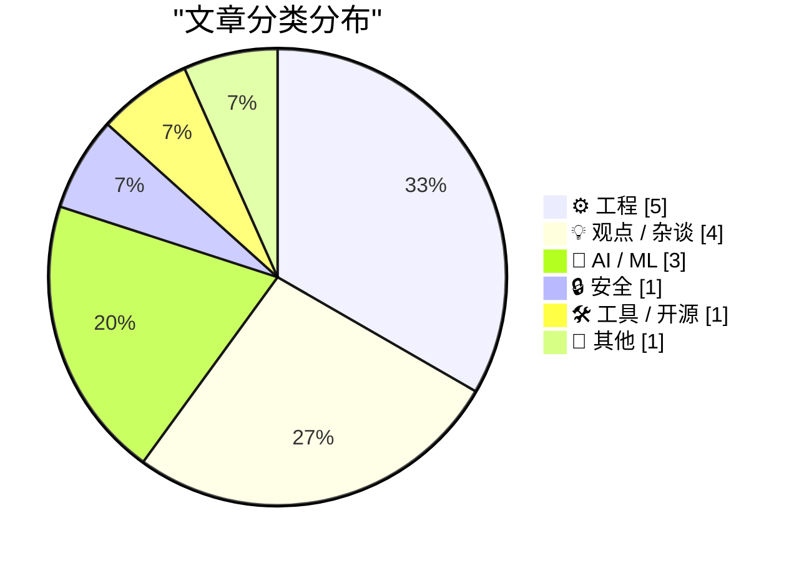
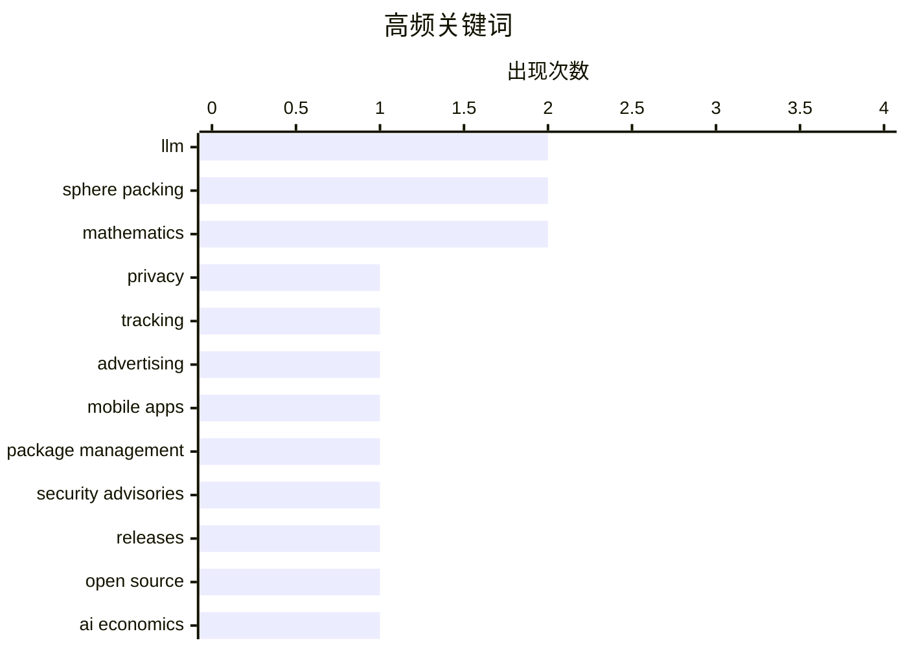

# 📰 Aug 16, 2026

> 来自 Karpathy 推荐的 92 个顶级技术博客，AI 精选 Top 15

## 📝 今日看点

今日技术圈的核心议题之一，是人工智能从模型能力竞赛走向成本、资本与可持续性的现实审视，训练基础设施和商业化投入仍在持续放大。AI 应用与研究也呈现出更强的“跨界实验”特征，从强化学习操控网页游戏，到让模型以生成方式完成内容标注，再到借助 AI 探索数学结构，方法边界不断拓展。隐私与数字权利持续升温，广告追踪关系的透明化、数据收集者识别以及年龄验证和互联网治理成为重要讨论方向。与此同时，底层工程仍在加速演进，Rust 并发编程、ARM64X 架构控制和包管理安全共同反映出软件基础设施对可靠性与供应链治理的更高要求。

---

## 🏆 今日必读

🥇 **谁在追踪你？用这项新服务查明真相**

[Who’s Tracking You? Use This New Service to Find Out](https://krebsonsecurity.com/2026/08/whos-tracking-you-use-this-new-service-to-find-out/) — krebsonsecurity.com · 1 天前 · 🔒 安全

> 网站广告和移动应用的数据收集方往往难以辨认，相关信息虽半公开，却长期分散在大型广告平台的封闭体系中。免费服务 DecryptAds 会抓取并关联广告技术（adtech）数据，将原本难以解析的追踪关系集中呈现。用户可借此快速识别在访问网站或使用 App 时参与广告投放、数据收集和用户追踪的实体。该服务降低了广告技术生态的透明度门槛，使普通用户和研究人员更容易审视自身数据流向。

💡 **为什么值得读**: DecryptAds 提供了一个可实际使用的广告追踪调查入口，适合希望核查网站和 App 隐私行为的人阅读。

🏷️ privacy, tracking, advertising, mobile apps

🥈 **本周包管理动态：2026 年 8 月 15 日**

[This Week in Package Management: 15 August 2026](https://nesbitt.io/2026/08/15/this-week-in-package-management.html) — nesbitt.io · 15 小时前 · 🛠 工具 / 开源

> 内容汇总了截至 2026 年 8 月 15 日包管理领域的一周动态。覆盖范围包括软件包管理工具及生态中的版本发布、安全公告和技术文章。读者可通过这份周报快速了解依赖分发、漏洞披露与包管理实践的最新信息。文章定位为跨生态的信息索引，而非针对单一语言或单个包管理器的深度分析。

💡 **为什么值得读**: 需要持续跟踪依赖供应链和包管理生态变化的开发者，可用它高效筛选本周值得进一步关注的发布与安全通告。

🏷️ package management, security advisories, releases, open source

🥉 **AI 到底需要多少钱？**

[Premium: How Much Money Does AI Need?](https://www.wheresyoured.at/premium-how-much-money-does-ai-need/) — wheresyoured.at · 1 天前 · 💡 观点 / 杂谈

> 文章聚焦人工智能产业要维持和扩张所需的资金规模。作者回应了读者对长文篇幅的意见，认为复杂的论证需要足够篇幅才能成立。标题指向 AI 的资本需求问题，隐含对训练、基础设施、商业化或融资可持续性的审视。由于提供的内容仅包含开头，无法确认作者对具体资金规模、企业数据或投资回报的最终结论。

💡 **为什么值得读**: AI 热潮背后的资本开支与商业可持续性是判断行业前景的关键变量，适合关注模型经济学和科技投资的人深入阅读。

🏷️ AI economics, capital expenditure, LLM, AI industry

---

## 📊 数据概览

| 扫描源 | 抓取文章 | 时间范围 | 精选 |
|:---:|:---:|:---:|:---:|
| 81/92 | 2475 篇 → 29 篇 | 48h | **15 篇** |

### 分类分布



### 高频关键词



<details>
<summary>📈 纯文本关键词图（终端友好）</summary>

```
llm                 │ ████████████████████ 2
sphere packing      │ ████████████████████ 2
mathematics         │ ████████████████████ 2
privacy             │ ██████████░░░░░░░░░░ 1
tracking            │ ██████████░░░░░░░░░░ 1
advertising         │ ██████████░░░░░░░░░░ 1
mobile apps         │ ██████████░░░░░░░░░░ 1
package management  │ ██████████░░░░░░░░░░ 1
security advisories │ ██████████░░░░░░░░░░ 1
releases            │ ██████████░░░░░░░░░░ 1
```

</details>

### 🏷️ 话题标签

**llm**(2) · **sphere packing**(2) · **mathematics**(2) · privacy(1) · tracking(1) · advertising(1) · mobile apps(1) · package management(1) · security advisories(1) · releases(1) · open source(1) · ai economics(1) · capital expenditure(1) · ai industry(1) · reinforcement learning(1) · bonk.io(1) · physics engine(1) · neural network(1) · classification(1) · hallucination(1)

---

## ⚙️ 工程

### 1. 并发服务器：第 7 部分 - Rust

[Concurrent Servers: Part 7 - Rust](https://eli.thegreenplace.net/2026/concurrent-servers-part-7-rust/) — **eli.thegreenplace.net** · 8 小时前 · ⭐ 22/30

> 系列第 7 篇讨论 Rust 如何应对并发网络服务器开发中的典型挑战。文章承接此前关于并发服务器的系列内容，将关注点放在 Rust 语言的并发模型与网络服务实现方式上。Rust 的所有权、借用和类型系统可在编译阶段约束部分共享状态与内存安全问题，从而改变并发代码的设计方式。该篇旨在把前述语言无关的服务器难题映射到 Rust 的具体工具和实践中。

🏷️ Rust, concurrency, network servers, async

---

### 2. 强制 ARM64X 可执行文件以指定架构运行

[Forcing an ARM64X executable to run as a specific architecture](https://devblogs.microsoft.com/oldnewthing/20260814-00/?p=112613) — **devblogs.microsoft.com/oldnewthing** · 1 天前 · ⭐ 21/30

> 文章说明 ARM64X 可执行文件可以请求指定目标机器架构来运行。ARM64X 面向 Windows 的混合架构兼容场景，因此运行时架构选择会影响加载和执行行为。作者聚焦如何显式指定目标架构，而非完全依赖系统的默认决策。该技巧适用于需要控制 ARM64、x64 等兼容路径的 Windows 应用与调试场景。

🏷️ ARM64X, Windows, architecture, executable

---

### 3. 压缩 Hadamard 矩阵

[Compressing a Hadamard matrix](https://www.johndcook.com/blog/2026/08/15/compressing-a-hadamard-matrix/) — **johndcook.com** · 9 小时前 · ⭐ 18/30

> 文章延续近期新 Hadamard 矩阵发现所引发的讨论，研究如何压缩 Hadamard 矩阵。作者此前已分别介绍 Hadamard 矩阵基础、Mariner 9 探测器使用的纠错码，以及球面堆积构造。Hadamard 矩阵属于正交矩阵，其元素通常取值为 +1 和 -1，这种高度规则的结构为表示与压缩问题提供了切入点。文章将压缩问题置于矩阵结构、编码和几何应用的连续脉络中。

🏷️ Hadamard matrix, compression, sphere packing, mathematics

---

### 4. 这个博客是如何构建的

[How This Blog Is Built](https://nesbitt.io/2026/08/14/how-this-blog-is-built.html) — **nesbitt.io** · 1 天前 · ⭐ 18/30

> nesbitt.io 采用自定义静态站点生成器，而非现成的 CMS 或博客托管平台。文章完整拆解从内容编写、构建处理到页面生成的内容管线，说明各环节如何协同工作。部署层使用边缘网络交付静态内容，以降低访问延迟并简化运维。核心观点是：针对个人网站，自建且结构清晰的静态发布系统能够兼顾控制力、性能与长期可维护性。

🏷️ static site generator, content pipeline, edge deployment

---

### 5. 纠正错误的概率

[Probability of correcting errors](https://www.johndcook.com/blog/2026/08/15/probability-of-correcting-errors/) — **johndcook.com** · 8 小时前 · ⭐ 17/30

> 纠错码通常以“能够保证纠正多少位错误”来描述，但实际通信中更重要的问题还包括超过该阈值时仍能成功恢复原始数据的概率。文章以用于火星 9 号探测器的 Hadamard 码为例：每个 6 位像素被编码为 32 位码字，在错误不超过 7 位时可以确定恢复原像素。作者进一步讨论随机错误模型下的概率计算，说明纠错能力并不是一个超过阈值便完全失效的二元属性。结论是，保证纠错界限提供最坏情况承诺，而概率分析才能衡量纠错码在真实噪声环境中的实际可靠性。

🏷️ error correction, Hadamard code, probability, coding theory

---

## 💡 观点 / 杂谈

### 6. AI 到底需要多少钱？

[Premium: How Much Money Does AI Need?](https://www.wheresyoured.at/premium-how-much-money-does-ai-need/) — **wheresyoured.at** · 1 天前 · ⭐ 24/30

> 文章聚焦人工智能产业要维持和扩张所需的资金规模。作者回应了读者对长文篇幅的意见，认为复杂的论证需要足够篇幅才能成立。标题指向 AI 的资本需求问题，隐含对训练、基础设施、商业化或融资可持续性的审视。由于提供的内容仅包含开头，无法确认作者对具体资金规模、企业数据或投资回报的最终结论。

🏷️ AI economics, capital expenditure, LLM, AI industry

---

### 7. Pluralistic：资本形成（2026 年 8 月 14 日）

[Pluralistic: Capital formation (14 Aug 2026)](https://pluralistic.net/2026/08/14/one-chokable-throat/) — **pluralistic.net** · 1 天前 · ⭐ 19/30

> 这是一篇名为“资本形成”的 Pluralistic 日报链接汇编，核心线索是“走向正规意味着走向主流”。条目覆盖版权与数字权利、隐私保护年龄验证、互联网审查、摄影权利、TSA 与化妆品等议题。文章还收录 London Copyfighters、Speaker's Corner、McMansion Hell、万智牌套牌版权等文化与政策链接，并列出作者即将及近期的公开活动。整体以技术政策、版权、隐私和互联网自由的评论性选读为主。

🏷️ capital formation, copyright, censorship, internet policy

---

### 8. 谷歌的“Material 3”设计说明有 93.3% 令人尴尬

[Google’s ‘Material 3’ Design Write-Up Is 93.3 Percent Embarrassing](https://design.google/library/expressive-material-design-google-research) — **daringfireball.net** · 1 天前 · ⭐ 17/30

> 作者尖锐批评谷歌对 Material 3 界面语言的设计阐释，认为其中大部分内容脱离了可用性和桌面交互的基本常识。一个具体例子是：在带鼠标的桌面浏览器中，页面将用于文本选择的 I-beam 光标替换成圆形光标。作者认为这种看似“有趣”或“富有表现力”的视觉改动，破坏了用户对成熟交互惯例的预期。核心观点是，设计系统不应为了品牌化的视觉表达而牺牲已被广泛理解的操作反馈与可用性。

🏷️ Material Design, UI design, Google, design systems

---

### 9. 别成为效率游客

[Don't Become a Productivity Tourist](https://www.joanwestenberg.com/p/dont-become-a-productivity-tourist) — **joanwestenberg.com** · 1 天前 · ⭐ 17/30

> 文章批评不断试用新效率工具、工作流和方法论，却始终不稳定执行的“效率游客”心态。作者提出一个反直觉标准：如果工作流开始显得无聊，往往意味着它已足够稳定、自动化且真正融入日常工作。频繁重构系统、追逐新应用或把优化流程当作主要任务，会将注意力从实际产出转移到管理工作的表演上。核心观点是，生产力来自长期坚持一个足够好的系统，而不是持续寻找更刺激的新方法。

🏷️ productivity, workflow, focus, habits

---

## 🤖 AI / ML

### 10. 训练强化学习模型玩 Bonk.io

[Training a Reinforcement Learning Model to Play Bonk.io](https://blog.pixelmelt.dev/training-a-reinforcement-learning-model-to-play-bonk-io/) — **blog.pixelmelt.dev** · 22 小时前 · ⭐ 23/30

> 项目以网页游戏 Bonk.io 为目标，构建能够进行游戏操作的强化学习模型。实现前先对游戏进行拆解，并重新实现其物理引擎，以获得可控、可重复训练的模拟环境。神经网络在该物理模拟器中学习策略，而不是直接依赖原始网页游戏运行时。该案例展示了将逆向分析、物理仿真和强化学习结合，用于处理真实网页游戏任务的工程路径。

🏷️ reinforcement learning, Bonk.io, physics engine, neural network

---

### 11. 别做分类，让模型“幻觉”生成

[Don't classify. Hallucinate!](https://simonwillison.net/2026/Aug/14/dont-classify-hallucinate/) — **simonwillison.net** · 1 天前 · ⭐ 22/30

> Simon Willison 分享了 Doug Turnbull 为旧博客内容自动打标签的思路。其博客已有 1,856 个标签，无法直接把全部候选标签交给 LLM 并要求分类匹配。替代方案是让模型在不知道既有标签列表的情况下，先自由生成它认为合适的标签，再将生成结果与现有标签体系进行对应或处理。核心观点是：面对超大标签集合，开放式生成可能比封闭式多类分类更实用。

🏷️ LLM, classification, hallucination, metadata

---

### 12. Hadamard 码与球面堆积

[Hadamard Codes and Sphere Packing](https://www.johndcook.com/blog/2026/08/13/hadamard-sphere-packing/) — **johndcook.com** · 1 天前 · ⭐ 21/30

> 一项借助 Claude AI 发现新 Hadamard 矩阵的消息，引出了 Hadamard 矩阵的应用讨论。Hadamard 矩阵不仅可用于构造，此前 NASA 的 Mariner 9 探测器就曾将相关纠错码用于通信。文章进一步给出其与球面堆积之间的联系，说明矩阵的正交结构可转换为几何构造。核心观点是，Hadamard 矩阵具有从纠错编码到高维几何的实际数学价值。

🏷️ Claude, Hadamard codes, sphere packing, mathematics

---

## 🔒 安全

### 13. 谁在追踪你？用这项新服务查明真相

[Who’s Tracking You? Use This New Service to Find Out](https://krebsonsecurity.com/2026/08/whos-tracking-you-use-this-new-service-to-find-out/) — **krebsonsecurity.com** · 1 天前 · ⭐ 26/30

> 网站广告和移动应用的数据收集方往往难以辨认，相关信息虽半公开，却长期分散在大型广告平台的封闭体系中。免费服务 DecryptAds 会抓取并关联广告技术（adtech）数据，将原本难以解析的追踪关系集中呈现。用户可借此快速识别在访问网站或使用 App 时参与广告投放、数据收集和用户追踪的实体。该服务降低了广告技术生态的透明度门槛，使普通用户和研究人员更容易审视自身数据流向。

🏷️ privacy, tracking, advertising, mobile apps

---

## 🛠 工具 / 开源

### 14. 本周包管理动态：2026 年 8 月 15 日

[This Week in Package Management: 15 August 2026](https://nesbitt.io/2026/08/15/this-week-in-package-management.html) — **nesbitt.io** · 15 小时前 · ⭐ 24/30

> 内容汇总了截至 2026 年 8 月 15 日包管理领域的一周动态。覆盖范围包括软件包管理工具及生态中的版本发布、安全公告和技术文章。读者可通过这份周报快速了解依赖分发、漏洞披露与包管理实践的最新信息。文章定位为跨生态的信息索引，而非针对单一语言或单个包管理器的深度分析。

🏷️ package management, security advisories, releases, open source

---

## 📝 其他

### 15. 《21 世纪住房之路法案》将如何影响住房供给？第二部分

[How Will the 21st Century ROAD to Housing Act Affect Housing Supply? Part II](https://www.construction-physics.com/p/how-will-the-21st-century-road-to) — **construction-physics.com** · 1 天前 · ⭐ 18/30

> 文章继续逐条审视近期通过的《21 世纪住房之路法案》（21st Century ROAD to Housing Act），聚焦法案条款对住房供给的实际影响。作者不满足于政策口号，而是分析每项规定具体改变了哪些审批、建设、融资或监管机制。重点在于区分“理论上促进建房”的条款与真正能解除供给约束的措施，并评估其执行条件。结论倾向于认为，法案影响取决于具体条款的落地细节，不能仅凭其促进住房的立法名称判断效果。

🏷️ housing supply, housing policy, ROAD Act, regulation

---

*生成于 2026-08-16 01:03 | 扫描 81 源 → 获取 2475 篇 → 精选 15 篇*
*基于 [Hacker News Popularity Contest 2025](https://refactoringenglish.com/tools/hn-popularity/) RSS 源列表，由 [Andrej Karpathy](https://x.com/karpathy) 推荐*
