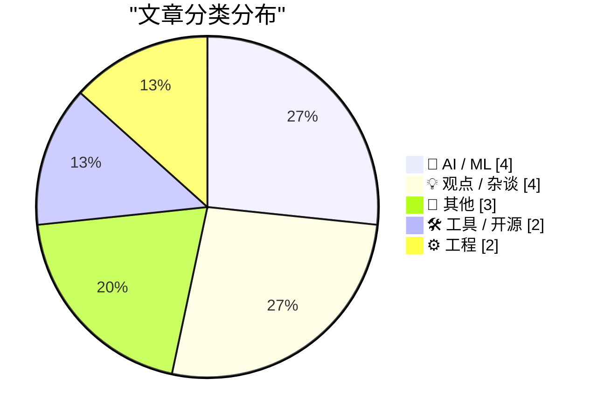
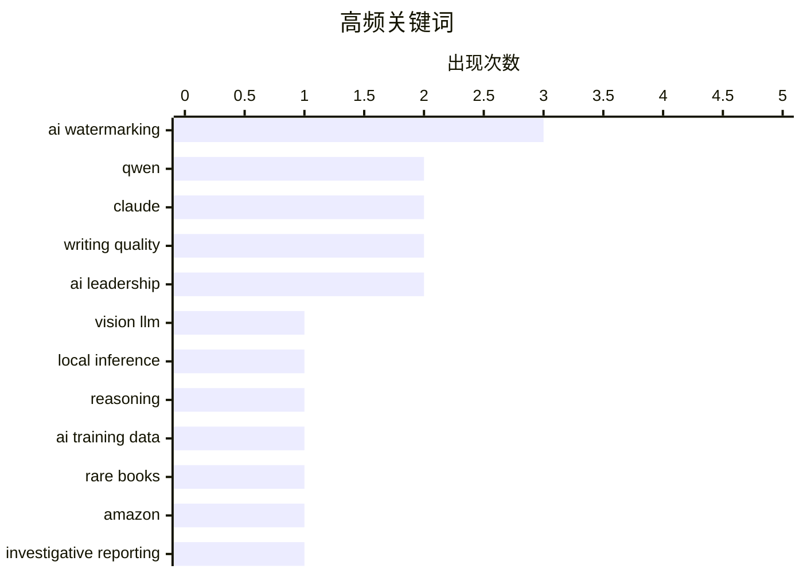

# 📰 Aug 18, 2026

> 来自 Karpathy 推荐的 92 个顶级技术博客，AI 精选 Top 15

## 📝 今日看点

今日技术圈的焦点，正从“谁的模型更强”转向“强模型如何被本地化、监管和信任机制塑形”：Qwen 3.8 27B 以开源、视觉能力和接近顶级性能的表现，推动高能力模型进一步下沉到个人设备。与此同时，AI 训练数据的来源与流向受到更严密审视，亚马逊相关图书采购调查凸显数据获取的版权与透明度风险。围绕文本水印、欧盟合规和 Siri 更新停滞的争议，则说明 AI 产品正在技术体验、可追溯性与监管要求之间经历更尖锐的权衡。

---

## 🏆 今日必读

🥇 **Qwen 3.8 27B 很出色，但默认会严重过度思考**

[Qwen 3.8 27B is excellent, but it defaults to wildly overthinking things](https://simonwillison.net/2026/Aug/16/qwen-38-27b/) — simonwillison.net · 1 天前 · 🤖 AI / ML

> 阿里巴巴通义千问团队发布了采用 Apache 2.0 许可证、拥有 270 亿参数并支持视觉能力的 Qwen 3.8 27B。27B 参数规模适合在配置较好的笔记本电脑上本地运行，延续了前代 Qwen 3.6 27B 的良好表现。文章重点指出，该模型虽然能力强，但默认推理行为存在“过度思考”问题，往往会为简单任务生成过长、复杂且不必要的分析过程。作者认为，Qwen 3.8 27B 是当前本地运行模型中非常值得关注的选择，但实际使用时需要调整推理模式或相关参数，以控制响应长度和延迟。

💡 **为什么值得读**: 适合想在本地部署高性能开源视觉语言模型、同时关心推理效率和使用体验的读者。

🏷️ Qwen, vision LLM, local inference, reasoning

🥈 **我们追踪了一批珍稀图书的货运，最终发现它们被送到了亚马逊的 AI 训练设施**

[We Tracked a Shipment of Rare Books. It Ended at an Amazon AI Training Facility](https://simonwillison.net/2026/Aug/17/we-tracked-a-shipment-of-rare-books-it-ended-at-an-amazon-ai-tra/) — simonwillison.net · 9 小时前 · 📝 其他

> 文章调查了书商近年来收到的大批量图书订单，这些订单通常来自匿名、对价格不敏感的买家，因此外界一直怀疑相关书籍被用于 AI 训练数据采集。记者追踪一批珍稀图书的物流路径，发现货物最终抵达亚马逊的一处 AI 训练设施。调查将图书采购、物流记录和 AI 公司训练数据需求联系起来，揭示了企业可能通过购买实体书获取版权内容的路径。报道也引出了版权授权、数据来源透明度以及 AI 训练产业链缺乏公开监督等问题，但仅凭物流终点仍不能证明这些书籍确实被用于训练模型。

💡 **为什么值得读**: 它提供了一个具体、可验证的物流调查案例，帮助读者理解 AI 训练数据采购如何从线上争议延伸到现实世界的图书市场。

🏷️ AI training data, rare books, Amazon, investigative reporting

🥉 **Qwen 3.8 27B 在 Artificial Analysis Intelligence Index 上获得 52 分**

[Qwen 3.8 27B scores 52 on the Artificial Analysis Intelligence Index](https://simonwillison.net/2026/Aug/17/qwen-38-27b-scores-52/) — simonwillison.net · 1 小时前 · 🤖 AI / ML

> Qwen 3.8 27B 在 Artificial Analysis Intelligence Index 上取得 52 分，与 GPT-5.6 Luna 的最高分相同。它只比最高配置的 GLM-5.2 和 DeepSeek V4 Pro 0813 低 1 分，却只有 270 亿参数，而 GLM-5.2 拥有 7530 亿参数，DeepSeek V4 Pro 也达到 1.6 万亿参数。这个结果表明，模型规模并不能简单等同于综合智能水平，训练方法、数据质量和推理能力同样关键。作者据此认为，Qwen 3.8 27B 在开源、本地部署和性能成本比方面尤其令人惊讶。

💡 **为什么值得读**: 如果你在比较闭源前沿模型与可本地运行的开源模型，这组跨参数规模的基准成绩能提供很有冲击力的选型参考。

🏷️ Qwen, LLM, benchmark, model evaluation

---

## 📊 数据概览

| 扫描源 | 抓取文章 | 时间范围 | 精选 |
|:---:|:---:|:---:|:---:|
| 82/92 | 2520 篇 → 22 篇 | 48h | **15 篇** |

### 分类分布



### 高频关键词



<details>
<summary>📈 纯文本关键词图（终端友好）</summary>

```
ai watermarking  │ ████████████████████ 3
qwen             │ █████████████░░░░░░░ 2
claude           │ █████████████░░░░░░░ 2
writing quality  │ █████████████░░░░░░░ 2
ai leadership    │ █████████████░░░░░░░ 2
vision llm       │ ███████░░░░░░░░░░░░░ 1
local inference  │ ███████░░░░░░░░░░░░░ 1
reasoning        │ ███████░░░░░░░░░░░░░ 1
ai training data │ ███████░░░░░░░░░░░░░ 1
rare books       │ ███████░░░░░░░░░░░░░ 1
```

</details>

### 🏷️ 话题标签

**ai watermarking**(3) · **qwen**(2) · **claude**(2) · writing quality(2) · ai leadership(2) · vision llm(1) · local inference(1) · reasoning(1) · ai training data(1) · rare books(1) · amazon(1) · investigative reporting(1) · llm(1) · benchmark(1) · model evaluation(1) · text adulteration(1) · markdown(1) · svg(1) · renderer(1) · web tools(1)

---

## 🤖 AI / ML

### 1. Qwen 3.8 27B 很出色，但默认会严重过度思考

[Qwen 3.8 27B is excellent, but it defaults to wildly overthinking things](https://simonwillison.net/2026/Aug/16/qwen-38-27b/) — **simonwillison.net** · 1 天前 · ⭐ 27/30

> 阿里巴巴通义千问团队发布了采用 Apache 2.0 许可证、拥有 270 亿参数并支持视觉能力的 Qwen 3.8 27B。27B 参数规模适合在配置较好的笔记本电脑上本地运行，延续了前代 Qwen 3.6 27B 的良好表现。文章重点指出，该模型虽然能力强，但默认推理行为存在“过度思考”问题，往往会为简单任务生成过长、复杂且不必要的分析过程。作者认为，Qwen 3.8 27B 是当前本地运行模型中非常值得关注的选择，但实际使用时需要调整推理模式或相关参数，以控制响应长度和延迟。

🏷️ Qwen, vision LLM, local inference, reasoning

---

### 2. Qwen 3.8 27B 在 Artificial Analysis Intelligence Index 上获得 52 分

[Qwen 3.8 27B scores 52 on the Artificial Analysis Intelligence Index](https://simonwillison.net/2026/Aug/17/qwen-38-27b-scores-52/) — **simonwillison.net** · 1 小时前 · ⭐ 23/30

> Qwen 3.8 27B 在 Artificial Analysis Intelligence Index 上取得 52 分，与 GPT-5.6 Luna 的最高分相同。它只比最高配置的 GLM-5.2 和 DeepSeek V4 Pro 0813 低 1 分，却只有 270 亿参数，而 GLM-5.2 拥有 7530 亿参数，DeepSeek V4 Pro 也达到 1.6 万亿参数。这个结果表明，模型规模并不能简单等同于综合智能水平，训练方法、数据质量和推理能力同样关键。作者据此认为，Qwen 3.8 27B 在开源、本地部署和性能成本比方面尤其令人惊讶。

🏷️ Qwen, LLM, benchmark, model evaluation

---

### 3. Anthropic 的“弱水印”迎合了软弱的法律

[‘Anthropic’s Weak Watermarks Appease a Weak Law’](https://blog.j11y.io/2026-08-12_Anthropics-weak-watermarks-appease-a-weak-law/) — **daringfireball.net** · 1 天前 · ⭐ 22/30

> 文章批评 Anthropic 为遵守欧盟相关法规而在 Claude 文本中加入较弱的水印或可识别痕迹。作者借助计算器和拼写检查器的类比指出，人们通常不会因为工具参与了计算或纠错，就把输出视为可疑或需要特殊标记。将“辅助工具”区别对待的分界线设在它能够生成完整句子之后，缺乏一致、明确的原则。文章因此认为，法律把 AI 生成文本单独视为需要标记的对象，可能放大了对 AI 的不信任，也推动企业采用影响文本质量的技术方案。核心批评是，Anthropic 的做法更像是对不完善监管的妥协，而不是解决真实的用户需求。

🏷️ AI watermarking, Claude, EU regulation

---

### 4. 自 7 月初以来，Siri AI 在欧盟没有任何更新

[No Update Since Early July Regarding Siri AI Coming to the EU, Ever](https://www.ft.com/content/807d25c3-f4ac-4402-b815-3aa91018237d) — **daringfireball.net** · 3 小时前 · ⭐ 21/30

> 文章关注 Apple 面向欧盟推出新一代 Siri AI 的进展停滞，以及公司与欧盟监管机构之间持续存在的分歧。此前 Apple CEO Tim Cook 与欧盟负责科技事务的官员 Henna Virkkunen 曾举行被称为“建设性”的会谈，目标是缓和双方围绕 Siri AI 的争议。自 7 月 1 日相关会谈消息发布后，外界仍未看到 Siri AI 在欧盟落地时间或功能安排方面的进一步更新。文章反映出 Apple 的 AI 产品发布不仅取决于技术开发，也受到欧盟数字监管和合规谈判的直接影响。对欧洲用户而言，Siri AI 的推出时间仍然不确定。

🏷️ Siri, Apple Intelligence, EU, regulation

---

## 💡 观点 / 杂谈

### 5. Anthropic 在 Claude 中对文本进行“水印”式篡改，是对写作的扭曲

[★ Anthropic’s ‘Watermark’ Text Adulteration in Claude Is a Perversion of Writing](https://daringfireball.net/2026/08/anthropics_watermark_text_adulteration_in_claude_is_a_perversion_of_writing) — **daringfireball.net** · 1 天前 · ⭐ 23/30

> 文章批评 Anthropic 在 Claude 生成的文本中加入可识别来源的隐藏线索或“水印”特征。作者认为，任何为了证明文本来自 AI 而牺牲清晰度、连贯性、准确性或表达质量的做法都不可接受。文本生成工具的首要目标应是满足使用者的写作需求，而不是向第三方传递来源标记。文章将这种做法视为对写作自主性和文本质量的干扰，并质疑企业是否有权在用户请求的内容中加入未经明确同意的额外信息。核心观点是，来源追踪不应以降低生成文本的质量为代价。

🏷️ AI watermarking, Claude, text adulteration, writing quality

---

### 6. 关于 AI 生成文本水印方案的后续思考

[★ Follow-Up Thoughts on Watermarking Schemes for AI-Generated Text](https://daringfireball.net/2026/08/follow-up_thoughts_on_watermarking) — **daringfireball.net** · 4 分钟前 · ⭐ 22/30

> 文章继续讨论 AI 生成文本水印方案，核心关注点是水印是否会损害文本的实际可读性和表达质量。作者希望获得连贯、清晰、准确、简洁并且语气稳定的回答，而不是为了证明内容来源而被迫接受额外的语言特征。文章承认生成式 AI 已经成为写作工具，社会无法简单回到没有这类工具的状态，因此治理方案必须适应现实使用场景。作者隐含的判断是，水印设计应服务于用户和文本质量，而不能让识别需求凌驾于写作效果之上。

🏷️ AI watermarking, text generation, authorship, writing quality

---

### 7. 引用 Dario Amodei

[Quoting Dario Amodei](https://simonwillison.net/2026/Aug/16/dario-amodei/) — **simonwillison.net** · 1 天前 · ⭐ 21/30

> Dario Amodei 认为，公众对 AI 的负面看法主要不是由 AI 领导者持续警告风险造成的，而是源于一场更根本的信任危机。普通人不信任企业、政府和科技行业，因此总是怀疑这些机构正在策划新的方式损害公众利益。这个判断把 AI 舆论问题从单纯的风险传播，扩展到公司治理、政府监管和科技行业信誉等更广泛的社会背景。Amodei 的核心观点是，改善公众对 AI 的态度不能只靠解释技术风险，还必须重建机构与用户之间的信任。

🏷️ AI risk, public perception, AI leadership, trust

---

### 8. 《The Information》画像：Dario Amodei 的妻子、Ivanka Trump 的朋友、曾想从事色情业的 Cami Clark，以及 Anthropic 的“第一夫人”

[The Information Profiles Cami Clark — Dario Amodei’s Wife, Ivanka Trump’s Friend, One-Time Would-Be Pornographer, and Anthropic’s ‘First Lady’](https://www.theinformation.com/articles/anthropics-first-lady-took-winding-road-top?rc=jfy0lk) — **daringfireball.net** · 1 天前 · ⭐ 19/30

> 付费媒体《The Information》对 Anthropic 联合创始人兼 CEO Dario Amodei 的妻子 Cami Clark 进行了人物报道。报道指出，Amodei 在新德里、达沃斯和太阳谷等地讨论 AI 的潜力与风险时，Clark 几乎总在身边。熟悉两人的人士称，她是 Amodei 的“情绪压舱石”，并在 Anthropic 快速成长、以及公司与华盛顿发生政策冲突期间提供意见。标题以她与 Ivanka Trump 的关系、早年职业尝试及“Anthropic 第一夫人”的位置，勾勒其非传统经历与当前影响力。核心关注点是：在一家关键 AI 公司扩张和政治博弈的背景下，创始人伴侣如何可能影响领导者的决策环境。

🏷️ Anthropic, Dario Amodei, AI leadership, Silicon Valley

---

## 📝 其他

### 9. 我们追踪了一批珍稀图书的货运，最终发现它们被送到了亚马逊的 AI 训练设施

[We Tracked a Shipment of Rare Books. It Ended at an Amazon AI Training Facility](https://simonwillison.net/2026/Aug/17/we-tracked-a-shipment-of-rare-books-it-ended-at-an-amazon-ai-tra/) — **simonwillison.net** · 9 小时前 · ⭐ 24/30

> 文章调查了书商近年来收到的大批量图书订单，这些订单通常来自匿名、对价格不敏感的买家，因此外界一直怀疑相关书籍被用于 AI 训练数据采集。记者追踪一批珍稀图书的物流路径，发现货物最终抵达亚马逊的一处 AI 训练设施。调查将图书采购、物流记录和 AI 公司训练数据需求联系起来，揭示了企业可能通过购买实体书获取版权内容的路径。报道也引出了版权授权、数据来源透明度以及 AI 训练产业链缺乏公开监督等问题，但仅凭物流终点仍不能证明这些书籍确实被用于训练模型。

🏷️ AI training data, rare books, Amazon, investigative reporting

---

### 10. 特朗普政府“不支持”苹果使用中国制造的内存

[Trump Administration ‘Not in Favor’ of Apple Using Chinese RAM](https://www.wsj.com/tech/apple-china-memory-chip-plan-57773a83?st=vfe1SA) — **daringfireball.net** · 1 天前 · ⭐ 20/30

> 为缓解内存供应紧张，Apple 正考虑从中国制造商采购内存，但特朗普政府对此明确表示不支持。美国商务部长 Howard Lutnick 表示，美国企业使用中国内存并不是理想方案，并称政府已经直接向 Apple 传达了这一立场。相关争议体现了 Apple 的供应链成本、产能和交付压力，与美国政府推动供应链本土化及限制对华依赖之间的冲突。文章还指出，美国政府规则要求美国公司遵守特定的供应链和安全限制，因此 Apple 是否采用中国 RAM 不只是商业采购决定，也可能涉及政策与合规风险。最终方案取决于 Apple 能否在供应稳定性、价格和地缘政治要求之间找到平衡。

🏷️ Apple, memory supply, China, trade policy

---

### 11. Hadamard 矩阵中 1 的比例

[Proportion of 1s in a Hadamard matrix](https://www.johndcook.com/blog/2026/08/16/proportion-of-1s-in-a-hadamard-matrix/) — **johndcook.com** · 23 小时前 · ⭐ 17/30

> 文章研究 Hadamard 矩阵中元素 `1` 所占的比例，并接续此前关于 Hadamard 矩阵构造方法的系列讨论。它从两个 Hadamard 矩阵的 Kronecker 积出发：给定初始矩阵 `H₀` 与矩阵 `G`，递推构造 `Hₙ₊₁ = G ⊗ Hₙ`。这一递推不只扩大矩阵阶数，也使矩阵中 `1` 和 `-1` 的计数能够通过 Kronecker 积的组合规律进行分析。文章的重点是将看似局部的符号比例问题转化为递推构造下的可计算计数问题。结论方向是，Hadamard 矩阵的结构性构造能够直接揭示其 `1` 元素比例的演化规律。

🏷️ Hadamard matrix, Kronecker product, linear algebra, mathematics

---

## 🛠 工具 / 开源

### 12. Markdown SVG 功能升级

[Markdown SVG upgrades](https://simonwillison.net/2026/Aug/16/markdown-svg-upgrades/) — **simonwillison.net** · 1 天前 · ⭐ 22/30

> 作者持续完善 markdown-svg-renderer，使其从一个实验工具发展为用于分享包含 SVG 文档的 Markdown 转录内容的实用工具。该工具的目标是同时保留 Markdown 文本和 SVG 图形，并以更适合阅读、复制和发布的方式呈现复杂内容。升级后的功能围绕 Markdown 转录、SVG 文档嵌入以及作者常用的绘图工作流展开，体现了对技术文档可读性和可复用性的重视。文章适合关注浏览器工具、内容发布和 SVG 工作流的读者，也展示了一个小型工具如何通过持续迭代变成作者理想的日常工具。

🏷️ Markdown, SVG, renderer, web tools

---

### 13. XCancel：一个非官方的 Twitter/X 镜像

[XCancel — An Unofficial Twitter/X Mirror](https://xcancel.com/about) — **daringfireball.net** · 1 天前 · ⭐ 17/30

> XCancel 是基于开源项目 Nitter 部署的非官方 Twitter/X 浏览镜像。Nitter 提供注重隐私和性能的 X 前端，用户可在不运行 JavaScript 的情况下浏览公开内容。该方案可自行部署在 VPS 等环境中，以减少对官方站点追踪和复杂前端的依赖。XCancel 引用的性能说法是，Nitter 平均比 Twitter 轻约 15 倍，并且在多数情况下加载页面更快。其核心价值在于以兼容性镜像换取更轻量、低追踪的公开内容访问体验。

🏷️ XCancel, Nitter, Twitter, privacy

---

## ⚙️ 工程

### 14. 像 alloca 这样的函数如何从栈上分配内存？

[How do functions like alloca allocate memory from the stack?](https://devblogs.microsoft.com/oldnewthing/20260817-40/?p=112617) — **devblogs.microsoft.com/oldnewthing** · 9 小时前 · ⭐ 20/30

> 文章解释了 `alloca` 一类函数如何在当前函数调用栈中取得动态大小的临时内存。核心机制是调整栈指针，为所需字节数预留连续的栈空间，而不是通过堆分配器申请内存。对于较大的分配，运行时或编译器通常需要进行栈探测（stack probing），按页访问新扩展的栈区域，以触发栈增长并正确检测栈溢出保护页。分配得到的内存会在函数返回时随栈帧自动释放，因此其生命周期不能超出当前函数。作者强调，`alloca` 的实现关键不只是移动栈指针，还包括安全地处理栈增长、页保护和溢出风险。

🏷️ alloca, stack memory, memory allocation, Windows

---

### 15. 《Quake》共享版：一张容量有点过满的 CD-ROM

[Quake Shareware, a CD-ROM just a little too full](https://fabiensanglard.net/quake_shareware_cd/index.html) — **fabiensanglard.net** · 1 天前 · ⭐ 17/30

> 文章聚焦《Quake》共享版发行时所使用的一张 CD-ROM，以及其接近容量上限的制作问题。标题“容量有点过满”指向一个具体的发行工程约束：游戏数据、安装内容和光盘文件布局必须在有限介质容量内完成取舍。作为对经典游戏发行介质的考察，内容预期会追溯《Quake》共享版资源如何被装入 CD-ROM，并分析容量余量不足带来的技术和制作决策。主题不仅是游戏本身，也涉及 1990 年代软件分发中由物理介质决定的构建与发布限制。文章的核心视角是，从一张近乎装满的光盘还原早期 PC 游戏发行背后的工程细节。

🏷️ Quake, shareware, CD-ROM, game development

---

*生成于 2026-08-18 00:59 | 扫描 82 源 → 获取 2520 篇 → 精选 15 篇*
*基于 [Hacker News Popularity Contest 2025](https://refactoringenglish.com/tools/hn-popularity/) RSS 源列表，由 [Andrej Karpathy](https://x.com/karpathy) 推荐*
