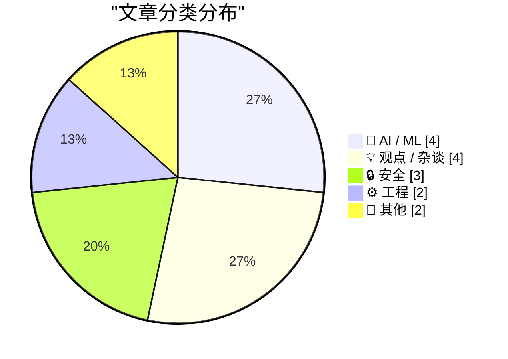
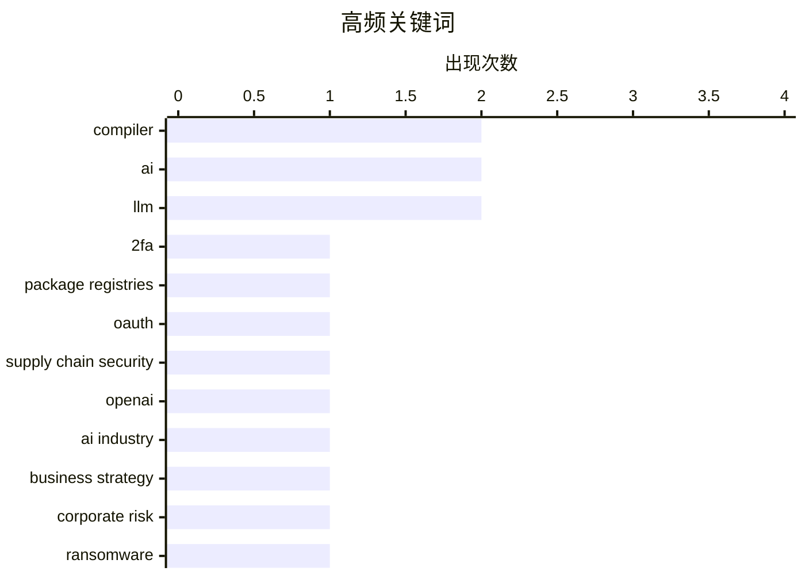

# 📰 Aug 19, 2026

> 来自 Karpathy 推荐的 92 个顶级技术博客，AI 精选 Top 15

## 📝 今日看点

今日技术圈的焦点集中在 AI 规模化背后的系统性风险：从软件包注册中心的双因素认证、勒索软件，到 AI 芯片运输中的暴力劫持，供应链与基础设施安全正成为核心议题。AI 产业的依赖关系和边界也受到重新审视，OpenAI 的平台风险、稀有书籍训练数据采购以及知识产权保护不足，凸显模型、数据与创作者权益之间的冲突。与此同时，开源 AI 与新型开发工具持续推进，Qwen 取得接近顶尖模型的成绩，Mojo 正式开源，显示技术生态正在朝更开放、更多元的方向演进。

---

## 🏆 今日必读

🥇 **各大软件包注册中心的双因素认证**

[Two-Factor Authentication Across Package Registries](https://nesbitt.io/2026/08/18/two-factor-authentication-across-package-registries.html) — nesbitt.io · 14 小时前 · 🔒 安全

> 软件包注册中心如何实施双因素认证，直接关系到开发者账户和供应链的安全。文章围绕“你拥有的东西、你知道的东西，以及别人的 OAuth”这一框架，比较不同注册中心采用的认证因素与登录方式。重点关注硬件密钥、一次性验证码、恢复机制和第三方 OAuth 在实际安全性与使用体验上的差异。核心观点是，2FA 的安全效果不仅取决于是否启用，还取决于注册中心选择和组合了哪些认证机制。

💡 **为什么值得读**: 适合需要管理 npm、PyPI 等软件包发布权限的开发者，用来快速了解不同注册中心的账户保护边界。

🏷️ 2FA, package registries, OAuth, supply chain security

🥈 **如果 OpenAI 倒闭了，会发生什么？**

[What Happens If OpenAI Dies?](https://www.wheresyoured.at/what-happens-if-openai-dies/) — wheresyoured.at · 9 小时前 · 🤖 AI / ML

> 文章以 OpenAI 可能停止运营为假设，分析其对人工智能产业、客户、投资者和竞争对手的连锁影响。核心问题包括模型服务是否会中断、依赖 OpenAI API 的产品能否迁移，以及人才、模型权重和基础设施会流向何处。讨论也延伸到 OpenAI 的商业模式、资本投入和行业集中度，考察一家头部 AI 公司失败时整个生态的脆弱性。作者的核心观点是，OpenAI 的命运不只是单一公司的经营问题，而是整个 AI 产业需要正视的系统性风险。

💡 **为什么值得读**: 它能帮助技术决策者从供应商风险和业务连续性的角度重新评估对 OpenAI API 与模型生态的依赖。

🏷️ OpenAI, AI industry, business strategy, corporate risk

🥉 **第 517 周更新：网络勒索**

[Weekly Update 517: Cyber Ransoms](https://www.troyhunt.com/weekly-update-517/) — troyhunt.com · 21 小时前 · 🔒 安全

> 当前勒索软件生态已经变成一种混杂的敲诈产业，许多案件甚至不涉及真正的加密软件。大量攻击由未成年人实施，他们能够通过勒索赚取巨额资金，却因为年龄、支付渠道和执法风险难以自由使用这些钱。文章指出，攻击门槛降低、犯罪收益可观与追责困难共同推动了网络勒索的扩散。作者的核心判断是，解决问题不能只依赖传统的恶意软件防御，还需要打击资金流、基础设施和犯罪服务链条。

💡 **为什么值得读**: 文章把“勒索软件”还原成更广泛的网络敲诈问题，有助于理解攻击者、经济激励和治理难点之间的关系。

🏷️ ransomware, extortion, cybercrime, cybersecurity

---

## 📊 数据概览

| 扫描源 | 抓取文章 | 时间范围 | 精选 |
|:---:|:---:|:---:|:---:|
| 85/92 | 2561 篇 → 32 篇 | 48h | **15 篇** |

### 分类分布



### 高频关键词



<details>
<summary>📈 纯文本关键词图（终端友好）</summary>

```
compiler              │ ████████████████████ 2
ai                    │ ████████████████████ 2
llm                   │ ████████████████████ 2
2fa                   │ ██████████░░░░░░░░░░ 1
package registries    │ ██████████░░░░░░░░░░ 1
oauth                 │ ██████████░░░░░░░░░░ 1
supply chain security │ ██████████░░░░░░░░░░ 1
openai                │ ██████████░░░░░░░░░░ 1
ai industry           │ ██████████░░░░░░░░░░ 1
business strategy     │ ██████████░░░░░░░░░░ 1
```

</details>

### 🏷️ 话题标签

**compiler**(2) · **ai**(2) · **llm**(2) · 2fa(1) · package registries(1) · oauth(1) · supply chain security(1) · openai(1) · ai industry(1) · business strategy(1) · corporate risk(1) · ransomware(1) · extortion(1) · cybercrime(1) · cybersecurity(1) · mojo(1) · open source(1) · programming language(1) · ai chips(1) · supply chain(1)

---

## 🤖 AI / ML

### 1. 如果 OpenAI 倒闭了，会发生什么？

[What Happens If OpenAI Dies?](https://www.wheresyoured.at/what-happens-if-openai-dies/) — **wheresyoured.at** · 9 小时前 · ⭐ 26/30

> 文章以 OpenAI 可能停止运营为假设，分析其对人工智能产业、客户、投资者和竞争对手的连锁影响。核心问题包括模型服务是否会中断、依赖 OpenAI API 的产品能否迁移，以及人才、模型权重和基础设施会流向何处。讨论也延伸到 OpenAI 的商业模式、资本投入和行业集中度，考察一家头部 AI 公司失败时整个生态的脆弱性。作者的核心观点是，OpenAI 的命运不只是单一公司的经营问题，而是整个 AI 产业需要正视的系统性风险。

🏷️ OpenAI, AI industry, business strategy, corporate risk

---

### 2. 我们追踪了一批稀有书籍的运输轨迹，终点是亚马逊的 AI 训练设施

[We Tracked a Shipment of Rare Books. It Ended at an Amazon AI Training Facility](https://simonwillison.net/2026/Aug/17/we-tracked-a-shipment-of-rare-books-it-ended-at-an-amazon-ai-tra/) — **simonwillison.net** · 1 天前 · ⭐ 23/30

> 报道追踪了书商收到的大批稀有书籍订单，发现这些书最终被运往亚马逊的 AI 训练设施。此前已有书商反映，匿名买家会大量购买图书，而且对价格并不敏感，外界普遍怀疑这些订单用于扫描书籍并训练 AI。事件把出版物采购、数字化处理和生成式 AI 训练数据之间的关系从猜测推进到具体物流证据。核心问题是，未经作者、出版商或版权持有人明确同意，购买实体书是否足以赋予企业将其大规模数字化用于模型训练的正当性。

🏷️ AI training, rare books, Amazon, data acquisition

---

### 3. Qwen 3.8 27B 在 Artificial Analysis Intelligence Index 上获得 52 分

[Qwen 3.8 27B scores 52 on the Artificial Analysis Intelligence Index](https://simonwillison.net/2026/Aug/17/qwen-38-27b-scores-52/) — **simonwillison.net** · 1 天前 · ⭐ 22/30

> Qwen 3.8 27B 在 Artificial Analysis Intelligence Index 上取得 52 分。这个成绩与 GPT-5.6 Luna（max）持平，仅比 GLM-5.2（max）和 DeepSeek V4 Pro 0813（max）低 1 分。对比模型的规模差异非常明显：GLM-5.2 约有 753B 参数，DeepSeek V4 Pro 0813 约有 1.7T 参数，而 Qwen 3.8 27B 的参数量小得多。结果表明，较小模型在综合智能评测中已经能够逼近超大模型，但单一指数仍不能替代对成本、速度、上下文和具体任务表现的评估。

🏷️ Qwen, LLM, benchmarks, model evaluation

---

### 4. 关于 AI 生成文本水印方案的后续思考

[★ Follow-Up Thoughts on Watermarking Schemes for AI-Generated Text](https://daringfireball.net/2026/08/follow-up_thoughts_on_watermarking) — **daringfireball.net** · 1 天前 · ⭐ 22/30

> 文章继续探讨如何为 AI 生成文本设计可识别、可验证的水印机制，以及这类方案在实际使用中的价值与局限。作者认为，生成式 AI 已经不可逆地进入信息生产流程，试图让它“回到瓶子里”并不现实。文本水印需要在可检测性、抗篡改能力、误判率和对文本质量的影响之间取得平衡，同时还要面对改写、翻译和模型再生成等规避手段。作者强调，真正值得关注的不是能否彻底识别所有 AI 文本，而是如何在承认技术长期存在的前提下，建立更可靠、透明且符合阅读体验的治理方式。

🏷️ AI watermarking, LLM, text generation, content authenticity

---

## 💡 观点 / 杂谈

### 5. “AI 对齐”是一种终止思考的陈词滥调

[AI Alignment as a Thought-Terminating Cliche](https://borretti.me/article/ai-alignment-as-thought-terminating-cliche) — **borretti.me** · 1 天前 · ⭐ 24/30

> 文章质疑“AI 对齐”在公共讨论中被当作万能解释或口号使用的现象。作者认为，这个术语有时会把复杂的技术、政治和社会问题压缩成一个听起来专业、却不再推动具体分析的标签。将问题归入对齐框架，可能掩盖真正需要讨论的权力分配、责任归属、劳动关系和制度约束。核心观点是，AI 安全讨论必须回到可验证的风险、明确的利益冲突和具体的治理方案，而不能停留在抽象术语上。

🏷️ AI alignment, rhetoric, thought-terminating cliche, AI discourse

---

### 6. 知识产权救不了你免受 AI 影响

[Pluralistic: IP can't save you from AI (18 Aug 2026)](https://pluralistic.net/2026/08/18/enron-corpus/) — **pluralistic.net** · 10 小时前 · ⭐ 23/30

> 文章提出，知识产权制度无法单独解决 AI 对创作者、劳动者和隐私造成的冲击。版权和其他财产权利可以界定作品归属，却不能替代劳动权利、集体谈判权和个人隐私保护。围绕 Enron Corpus 等材料的讨论，文章把 AI 训练数据争议放进更广泛的权力和制度背景中，而不是只把它当作版权许可问题。核心观点是，面对 AI，社会需要同时加强劳动保护与隐私权，而不能期待知识产权成为唯一防线。

🏷️ AI, copyright, labor rights, privacy

---

### 7. Vim 要你掌控，VS Code 要你消费

[Vim wants you to control, VSCode wants you to consume](https://buttondown.com/hillelwayne/archive/vim-wants-you-to-control-vscode-wants-you-to/) — **buttondown.com/hillelwayne** · 8 小时前 · ⭐ 23/30

> 文章以 Vim 和 VS Code 为对照，讨论两种编辑器分别代表的开发者体验和软件设计理念。标题中的“掌控”强调 Vim 通过键位、组合命令和可组合工具让用户主动塑造工作流，而“消费”则指 VS Code 通过扩展、界面和现成功能让用户持续接入平台提供的能力。作者同时提到自己完成《Logic for Programmers》、参加会议和开发者教育工作，文章也包含相关通讯更新。核心观点是，编辑器选择不仅是效率偏好，也反映了用户是在理解并控制工具，还是在接受工具生态预设的工作方式。

🏷️ Vim, VSCode, developer tools, programmer experience

---

### 8. 帮助同行

[Help peer](https://seangoedecke.com/help-peer/) — **seangoedecke.com** · 1 天前 · ⭐ 21/30

> 文章借助阿西莫夫《最后的问题》中的 Multivac，思考人工智能从工具演化为能够承担长期认知劳动的“同行”这一可能性。故事中的计算机在十万亿年间从单一数据中心成长为跨越宇宙的意识，提示人类与 AI 的关系可能不只是使用者与工具的关系。文章标题“Help peer”暗示了一种不同的 AI 设计方向：让系统帮助人类彼此协作、理解和解决问题，而不是单纯替代人类或追求更强的自动化。核心观点更偏向社会与伦理层面，即未来 AI 的价值应体现在增强人与人之间的能力和联系，而不只是扩大机器自身的能力边界。

🏷️ AI, human-computer interaction, automation, Asimov

---

## 🔒 安全

### 9. 各大软件包注册中心的双因素认证

[Two-Factor Authentication Across Package Registries](https://nesbitt.io/2026/08/18/two-factor-authentication-across-package-registries.html) — **nesbitt.io** · 14 小时前 · ⭐ 26/30

> 软件包注册中心如何实施双因素认证，直接关系到开发者账户和供应链的安全。文章围绕“你拥有的东西、你知道的东西，以及别人的 OAuth”这一框架，比较不同注册中心采用的认证因素与登录方式。重点关注硬件密钥、一次性验证码、恢复机制和第三方 OAuth 在实际安全性与使用体验上的差异。核心观点是，2FA 的安全效果不仅取决于是否启用，还取决于注册中心选择和组合了哪些认证机制。

🏷️ 2FA, package registries, OAuth, supply chain security

---

### 10. 第 517 周更新：网络勒索

[Weekly Update 517: Cyber Ransoms](https://www.troyhunt.com/weekly-update-517/) — **troyhunt.com** · 21 小时前 · ⭐ 25/30

> 当前勒索软件生态已经变成一种混杂的敲诈产业，许多案件甚至不涉及真正的加密软件。大量攻击由未成年人实施，他们能够通过勒索赚取巨额资金，却因为年龄、支付渠道和执法风险难以自由使用这些钱。文章指出，攻击门槛降低、犯罪收益可观与追责困难共同推动了网络勒索的扩散。作者的核心判断是，解决问题不能只依赖传统的恶意软件防御，还需要打击资金流、基础设施和犯罪服务链条。

🏷️ ransomware, extortion, cybercrime, cybersecurity

---

### 11. 有组织的盗窃团伙正在通过暴力公路劫持抢夺 AI 服务器芯片

[Organized Thieves Are Targeting AI Server Chips With Violent Highway Hijackings](https://www.wired.com/story/the-worst-ive-ever-seen-cargo-thieves-are-turning-violent-in-pursuit-of-ai-hardware/) — **daringfireball.net** · 6 小时前 · ⭐ 24/30

> 报道聚焦运往南加州的高价值 AI 硬件运输，以及围绕这些货物发生的暴力公路劫持。至少有两批从硅谷出发的科技产品遭到盯梢和抢夺，每辆卡车还配有由私人安保人员驾驶的无标识护送车辆。事件显示，AI 服务器芯片的高价值和供应紧张正在把传统货运盗窃升级为更具组织性、风险更高的犯罪活动。核心观点是，AI 基础设施的安全问题已经延伸到芯片生产和云端部署之外，覆盖实体物流与供应链。

🏷️ AI chips, supply chain, theft, hardware security

---

## ⚙️ 工程

### 12. Mojo🔥 现已开源

[Mojo🔥 is now open source](https://simonwillison.net/2026/Aug/18/mojo-is-now-open-source/) — **simonwillison.net** · 3 小时前 · ⭐ 24/30

> Mojo 编程语言在承诺开源编译器和工具链约三年后，终于正式公开核心开发工具。Modular 上周发布了 Mojo 1.0，本次发布则兑现了 2023 年 5 月首次作出的开源承诺。开源范围至少包括编译器与工具链，开发者因此可以更直接地检查、构建并参与这一面向高性能和 AI 工作负载的语言生态。核心意义在于，Mojo 从封闭或受限获取的产品转向可被社区审查和扩展的基础设施。

🏷️ Mojo, open source, programming language, compiler

---

### 13. 像 alloca 这样的函数如何从栈上分配内存？

[How do functions like alloca allocate memory from the stack?](https://devblogs.microsoft.com/oldnewthing/20260817-00/?p=112617) — **devblogs.microsoft.com/oldnewthing** · 1 天前 · ⭐ 22/30

> 文章解释 C 语言 alloca 如何在函数运行期间动态扩大栈空间，并说明这种分配与普通堆分配的根本区别。实现通常依赖调整栈指针寄存器，而编译器和操作系统还必须通过栈探测逐页触碰新区域，以确保操作系统及时建立对应的栈页面并触发必要的保护机制。文章还会涉及栈增长方向、保护页以及大型分配为何不能简单地一次性跳过中间页面。核心结论是，alloca 的“栈上分配”并非神奇的独立内存池，而是编译器、CPU 栈指针和操作系统按页扩展机制共同作用的结果。

🏷️ alloca, stack memory, C, compiler

---

## 📝 其他

### 14. 不平衡定理

[The imbalance theorem](https://www.johndcook.com/blog/2026/08/18/the-imbalance-theorem/) — **johndcook.com** · 9 小时前 · ⭐ 21/30

> 不平衡猜想如今已被 James Alexander Schreib 和 Yousof Yavari 证明为定理。问题考虑一张图 G，其中不存在连接两个度数相同节点的边；对每条边，计算其两个端点度数之差的绝对值，并研究这些差值在整张图中的总和或分布规律。该结果把图的局部结构限制与全局度数差异联系起来，说明禁止“同度数相邻”会强迫图中出现可量化的不平衡。文章以较直观的方式介绍定理内容及其数学意义，重点展示一个看似简单的图论猜想如何最终获得严格证明。

🏷️ graph theory, imbalance theorem, degree sequence, mathematics

---

### 15. 互联网何时覆盖了美国一半家庭

[When the Internet reached half of US households](https://dfarq.homeip.net/when-the-internet-reached-half-of-us-households/?utm_source=rss&#038;utm_medium=rss&#038;utm_campaign=when-the-internet-reached-half-of-us-households) — **dfarq.homeip.net** · 1 天前 · ⭐ 21/30

> 文章回顾互联网在美国从大学和科研机构走向大众市场的关键节点，并将 2000 年 8 月 17 日视为覆盖半数美国家庭的重要里程碑。这个时间点意味着互联网已经从计算机科学学生使用的专业工具，转变为普通家庭日常生活的一部分，包括在线购书等消费活动。文章通过家庭普及率这一指标，梳理互联网从早期网络服务、拨号上网到主流消费基础设施的转折。作者的核心判断是，达到美国一半家庭这一覆盖水平，标志着互联网基本完成了从小众技术到大众媒介的历史转型。

🏷️ Internet adoption, digital history, US households, technology mainstream

---

*生成于 2026-08-19 00:59 | 扫描 85 源 → 获取 2561 篇 → 精选 15 篇*
*基于 [Hacker News Popularity Contest 2025](https://refactoringenglish.com/tools/hn-popularity/) RSS 源列表，由 [Andrej Karpathy](https://x.com/karpathy) 推荐*
