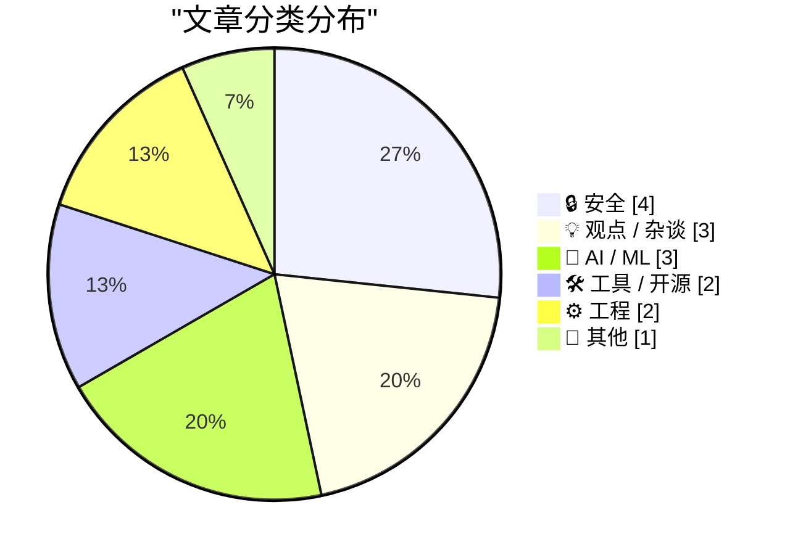
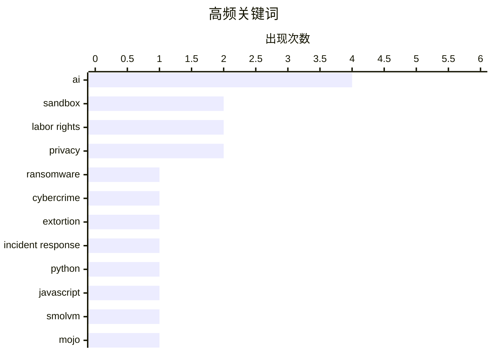

# 📰 Aug 20, 2026

> 来自 Karpathy 推荐的 92 个顶级技术博客，AI 精选 Top 15

## 📝 今日看点

今日技术圈的焦点正从“AI 能做什么”转向“AI 如何被安全、公平且可控地使用”：代理能力、推理定义与 AI 编程生产力都在被重新审视。与此同时，软件扩展和语言工具链进一步开放，LLM 加速了定制开发，但也提高了对沙箱隔离、身份认证与供应链安全的要求。AI 基础设施的高价值化已外溢到现实世界，芯片运输安全、数据勒索和平台力量不对称共同凸显了技术繁荣背后的风险分配问题。

---

## 🏆 今日必读

🥇 **每周更新 517：网络勒索**

[Weekly Update 517: Cyber Ransoms](https://www.troyhunt.com/weekly-update-517/) — troyhunt.com · 1 天前 · 🔒 安全

> 当前的勒索软件生态更接近“勒索”而非传统意义上的恶意软件：攻击者通过窃取数据、威胁公开或干扰业务获利。大量攻击由年轻犯罪者实施，他们虽然能获得巨额赎金，却难以在不暴露身份的前提下消费或清洗资金。文章将这一现象置于更广泛的网络犯罪、加密货币变现与执法压力之间审视。核心观点是，打击勒索不能只关注终端恶意软件，还必须切断身份隐藏、赎金流转和数据勒索这一整条利益链。

💡 **为什么值得读**: 值得读，因为它用现实犯罪链条纠正了“装个杀毒软件就能防勒索软件”的过度简化认知。

🏷️ ransomware, cybercrime, extortion, incident response

🥈 **将 smolmachines / smolvm 用作不受信任 Python 与 JavaScript 的沙箱**

[smolmachines / smolvm as a sandbox for untrusted Python & JavaScript](https://simonwillison.net/2026/Aug/19/smolmachines-untrusted-sandbox/) — simonwillison.net · 1 小时前 · 🔒 安全

> 研究评估 smolmachines.com 与 smolvm 是否能成为快速且安全的运行时，用于执行不受信任的 Python 和 JavaScript。测试重点是隔离边界、代码执行能力、网络与文件系统访问限制，以及将该方案接入应用程序的实际成本。作者让 Claude Fable 5 在 Claude Code for web 中开展调研，检验产品声明与可操作的部署方案之间的差距。结论指向一个工程问题：面向用户代码或 LLM 生成代码的执行环境，必须以可验证的沙箱边界和最小权限配置为前提，而非只看执行速度。

💡 **为什么值得读**: 值得读，因为它把 AI 代码执行这一高风险需求落到具体沙箱产品和可验证安全边界上，适合评估生产方案。

🏷️ sandbox, Python, JavaScript, smolvm

🥉 **Mojo🔥 现已开源**

[Mojo🔥 is now open source](https://simonwillison.net/2026/Aug/18/mojo-is-now-open-source/) — simonwillison.net · 1 天前 · 🛠 工具 / 开源

> Modular 的 Mojo 编程语言在 2026 年发布 1.0 后，终于兑现自 2023 年 5 月起公开承诺的开源计划。其编译器和工具链以 Apache 2.0 许可证发布，意味着开发者和企业可以审阅、使用并参与生态建设。Mojo 的定位是结合 Python 的开发体验与面向 AI、异构计算的高性能系统编程能力。开源消除了该语言长期以来最关键的采用障碍之一，但其能否成为主流仍取决于生态、工具成熟度和实际工作负载表现。

💡 **为什么值得读**: 值得读，因为 Apache 2.0 开源改变了 Mojo 从“值得关注的封闭技术”到可纳入长期技术选型的基础条件。

🏷️ Mojo, open source, programming language, AI

---

## 📊 数据概览

| 扫描源 | 抓取文章 | 时间范围 | 精选 |
|:---:|:---:|:---:|:---:|
| 83/92 | 2518 篇 → 28 篇 | 48h | **15 篇** |

### 分类分布



### 高频关键词



<details>
<summary>📈 纯文本关键词图（终端友好）</summary>

```
ai                │ ████████████████████ 4
sandbox           │ ██████████░░░░░░░░░░ 2
labor rights      │ ██████████░░░░░░░░░░ 2
privacy           │ ██████████░░░░░░░░░░ 2
ransomware        │ █████░░░░░░░░░░░░░░░ 1
cybercrime        │ █████░░░░░░░░░░░░░░░ 1
extortion         │ █████░░░░░░░░░░░░░░░ 1
incident response │ █████░░░░░░░░░░░░░░░ 1
python            │ █████░░░░░░░░░░░░░░░ 1
javascript        │ █████░░░░░░░░░░░░░░░ 1
```

</details>

### 🏷️ 话题标签

**ai**(4) · **sandbox**(2) · **labor rights**(2) · privacy(2) · ransomware(1) · cybercrime(1) · extortion(1) · incident response(1) · python(1) · javascript(1) · smolvm(1) · mojo(1) · open source(1) · programming language(1) · llm(1) · extensibility(1) · web(1) · ai chips(1) · supply chain(1) · theft(1)

---

## 🔒 安全

### 1. 每周更新 517：网络勒索

[Weekly Update 517: Cyber Ransoms](https://www.troyhunt.com/weekly-update-517/) — **troyhunt.com** · 1 天前 · ⭐ 26/30

> 当前的勒索软件生态更接近“勒索”而非传统意义上的恶意软件：攻击者通过窃取数据、威胁公开或干扰业务获利。大量攻击由年轻犯罪者实施，他们虽然能获得巨额赎金，却难以在不暴露身份的前提下消费或清洗资金。文章将这一现象置于更广泛的网络犯罪、加密货币变现与执法压力之间审视。核心观点是，打击勒索不能只关注终端恶意软件，还必须切断身份隐藏、赎金流转和数据勒索这一整条利益链。

🏷️ ransomware, cybercrime, extortion, incident response

---

### 2. 将 smolmachines / smolvm 用作不受信任 Python 与 JavaScript 的沙箱

[smolmachines / smolvm as a sandbox for untrusted Python & JavaScript](https://simonwillison.net/2026/Aug/19/smolmachines-untrusted-sandbox/) — **simonwillison.net** · 1 小时前 · ⭐ 25/30

> 研究评估 smolmachines.com 与 smolvm 是否能成为快速且安全的运行时，用于执行不受信任的 Python 和 JavaScript。测试重点是隔离边界、代码执行能力、网络与文件系统访问限制，以及将该方案接入应用程序的实际成本。作者让 Claude Fable 5 在 Claude Code for web 中开展调研，检验产品声明与可操作的部署方案之间的差距。结论指向一个工程问题：面向用户代码或 LLM 生成代码的执行环境，必须以可验证的沙箱边界和最小权限配置为前提，而非只看执行速度。

🏷️ sandbox, Python, JavaScript, smolvm

---

### 3. 有组织盗贼以暴力公路劫持瞄准 AI 服务器芯片

[Organized Thieves Are Targeting AI Server Chips With Violent Highway Hijackings](https://www.wired.com/story/the-worst-ive-ever-seen-cargo-thieves-are-turning-violent-in-pursuit-of-ai-hardware/) — **daringfireball.net** · 1 天前 · ⭐ 24/30

> 高价值 AI 硬件运输正在成为有组织货运犯罪的目标，硅谷至南加州的两批技术货物已发生相关事件。报道指出，即使卡车配有由私营安保人员驾驶的无标识护送车辆，货物仍可能遭到跟踪和抢劫。AI 服务器芯片的稀缺性、高单价和易于转售，使供应链安全从机房防护扩展到实体物流环节。结论是，AI 基础设施的风险模型不能只覆盖网络攻击和数据中心安全，运输路线、托运交接与硬件可追溯性也必须纳入防护。

🏷️ AI chips, supply chain, theft, hardware security

---

### 4. 跨软件包注册表的双因素认证

[Two-Factor Authentication Across Package Registries](https://nesbitt.io/2026/08/18/two-factor-authentication-across-package-registries.html) — **nesbitt.io** · 1 天前 · ⭐ 24/30

> 软件包注册表的双因素认证不只涉及“你拥有的设备”和“你知道的密码”，还越来越依赖第三方 OAuth 身份提供商。标题“Something you have, something you know, and someone else's OAuth”指出了这种认证结构的新依赖：维护者账户安全会被外部 OAuth 账户及其恢复流程共同决定。对于 npm、PyPI、RubyGems 等供应链入口，2FA 的实际强度取决于注册表自身策略、硬件密钥支持、OAuth 绑定与账户恢复机制是否一致。结论是，不能把启用 2FA 视为供应链安全的终点，跨平台注册表的身份联邦关系需要被单独建模和审计。

🏷️ 2FA, package registries, OAuth, supply chain security

---

## 💡 观点 / 杂谈

### 5. Pluralistic：知识产权救不了你免受 AI 影响（2026 年 8 月 18 日）

[Pluralistic: IP can't save you from AI (18 Aug 2026)](https://pluralistic.net/2026/08/18/enron-corpus/) — **pluralistic.net** · 1 天前 · ⭐ 24/30

> 文章反驳了“强化知识产权即可解决 AI 冲击”的观点，认为财产权不能替代劳动权和隐私权。面对 AI 对创作者、知识工作者及个人数据的影响，版权、许可和内容所有权只能处理部分分配问题。作者强调，劳动者的议价能力、集体权利、隐私保护和对数据滥用的约束，才是更根本的制度工具。核心结论是，将 AI 治理押注于 IP 扩张，可能掩盖了权力不对称和劳动保护不足的问题。

🏷️ AI, intellectual property, labor rights, privacy

---

### 6. 概念完整性与代码行数统计

[Conceptual integrity and counting lines of code](https://simonwillison.net/2026/Aug/19/conceptual-integrity-and-counting-lines-of-code/) — **simonwillison.net** · 2 小时前 · ⭐ 23/30

> Simon Willison 在 Talking Postgres 播客“AI 如何改变软件开发”访谈中，进一步阐述了他对 AI 编程影响的看法。讨论聚焦于代码行数不再是可靠的产出指标：生成式 AI 可以快速增加代码量，却不能自动保证系统设计的一致性。与之相比，“概念完整性”要求产品和代码库由连贯的模型、清晰的边界与一致的决策驱动。结论是，AI 降低实现成本后，软件工程的稀缺能力更偏向判断什么该被构建、如何保持整体设计一致，以及如何审查生成结果。

🏷️ software development, AI, conceptual integrity, LOC

---

### 7. 复数主义：邪恶的平庸性

[Pluralistic: The ordinariness of evil (19 Aug 2026)](https://pluralistic.net/2026/08/19/banaility/) — **pluralistic.net** · 17 小时前 · ⭐ 23/30

> 文章以“邪恶的平庸性”为切入点，批评科技行业继续推销有害或并不可靠的人工智能产品。作者将 AI 热潮放在更广泛的商业宣传、权力结构与社会责任问题中考察，质疑企业是否把风险转嫁给用户和公众。“Stop selling AI (bad)”这一主张意味着，与其不断包装 AI 的商业价值，不如正视其实际危害、失败模式和被滥用的可能。核心观点是，技术行业不能用创新叙事掩盖具体的伤害，公众也应警惕将 AI 神化为不可质疑的解决方案。

🏷️ AI, labor rights, privacy, Pentagon

---

## 🤖 AI / ML

### 8. 不对称代理

[Asymmetric Agents](https://shkspr.mobi/blog/2026/08/asymmetric-agents/) — **shkspr.mobi** · 13 小时前 · ⭐ 24/30

> AI 代理常被设想为代表个人完成搜索、议价、预订和协调事务的自主助手。文章指出，这种愿景会遭遇不对称性：用户的代理可能弱小、信息有限且受平台约束，而商家、平台或对手方的代理拥有更多数据、算力、谈判目标和操纵能力。即便个人代理了解饮食偏好、预算和约会需求，它也未必能在由商业平台塑造的市场中真正代表用户利益。结论是，代理之间的互动不是天然平等的自动化协作，必须正视代理所有权、激励结构、信息优势与监管问题。

🏷️ AI agents, automation, personal assistants, incentives

---

### 9. 什么是推理

[What Is Reasoning](https://lucumr.pocoo.org/2026/8/19/what-is-reasoning/) — **lucumr.pocoo.org** · 1 天前 · ⭐ 24/30

> 文章追问 AI 语境中被频繁使用的“推理（reasoning）”究竟指什么，而非把它当作不言自明的能力标签。标题页提示该博文触发了安全检查，反映出对推理、能力边界或敏感内容的讨论本身也可能被自动审核系统误判。该主题要求区分语言模型输出看似连贯的步骤、可验证的逻辑过程、规划能力，以及人类认知意义上的推理。核心观点是，若不先定义术语和评估标准，围绕模型是否“会推理”的争论很容易沦为营销叙事或语义混淆。

🏷️ AI reasoning, language models, safety checks, cognition

---

### 10. 如果 OpenAI 倒闭，会发生什么？

[What Happens If OpenAI Dies?](https://www.wheresyoured.at/what-happens-if-openai-dies/) — **wheresyoured.at** · 1 天前 · ⭐ 23/30

> 文章围绕 OpenAI 停止运营这一假设，分析其对人工智能产业、开发者、企业客户和普通用户可能造成的连锁影响。核心问题包括模型 API、托管服务、应用依赖、知识产权以及围绕 OpenAI 建立的资本和产品生态将如何处置。OpenAI 的基础设施和模型服务已经成为大量软件与商业流程的依赖点，因此公司消失不只是单一供应商退出，还可能引发迁移、停摆和合同风险。文章的核心观点是，任何把关键业务完全建立在一家 AI 供应商之上的组织，都应提前评估供应商失败情景并准备替代模型、数据迁移和服务降级方案。

🏷️ OpenAI, AI industry, organizational risk, resilience

---

## 🛠 工具 / 开源

### 11. Mojo🔥 现已开源

[Mojo🔥 is now open source](https://simonwillison.net/2026/Aug/18/mojo-is-now-open-source/) — **simonwillison.net** · 1 天前 · ⭐ 25/30

> Modular 的 Mojo 编程语言在 2026 年发布 1.0 后，终于兑现自 2023 年 5 月起公开承诺的开源计划。其编译器和工具链以 Apache 2.0 许可证发布，意味着开发者和企业可以审阅、使用并参与生态建设。Mojo 的定位是结合 Python 的开发体验与面向 AI、异构计算的高性能系统编程能力。开源消除了该语言长期以来最关键的采用障碍之一，但其能否成为主流仍取决于生态、工具成熟度和实际工作负载表现。

🏷️ Mojo, open source, programming language, AI

---

### 12. 上手体验树莓派 CM5 编程夹具

[Hands-on with Raspberry Pi's CM5 Programming Jig](https://www.jeffgeerling.com/blog/2026/cm5-programming-jig/) — **jeffgeerling.com** · 17 小时前 · ⭐ 22/30

> 文章记录了 Raspberry Pi Compute Module 5（CM5）编程夹具的实际使用体验，重点解决批量向多块 CM5 刷写 Raspberry Pi OS 的繁琐问题。作者此前搭建过多个 Raspberry Pi 集群，发现逐台完成系统写入是装机过程中最令人烦恼的环节，因此转向评估专用编程夹具。该设备的价值在于为 CM5 提供更适合批量处理的连接和供电方式，从而减少反复插拔、手工刷写和逐台配置的工作量。文章适合关注 CM5 集群、硬件批量部署和 Raspberry Pi 生产流程的人，用于判断这类夹具是否值得纳入装机工具链。

🏷️ Raspberry Pi, CM5, hardware, flashing

---

## ⚙️ 工程

### 13. 引用 Jeremy Morrell：LLM 时代的可扩展软件

[Quoting Jeremy Morrell](https://simonwillison.net/2026/Aug/19/jeremy-morrell/) — **simonwillison.net** · 2 小时前 · ⭐ 24/30

> Jeremy Morrell 提出，Web 上的可扩展软件正迎来新的机会窗口。LLM 显著降低了编写扩展、自动化脚本和定制功能的成本，使用户可以补齐应用原本没有覆盖的需求。现代沙箱原语则降低了扩展部署成本，并为不受信任代码建立安全隔离边界。文章主张应用应保留可靠、可追责的核心，同时让用户在受控环境中通过 LLM 生成的扩展向外延展。

🏷️ LLM, extensibility, web, sandbox

---

### 14. Anubis 继续揭示人们配置 Web 服务器的新方式

[Anubis continues to expose new ways people configure webservers](https://xeiaso.net/notes/2026/anubis-csp-worker-hell/) — **xeiaso.net** · 1 天前 · ⭐ 23/30

> 文章通过 Anubis 暴露出的案例，说明 Web 服务器管理员关闭浏览器功能后，相关功能会以令人困惑且难以调试的方式失效。问题的关键不一定在 Anubis 本身，而在 Content Security Policy（CSP）等安全策略、浏览器能力与站点配置之间的相互影响。管理员可能为了缓解爬虫、攻击或其他风险而禁用脚本、Worker 等浏览器特性，却没有意识到这会破坏依赖这些特性的前端行为。结论是，服务器安全配置必须结合浏览器端依赖进行验证，否则“更安全”的设置可能只会制造隐蔽的兼容性故障。

🏷️ Anubis, web servers, browser features, debugging

---

## 📝 其他

### 15. 不平衡定理

[The imbalance theorem](https://www.johndcook.com/blog/2026/08/18/the-imbalance-theorem/) — **johndcook.com** · 1 天前 · ⭐ 21/30

> 不平衡猜想现已被 James Alexander Schreib 和 Yousof Yavari 证明为定理。命题研究一种图 G：任意相连的两个节点，其度数不能相同；对每条边，计算边两端节点度数之差的绝对值。不平衡定理断言，这些边上的度数差具有必然的整体性质，说明局部节点度数约束会强制图结构表现出某种不平衡。文章以较短的形式介绍定理背景和证明工作的最新进展，适合希望快速了解该图论结果含义的读者。

🏷️ graph theory, imbalance theorem, node degree, mathematics

---

*生成于 2026-08-20 00:59 | 扫描 83 源 → 获取 2518 篇 → 精选 15 篇*
*基于 [Hacker News Popularity Contest 2025](https://refactoringenglish.com/tools/hn-popularity/) RSS 源列表，由 [Andrej Karpathy](https://x.com/karpathy) 推荐*
