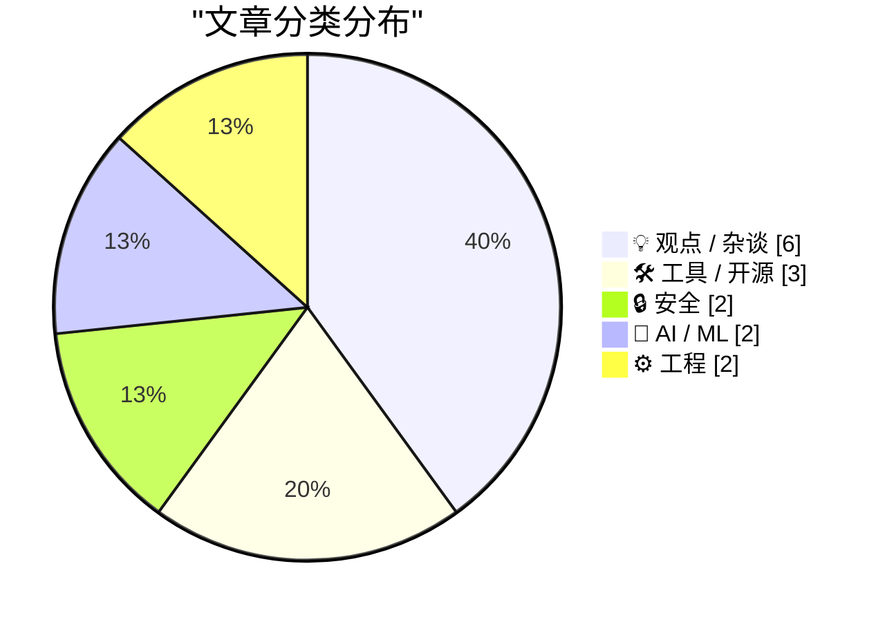
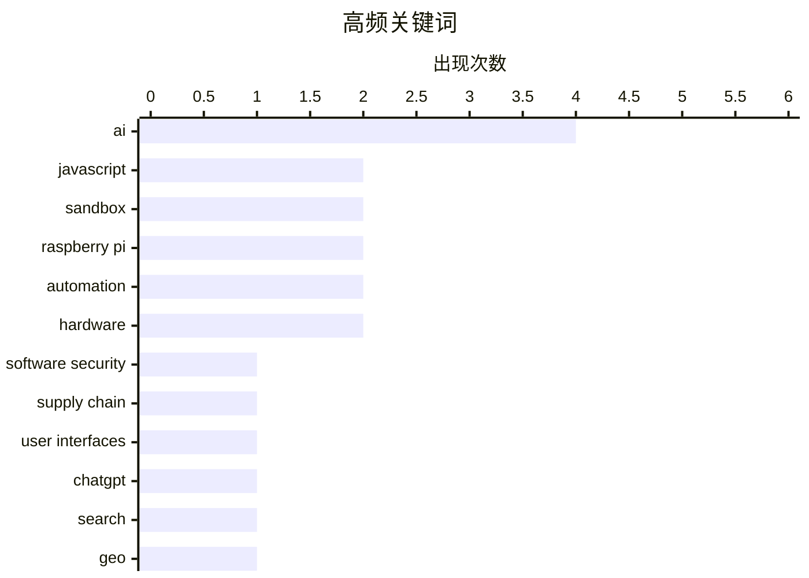

# 📰 Aug 21, 2026

> 来自 Karpathy 推荐的 92 个顶级技术博客，AI 精选 Top 15

## 📝 今日看点

今天的技术讨论集中在 AI 重塑软件安全、搜索与开发方式：从 ChatGPT 搜索大量使用 site: 操作符，到通过沙箱和 WebView 执行不受信任代码，AI 应用正加速进入更复杂的系统工程阶段。安全边界也从代码本身扩展到界面设计、代理权限和扩展机制，如何在开放能力与可控风险之间取得平衡成为核心议题。与此同时，围绕 AI 代理、信息真实性和责任归属的反思持续升温，行业开始重新审视“自动化更多”是否等同于“软件更有价值”。

---

## 🏆 今日必读

🥇 **粗糙的界面会带来安全风险**

[A Sloppy Interface Is a Security Liability ](https://blog.jim-nielsen.com/2026/sloppy-ui-is-security-liability/) — blog.jim-nielsen.com · 6 小时前 · 🔒 安全

> 安全漏洞不只来自代码，也可能源于让用户失去警惕的界面设计。Feross Aboukhadijeh 在演讲《为什么 AI 正在改变我们所知的软件安全》中，以 Axios npm 事件为例，指出维护者遭遇钓鱼攻击的一个关键环节是假冒 Microsoft Teams 界面。攻击者借助熟悉的品牌、相似的交互流程和低质量但足以蒙混过关的视觉仿制品，诱导用户输入凭据或执行危险操作。界面中的域名、权限提示、登录状态和操作反馈如果不清晰，就会成为社会工程攻击的放大器。软件安全因此需要把用户界面视为安全边界的一部分，而不是仅关注后端代码和基础设施。

💡 **为什么值得读**: 它把常被归入用户体验问题的界面粗糙，明确连接到钓鱼攻击和供应链安全，适合前端、安全及产品团队共同阅读。

🏷️ software security, AI, supply chain, user interfaces

🥈 **ChatGPT 搜索开始大规模使用 site: 操作符**

[ChatGPT search now uses the site:operator at scale](https://simonwillison.net/2026/Aug/20/chatgpt-search-now-uses-the-siteoperator-at-scale/) — simonwillison.net · 1 小时前 · 🤖 AI / ML

> Promptwatch 的数据表明，ChatGPT 搜索正在大规模使用搜索引擎中的 site: 操作符，将查询限制到特定网站。Promptwatch 属于新兴的 GEO（Generative Engine Optimization，生成式引擎优化）领域，目标是提高网站内容出现在 ChatGPT 等产品回答中的概率。其产品通过自动化方式，持续追踪不同终端聊天产品对指定提示词的回答，并分析哪些网站和内容获得了曝光。site: 操作符的规模化使用意味着网站在生成式搜索中的可见性，可能受到更明确的站点筛选和内容来源偏好的影响。传统 SEO 之外，网站运营者还需要关注聊天产品如何检索、选择和引用自己的内容。

💡 **为什么值得读**: 文章提供了生成式搜索如何实际检索网页的可观察证据，有助于理解 GEO 与传统 SEO 的差异及其对网站流量的影响。

🏷️ ChatGPT, search, GEO, SEO

🥉 **基于 Bun 1.4 新 Bun.WebView 构建 shot-scraper 风格的 JSON API**

[A shot-scraper-style JSON API on Bun 1.4's new Bun.WebView](https://simonwillison.net/2026/Aug/20/bun-webview-json-api/) — simonwillison.net · 9 小时前 · 🛠 工具 / 开源

> Bun 1.4 首次带来了稳定版 Bun.WebView，为在 Bun 环境中驱动网页视图和构建浏览器自动化工具提供了新基础。文章通过研究项目，探索如何利用 Bun.WebView 实现类似 shot-scraper 的 JSON API，把网页访问、截图或数据提取能力封装成可调用的接口。这个方向的重点在于减少传统浏览器自动化工具链的复杂度，并利用 Bun 的运行时能力整合 JavaScript 服务与网页渲染。Bun 1.4 发布时距离此前的 Rust 重写仅数月，因而其 API 稳定性、兼容性和实际可用性也是重要背景。研究结果适合关注轻量级网页自动化、无头浏览器服务和 Bun 生态发展的开发者参考。

💡 **为什么值得读**: 它展示了 Bun.WebView 从新功能走向实际工具的过程，能帮助开发者判断 Bun 是否足以替代部分 shot-scraper 或传统浏览器自动化方案。

🏷️ Bun, WebView, JSON API, JavaScript

---

## 📊 数据概览

| 扫描源 | 抓取文章 | 时间范围 | 精选 |
|:---:|:---:|:---:|:---:|
| 83/92 | 2518 篇 → 22 篇 | 48h | **15 篇** |

### 分类分布



### 高频关键词



<details>
<summary>📈 纯文本关键词图（终端友好）</summary>

```
ai                │ ████████████████████ 4
javascript        │ ██████████░░░░░░░░░░ 2
sandbox           │ ██████████░░░░░░░░░░ 2
raspberry pi      │ ██████████░░░░░░░░░░ 2
automation        │ ██████████░░░░░░░░░░ 2
hardware          │ ██████████░░░░░░░░░░ 2
software security │ █████░░░░░░░░░░░░░░░ 1
supply chain      │ █████░░░░░░░░░░░░░░░ 1
user interfaces   │ █████░░░░░░░░░░░░░░░ 1
chatgpt           │ █████░░░░░░░░░░░░░░░ 1
```

</details>

### 🏷️ 话题标签

**ai**(4) · **javascript**(2) · **sandbox**(2) · raspberry pi(2) · automation(2) · hardware(2) · software security(1) · supply chain(1) · user interfaces(1) · chatgpt(1) · search(1) · geo(1) · seo(1) · bun(1) · webview(1) · json api(1) · python(1) · smolvm(1) · llm(1) · extensibility(1)

---

## 💡 观点 / 杂谈

### 1. 引用 Jeremy Morrell：LLM 时代的可扩展软件

[Quoting Jeremy Morrell](https://simonwillison.net/2026/Aug/19/jeremy-morrell/) — **simonwillison.net** · 1 天前 · ⭐ 24/30

> LLM 正在降低编写软件扩展的成本，Web 平台的新型沙箱原语则降低了部署扩展的成本。Jeremy Morrell 的核心假设是，应用可以保留一个稳固、可负责的核心，同时允许用户通过扩展向更多方向定制功能。LLM 可以填补扩展开发中的缺失部分，帮助用户生成过去需要专业开发者完成的插件或自动化逻辑。现代沙箱能够为这些扩展提供安全边界，减少用户代码对核心应用、数据和其他租户的影响。该模式的关键不只是生成代码，而是把 LLM 生成能力与权限控制、隔离机制和责任边界结合起来。

🏷️ LLM, extensibility, web software, sandbox

---

### 2. 复数主义：真正的认识危机（2026 年 8 月 20 日）

[Pluralistic: The actual epistemic crisis (20 Aug 2026)](https://pluralistic.net/2026/08/20/epistemic-void/) — **pluralistic.net** · 1 小时前 · ⭐ 24/30

> 文章把当下的核心危机定义为认识危机：AI 对现实的侵蚀像一种借机扩散的机会性感染。问题不只是生成错误信息，而是 AI 生成、传播和放大内容的机制正在削弱人们判断事实、来源和证据的能力。标题所说的“actual epistemic crisis”将技术问题提升到公共知识系统和社会信任层面，关注现实如何被平台、自动化内容和权力结构共同塑造。文章同时收录多个延伸链接与文化、政治及技术评论，形成围绕信息真实性和公共认知的杂文式讨论。核心观点是，面对 AI 造成的现实感崩塌，不能只依赖更好的模型或单点事实核查，还需要重新审视生产、分发和验证知识的制度。

🏷️ AI, epistemic crisis, misinformation, reality

---

### 3. 非对称代理

[Asymmetric Agents](https://shkspr.mobi/blog/2026/08/asymmetric-agents/) — **shkspr.mobi** · 1 天前 · ⭐ 24/30

> AI 代理的常见承诺是成为能够替用户谈判、办事和执行任务的自主数字助手。文章从 1990 年代就存在的“个人代理”想象出发，追问这种代理关系中的权力是否真正对用户有利。所谓非对称，可能意味着代理掌握大量自动化能力和平台接口，但用户对代理的目标、权限、行动过程和谈判结果缺乏同等程度的控制。一个能替用户寻找符合饮食偏好的餐厅的代理，只是简单案例；更复杂的采购、议价、预约和长期委托会放大授权范围、利益冲突和责任归属问题。文章的关键提醒是，代理的自主性越强，用户越需要可审计的目标设定、权限边界、确认机制和退出能力。

🏷️ AI agents, autonomy, delegation, negotiation

---

### 4. 概念完整性与统计代码行数

[Conceptual integrity and counting lines of code](https://simonwillison.net/2026/Aug/19/conceptual-integrity-and-counting-lines-of-code/) — **simonwillison.net** · 1 天前 · ⭐ 23/30

> 讨论的核心问题是，AI 辅助编程正在改变软件开发效率，但代码数量仍不能直接代表软件价值或工程生产力。文章延续了“概念完整性”的观点：优秀系统应让相关概念集中、接口清晰、实现容易理解，而不是简单堆积更多代码。统计代码行数可以作为粗略的规模指标，却无法反映架构复杂度、重复实现、删除无用代码或一次设计解决多少问题。AI 让生成代码变得更便宜，也因此可能让低质量实现和无必要的代码膨胀更容易出现。作者的核心判断是，评估 AI 时代的软件开发，应更重视概念设计、可维护性和系统行为，而不是把 LOC 增长当作产出本身。

🏷️ AI, software development, conceptual integrity, LOC

---

### 5. 复数主义：平庸之恶（2026 年 8 月 19 日）

[Pluralistic: The ordinariness of evil (19 Aug 2026)](https://pluralistic.net/2026/08/19/banaility/) — **pluralistic.net** · 1 天前 · ⭐ 23/30

> 文章以“平庸之恶”为主题，批评在缺乏充分审视的情况下继续销售和部署有害的 AI 系统。它将 AI 产业中的责任扩散、官僚化决策和“只是执行要求”的姿态，与更广泛的政治、军事和企业权力问题联系起来。当天链接还涉及五角大楼一年内丢失 6.5 万亿美元、选民身份证制度与投票压制、版权诉讼以及“成为不可优化对象”等议题。不同案例共同指向一个问题：技术系统往往把重大伤害拆解成普通流程，使参与者无需直接面对后果。文章的核心观点是，拒绝把 AI 当作中性的效率工具，必须追问谁从中获益、谁承担风险，以及个人和机构如何拒绝参与有害部署。

🏷️ AI, ethics, automation, society

---

### 6. 我们的仆人会替我们完成那些事

[Our Servants Will Do That For Us](https://borretti.me/article/our-servants-will-do-that-for-us) — **borretti.me** · 1 天前 · ⭐ 20/30

> 文章质疑“后稀缺社会”能够自然形成乌托邦这一常见设想。标题中的“仆人”指向一种由自动化系统或机器承担生产与服务工作的社会图景，但作者认为，仅仅让技术替人完成劳动，并不足以解决资源分配、权力结构和社会组织问题。由此推断，物质生产能力的提升不等于所有人都能平等享有成果，技术进步也不会自动消除稀缺与冲突。核心观点是，后稀缺乌托邦之所以不太可能出现，障碍并不只在生产效率，而在制度和权力如何配置。

🏷️ automation, post-scarcity, technology, economics

---

## 🛠 工具 / 开源

### 7. 基于 Bun 1.4 新 Bun.WebView 构建 shot-scraper 风格的 JSON API

[A shot-scraper-style JSON API on Bun 1.4's new Bun.WebView](https://simonwillison.net/2026/Aug/20/bun-webview-json-api/) — **simonwillison.net** · 9 小时前 · ⭐ 24/30

> Bun 1.4 首次带来了稳定版 Bun.WebView，为在 Bun 环境中驱动网页视图和构建浏览器自动化工具提供了新基础。文章通过研究项目，探索如何利用 Bun.WebView 实现类似 shot-scraper 的 JSON API，把网页访问、截图或数据提取能力封装成可调用的接口。这个方向的重点在于减少传统浏览器自动化工具链的复杂度，并利用 Bun 的运行时能力整合 JavaScript 服务与网页渲染。Bun 1.4 发布时距离此前的 Rust 重写仅数月，因而其 API 稳定性、兼容性和实际可用性也是重要背景。研究结果适合关注轻量级网页自动化、无头浏览器服务和 Bun 生态发展的开发者参考。

🏷️ Bun, WebView, JSON API, JavaScript

---

### 8. 上手体验 Raspberry Pi 的 CM5 编程夹具

[Hands-on with Raspberry Pi's CM5 Programming Jig](https://www.jeffgeerling.com/blog/2026/cm5-programming-jig/) — **jeffgeerling.com** · 1 天前 · ⭐ 24/30

> Raspberry Pi CM5 集群部署中的一个实际痛点，是需要逐块为计算模块刷写 Raspberry Pi OS。文章围绕 Raspberry Pi CM5 Programming Jig，实测一种用于批量连接、编程和初始化 CM5 的硬件夹具。相比手工逐台插拔和刷写，专用夹具可以让模块以更一致、更高效的方式完成系统写入，降低搭建集群时的重复劳动。文章也延续了作者此前构建 Pi 集群的实践背景，强调硬件可维护性和批量部署体验，而不只是单板性能。读者可以据此判断该夹具是否适合 CM5 集群、生产烧录或频繁重装系统的场景。

🏷️ Raspberry Pi, CM5, programming jig, flashing

---

### 9. 介绍 Dashboard Touch：自己打造 Touch ID

[Introducing Dashboard Touch, a build-your-own version of Touch ID](https://anildash.com/2026/08/20/introducing-dashboard-touch/) — **anildash.com** · 1 天前 · ⭐ 20/30

> 作者推出 Dashboard Touch，目标是在不依赖 Apple 键盘的情况下，为 Mac 提供独立的 Touch ID 身份认证功能。作者虽然喜欢苹果键盘，但日常使用的是体积较大、按键声音明显的机械键盘，因此希望保留 Touch ID，同时继续使用自己的键盘。此前尝试过多种替代方案，包括拆解昂贵的 Apple 键盘以取出 Touch ID 传感器，但都没有真正解决问题。文章介绍了这一自制方案的诞生背景和产品方向，具体实现细节需要结合完整原文进一步了解。

🏷️ Touch ID, authentication, macOS, hardware

---

## 🔒 安全

### 10. 粗糙的界面会带来安全风险

[A Sloppy Interface Is a Security Liability ](https://blog.jim-nielsen.com/2026/sloppy-ui-is-security-liability/) — **blog.jim-nielsen.com** · 6 小时前 · ⭐ 25/30

> 安全漏洞不只来自代码，也可能源于让用户失去警惕的界面设计。Feross Aboukhadijeh 在演讲《为什么 AI 正在改变我们所知的软件安全》中，以 Axios npm 事件为例，指出维护者遭遇钓鱼攻击的一个关键环节是假冒 Microsoft Teams 界面。攻击者借助熟悉的品牌、相似的交互流程和低质量但足以蒙混过关的视觉仿制品，诱导用户输入凭据或执行危险操作。界面中的域名、权限提示、登录状态和操作反馈如果不清晰，就会成为社会工程攻击的放大器。软件安全因此需要把用户界面视为安全边界的一部分，而不是仅关注后端代码和基础设施。

🏷️ software security, AI, supply chain, user interfaces

---

### 11. 使用 smolmachines / smolvm 作为不受信任 Python 和 JavaScript 代码的沙箱

[smolmachines / smolvm as a sandbox for untrusted Python & JavaScript](https://simonwillison.net/2026/Aug/19/smolmachines-untrusted-sandbox/) — **simonwillison.net** · 1 天前 · ⭐ 24/30

> 核心问题是如何以较低延迟和较低成本，安全执行不受信任的 Python 与 JavaScript 代码。研究以 smolmachines.com 为对象，并让运行在 Claude Code for web 中的 Claude Fable 5 对其快速、安全的沙箱能力进行实测。重点考察内容包括运行时隔离、资源限制、网络访问、文件系统权限以及恶意代码逃逸风险。smolvm 的价值在于提供轻量级虚拟化或沙箱边界，使应用能够承载用户提交的代码、AI 生成代码或插件逻辑。最终是否适合生产环境，取决于隔离强度、启动速度、可观测性和对 Python、JavaScript 运行时的支持，而不能只看演示层面的执行效果。

🏷️ sandbox, Python, JavaScript, smolvm

---

## 🤖 AI / ML

### 12. ChatGPT 搜索开始大规模使用 site: 操作符

[ChatGPT search now uses the site:operator at scale](https://simonwillison.net/2026/Aug/20/chatgpt-search-now-uses-the-siteoperator-at-scale/) — **simonwillison.net** · 1 小时前 · ⭐ 24/30

> Promptwatch 的数据表明，ChatGPT 搜索正在大规模使用搜索引擎中的 site: 操作符，将查询限制到特定网站。Promptwatch 属于新兴的 GEO（Generative Engine Optimization，生成式引擎优化）领域，目标是提高网站内容出现在 ChatGPT 等产品回答中的概率。其产品通过自动化方式，持续追踪不同终端聊天产品对指定提示词的回答，并分析哪些网站和内容获得了曝光。site: 操作符的规模化使用意味着网站在生成式搜索中的可见性，可能受到更明确的站点筛选和内容来源偏好的影响。传统 SEO 之外，网站运营者还需要关注聊天产品如何检索、选择和引用自己的内容。

🏷️ ChatGPT, search, GEO, SEO

---

### 13. 使用内置 GELU，不要自己实现！

[Use the built-in GELU, don't roll your own!](https://www.gilesthomas.com/2026/08/built-in-gelu) — **gilesthomas.com** · 23 小时前 · ⭐ 23/30

> PyTorch 内置的 `torch.nn.GELU` 函数明显快于作者此前手写的 GELU 实现。作者在训练模型时意外发现，虽然代码逻辑基本相同，换用内置函数后训练速度提升幅度远超预期。文章记录了这一性能差异及其发现过程，提醒开发者优先使用 PyTorch 已提供并经过优化的算子。核心结论是，对于常见深度学习操作，手写实现未必能获得更好的控制或性能，反而可能显著拖慢训练。

🏷️ PyTorch, GELU, performance, deep learning

---

## ⚙️ 工程

### 14. 更好的电池

[Better Batteries](https://matklad.github.io/2026/08/20/better-batteries.html) — **matklad.github.io** · 1 天前 · ⭐ 23/30

> 围绕标准库应当保持精简还是功能全面的争论，文章认为这并不是一个正确的问题。作者提出，真正值得追问的是如何为编程语言提供更好的“电池”，但给出的具体判断和方案在当前摘录中尚未展开。现有内容明确指出，标准库设计不应被简单归结为“最小化”与“大而全”的二选一。由于原文摘录在提出核心问题后即结束，具体的设计原则、案例和结论无法从现有材料中可靠还原。

🏷️ standard library, programming languages, developer tools, API design

---

### 15. 让 Steam Deck LCD 在树莓派上工作

[Getting the Steam Deck LCD working on a Raspberry Pi](https://www.jeffgeerling.com/blog/2026/steam-deck-lcd-pi-hat/) — **jeffgeerling.com** · 11 小时前 · ⭐ 21/30

> 文章展示如何将原版 Steam Deck 使用的 BOE TV070WXM-TV0 LCD 接入 Raspberry Pi，重点是让这块屏幕在树莓派平台上正常工作。该屏幕售价约 30 美元，尺寸为 7 英寸，支持触控，亮度 400 nit，分辨率 1280×800，像素密度达到 216 ppi。作者配合 Raspberry Pi 5 和相关转接硬件进行实践，最终实现了 Steam Deck LCD 的显示与触控工作。这个项目说明，拆机或低价采购的专用设备屏幕也可以被重新利用为清晰度和成本都较有吸引力的树莓派显示方案。

🏷️ Steam Deck, Raspberry Pi, LCD, hardware

---

*生成于 2026-08-21 01:08 | 扫描 83 源 → 获取 2518 篇 → 精选 15 篇*
*基于 [Hacker News Popularity Contest 2025](https://refactoringenglish.com/tools/hn-popularity/) RSS 源列表，由 [Andrej Karpathy](https://x.com/karpathy) 推荐*
